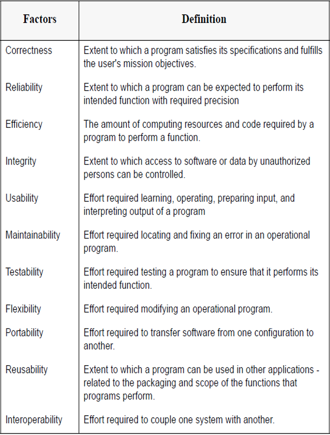
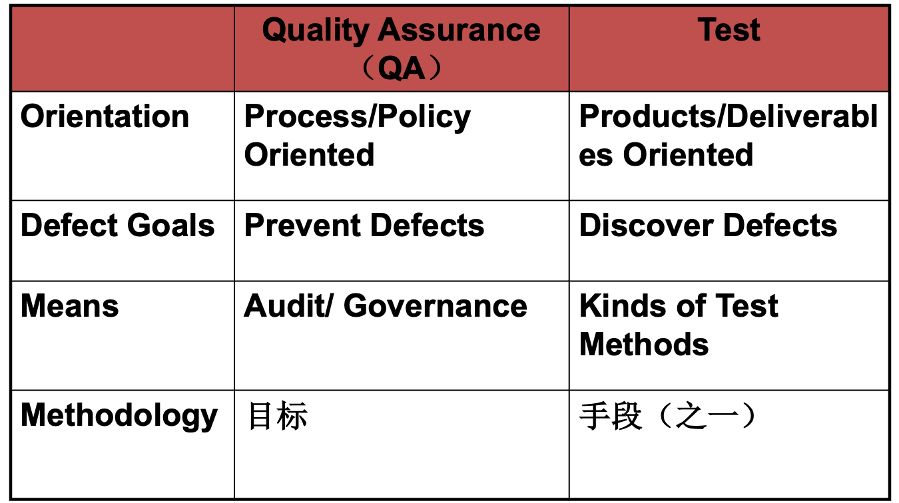
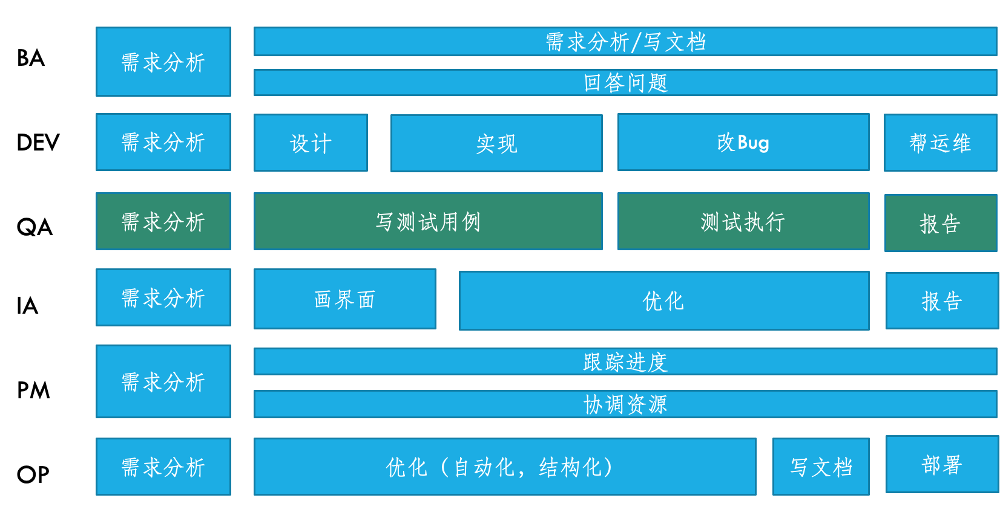

# 软测

## 评分标准

## 评分标准

* 两次作业（组队）：50%
* 期末：50%

## 个人感受

垃圾课，完全不用听，期末突击一下就好，两次作业的ddl很晚，可以考完计网再速通。

## 期末复习

这课平时几乎没人听，**最后一节课会划重点**，考试需要用英文答题，可以打印任意材料。建议**打印PPT(包含注释)**，并提前熟悉内容，可以参考小角龙学长的PPT索引。历年卷98上有一份回忆卷，过早的历年卷已经失效了（这门课原来据说是由一位爱尔兰的老师在上，现在换成zxq了）

### 内容

> 以下内容来自今年软测的最后一次课

考试主要有以下内容：

1. 质量保证基本框架 & 测试流程：测试计划重要
2. <del>自动化测试 & 非功能测试</del>
3. 白盒测试：单元测试和白盒测试方法
4. 评估：评估方法论和过程改进

#### 基本概念

以下定义需要清楚

{width=400}

- 为什么要把测试往前推？
- 对中间结果进行评估的好处是什么？

因为50%的缺陷来自对需求的理解不足，30%来自设计不行，仅有20%来自编码，且越早解决bug的cost相对越小。

QA(Quality assurance) 和 Test的区别：

{width=400}

实现QA的手段除了Test还有评估和过程改进

#### 测试分类

这种题年年考

1. 比较不同测试的异同：
   1. 单元测试大概对应白盒测试，集成测试大概对应灰盒测试，系统测试大概对应黑盒测试
   2. 功能性测试基本是对半分，既有白盒，又有黑盒，既有系统级的，又有单元级的

???question '白盒测试和单元测试的区别'
    最核心的是分类体系不同

1. 冒烟测试和回归测试
2. $\alpha$测试和$\beta$测试

> SDP 不太会考，因为它属于泛软件工程的知识

#### 测试计划

会问A在做xx事情的时候，B在做什么？比如 DEV 实现功能后，QA要先做冒烟测试

???quesion 'QA做的需求分析和其他人有什么不同？'
    1，参与需求分析，并评估需求的正确性
    2，保证各团队和各角色对需求理解的一致性
    3，设定各阶段的评估模型，评估项，评估指标

需要知道产品 vs 项目和全功能提交团队

#### 评估

需要知道：

- 软件度量体系的概念
- 度量指标

围绕瀑布模型举的例子，一定要看，不要求计算，但要知道评价指标，比如代码的圈复杂度是低更好。

缺陷在一个周期内的时序变化趋势符合瑞利分布(Rayleigh distribution)，英文单词要知道。

#### 测试用例

给一个例子做题，有一些基本的套路要遵守：

1. 要把系统抽象成一个函数
2. 对定义域分等价类和边界值

bug 的 life cycle

#### 单元测试

例子要看

??? 'A=B>= 3 是条件还是可执行语句'
    是个条件，但不是判定

!!!tip 简答题不要答长篇大论
    PPT下面的comments只需要抄最关键的语句，不需要抄完