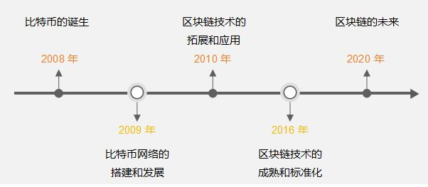
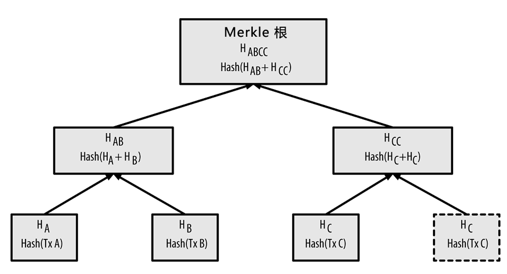
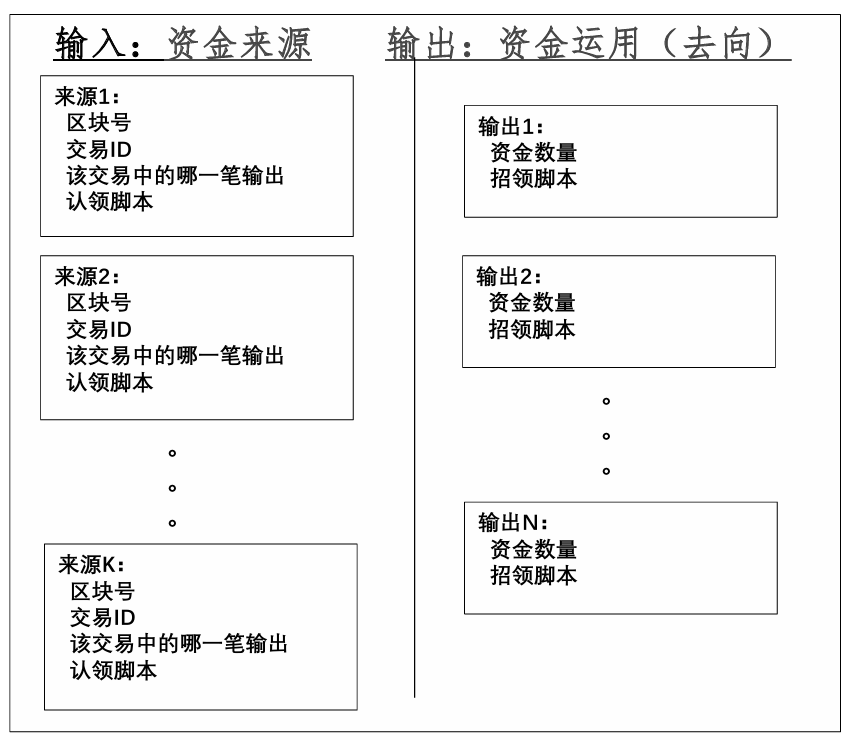

# 区块链

>区块链可以看作是特殊的分布式数据库,信息存储在所有加入到区块链网络的节点当中，节点的数据是同步的。

## 货币知识

### 货币的本质

加密货币也是货币，货币是一般等价物，具有使用价值和交换价值。纸币本质是**信用**：

- 金本位
- 国家信用
- 布雷顿森林体系：美元和黄金锚定

纸币的全球化：

- 美元、欧元、英镑、日元...
- 国际货币基金组织特别提款权

### 加密货币

加密货币是一种基于区块链技术的去中心化数字资产，利用密码学确保交易安全与控制新单位生成。它不依赖央行或中央机构发行与管理。虚拟币是因信称义，价格由市场供需决定，波动较大。比特币的第一笔交易使用10,000比特币购买了25美元的披萨，而现在比特币的价格如下图所示：


稳定币是基于区块链技术发行的数字资产，通过“锚定机制”维持其相对于法币的价格稳定。稳定币因其实时的结算速度、低廉的交易成本和7×24小时无国界流转等优势，逐渐被应用于跨境支付和贸易结算等领域。

### 起源

中本聪2008年设计了一种点对点的电子现金系统，即比特币，次年提取出了区块链的思想。**比特币(bitcoin)总共将发行2100万枚，目前已生成1800万枚**，单价超十万美元，总市值超两万亿美元。比特币是迄今最成功的区块链应用，上线以来没有出现过一次服务暂停，任何交易可被追溯。



## 技术组成

>区块链并非全新的技术，它整合了大量现有技术。

### 哈希算法

#### 介绍

单向加密函数，能将任意长度的输入数据转化为固定长度的输出，该输出就是哈希值：

- 输入空间是无限的（任意字符串），而输出空间有限（定长），故输入空间大于输出空间
- 两个不同的输入理论上可能产生相同输出，称为碰撞
- 由输出推算输入很困难（当前计算机算力无法在有效时间内完成）

hash实际是一种思想，实际包含很多算法，常见的哈希算法有md5（已不安全）、SHA1和SHA2等，哈希算法需要逆向困难和抗碰撞。

哈希算法的应用也很多：

- 快速定位：数据库中的哈希索引
- 错误校验：下载大文件之后一般会校验哈希值来确保无篡改
- 唯一性验证：哈希后是唯一的就认为原像唯一

#### SHA256

SHA-2，Secure Hash Algorithm 2的缩写，是一种安全hash算法标准，SHA256是SHA-2下细分出的一种算法，对于任意长度的输入数据，SHA256都会产生一个256bit长的哈希值，通常用一个长度为64的十六进制字符串来表示。

### 公钥密码学

每个参与者拥有一对密钥：公钥和私钥，实现了身份认证和信息加密：

- 使用接收方的公钥加密待发送信息，接收方收到后用自己的私钥解密
- 使用发出方的私钥签名信息，接收方收到后用发出方的公钥校验签名。

非对称加密一般基于数学问题：

- 基于大素数分解难：RSA
- 基于离散对数难解：椭圆曲线加密

## 分布式账本技术原理

- 将交易向全网所有节点进行广播
- 众多记账节点对记账权达成共识，由共识确认的记账节点把记账区块发布给全网
- 所有账本数据完整存储于区块链网络的每个节点
- 所有节点都对账本数据的合法性和完整性进行验证

两个核心技术：

1. 以链式区块组织账本数据实现账本数据的不可篡改
2. 分布式的可信记账机制

### 区块链的结构

#### 宏观结构

区块链基于哈希值进行链接，区块链中数据无法篡改或删除，区块链越长可信度越高。

#### 微观结构

每个区块包括区块头和交易数据两个部分：

1. 区块头由当前区块的元数据和前一区块的Hash值构成
2. Merkle树用于对交易数据列表进行快速寻址

区块主标识符是它的加密哈希值，一个 **通过SHA256算法对区块头进行二次哈希计算**（为了提高安全强度）而得到的数字指纹。区块哈希值实际上并不包含在区块的数据结构，毕竟随时可以计算出来。第二种识别区块的方式是通过该区块在区块链中的位置，即“区块高度（block height）”。和区块哈希值不同的是，**区块高度并不是唯一的标识符**，因为有可能出现区块链分叉。


Merkle 树是一种哈希二叉树，它是一种用作快速归纳和校验大规模数据完整性的数据结构，它并不复杂：

- 叶节点是数据块的哈希值
- 非叶子节点是根据它下面的子节点的值哈希计算得到

在比特币网络中，Merkle树被用来归纳一个区块中的所有交易，同时生
成整个交易集合的数字指纹，且提供了一种校验区块是否存在某交易的
高效途径（时间复杂度$\log_2(n) $）。




计算流程如上图所示，从下往上计算，对每两个相邻的节点计算它们的Hash值（实际是两次SHA256），如果出现某一层数量为奇数的情况，比如最底层只有ABC，那么就把C复制一个，计算HASH(A+B)和HASH(C+C)，计算的次数显然是$1+2+\dots +\lceil \frac{n}{2}\rceil\leq \frac{1-\lceil n\rceil}{1-2}\leq n $，计算是线性时间复杂度的。

Merkle的价值如下：

1. 快速比较大量数据：当两个Merkle树的根哈希值相同时，说明所代表的的数据都相同。
2. 如果其中某个交易（数据）发生修改，从根向下可以快速定位被修改的数据。
3. 快速验证其中数据：要验证某个交易（数据）是否在Merkle树中，只需要提供一条从该交易的叶节点开始的路径，经过hash计算比对后即可验证。

### 比特币区块链中的节点

区块链中的节点分为：

- 全节点(full client)：存储着整个区块链，承担对交易请求进行验证和执行，可以通过挖矿争取发布区块，还承担着向别的节点发送区块和相关信息的义务，同时需要转发交易请求和区块
  - 矿工节点
  - 非矿工节点
- 轻节点(light client)：
  - 简单支付节点（SPV）：只存储区块头，不存储区块块体，仍可以对交易请求进行验证
  - 钱包(比如 MetaMask)：一个连接区块链的应用软件，记录所有与所有者相关的信息：区块链地址，私钥，账户余额等，不存储账本

## 共识机制

挖矿有经济激励，整个比特币完全由记账生成，PoW下挖矿是去计算SHA256，算出来立刻向全网广播，在全网达成共识。这个设计的目的是解决记账权问题，防止记账被控制。

### 分布式一致性

拜占庭将军问题：

1. 每个分布式节点独立运行 （每个将军控制自己的军队）
2. 相互间可通过网络通信 （通过信使给其他将军传递消息）
3. 可能存在恶意节点 （将军中可能有叛徒）
4. 信道是可靠的，但可能中断 （信使是可靠的，但可能被截获）

解决问题的目标：

1. 一致性：所有忠诚的将军按照相同的计划行动
2. 正确性：少数叛徒不能导致忠诚将军采取错误的行动计划

### PoW

工作量证明PoW共识,因为PBFT算法要求节点集相对稳定，数量有限，不适用

- 划定固定时间段（10分钟）
- 相同或相似输入数据（组装的区块）
- 算力竞争选出获胜节点，其它节点验证结果后不再发送消息
- 最长链原则，从短期共识扩展到长期共识

记账的难度并不是由用户决定的，而是在每个完整节点中独立自动发生的。每2,016个区块中的所有节点都会调整难度。难度的调整公式是由最新2,016个区块的花费时长与20,160分钟比较得出的。难度是根据实际时长与期望时长（平均十分钟一个区块）的比值进行相应调整的。

### 区块分叉

- 竞争胜出的节点创建区块并广播
- 其他独立节点校验新区块
- 区块链的组装和选择（根据父区块hash值查找父区块）
  - 连接到主链上
  - 分叉（备用链）
  - 孤立区块

因为同一时间可能有多个节点都算出了结果（比如因为网络延迟，不同区域不同步了），这种情况下要认为所有结果都是有效的，就只能将这些区块都连接在父节点上，从而形成兄弟区块（产生分叉）。后续区块（第3代、第4代...）到达后，依次加在前序区块后，若没有其他竞争性区块，这一分支最长，成为主链。

## 挖矿

如上文所说，挖矿是比特币产生的唯一方式，挖矿节点必须有钱包功能，有自己的160位密码地址、私钥。打包生成区块时，区块中额外加一个交易coinbase，生成一个UTXO，包含当前奖励数量的比特币(现在是6.25)

### 比特币账户

每个比特币用户有一个160位（20字节）长度的地址，产生的过程：

1. 用户生产一对非对称密钥
2. 公钥经hash计算（SHA160）产生160位的地址
3. 私钥自己保存，用于数字签名

这个160位地址，是用户在比特币网络中交易的唯一标识。

### UXTO 模型

UTXO(Unspent Transaction Output) 模型中收入和支出是分散在各区块中，计算总额需要去统计收入和支出的总和，全节点可以自己根据区块号和交易ID去确认，SPV需要通过P2P协议从全节点获取完整信息。



比特币中有两类交易：

- 常规交易，有交易输入（支付者地址和金额）、交易输出（收入者地址和金额）
- 挖矿交易（Coinbase），产生比特币，只有交易输出（挖矿者地址和金额）

每个地址的资金余额就是散布在账本中所有UTXO的总和，使用时把自己名下的UTXO作为交易输入，可能需要拼凑找零。

```cpp
class CTxOut {}
 ] CAmount nValue     
//本项输出即该UTXO所承载的（比特币）价值
] CScript scriptPubKey  //招领脚本，虽然名为scriptPubKey，
//却未必只是以公钥为条件的脚本
```

下图是CTxOut的示意图，其中：

1. P2PK：付给的Public Key，领取者凭Private Key领取
2. P2PKH：付给Public Key 的160bit哈希，也就是地址
3. P2SH：付给脚本的Hash值，这个脚本是收付双方预先在“链外” 约定的
4. 需要多方签名并采用SegWitness脚本的支付，具体又有两种：
   1. P2WPKH：付给SegWitness形式的多个公钥Hash值
   2. P2WSH：付给SegWitness形式的脚本Hash值


```cpp
class CTxIn {}
 ] COutPoint  prevout  //Previous Output。指向具体的资金来源，
//说明来自那一项交易的第几项输出，展开如下：
]] uint256  hash   
//资金来源所在Tx的Hash值，唯一地确定了一个Tx。
]] uint32_t  n     
//本项资金来源是该Tx中的第几项输出。
] CScript  scriptSig    //为认领该项资金而提供的“签名脚本”（认领脚本）。
] uint32_t  nSequence  //具有特殊作用。
] CScriptWitness  scriptWitness;  //见证脚本的数据，0x00表示无.
```

下图是CTxInput的示意图


### Coinbase交易

每一区块的第一笔交易必须是Coinbase 交易，也称为生成交易，由挖矿节点生成。

- 交易输入为0
- 产生的UTXO = 挖矿奖励（目前6.25BTC）+ 区块交易费用
- 区块交易费用= 所有输入的UTXO - 所有输出的UTXO

Coinbase 交易的UTXO **具有特殊条件**，即至少100 个区块内它不能花费（用作输入），主要目的是防止分叉，分链上的Coinbase UTXO是不能在主链上使用的。

### 比特币虚拟机

比特币节点软件的一个模块，基于堆栈，运行的程序就是招领脚本和认领脚本，指令集是有限能力的，主要验证签名是否正确。

### 支付通道

用于链外支付或其他交易，面向性能要求高、交易数量大等场景，比如按秒计费。支付通道分为三步，最后链上只有Funding Trsaction和Settlement Transaction

1. Funding transaction：A、B双方建立一个多签名的联合地址，拟议中的付方发布一个交易将一笔钱打到这个地址中,但这是P2SH支付，即支付给能够正确提供清算脚本Hash值的收款方，必须有双方的签名才能花。
2. Commitment transaction：A、B双方的链下交易，可以有很多个，不上链。每次支付的资金都来自同一个UTXO，每次交易的输出分成两部分，一是给收方的UTXO，其数值是付方至此为止承诺支付的总和，二是给付方自己的找零。
3. Settlement transaction：收款方把手中由付款方开具并签名的最后那个应承交易上签上自己的名并把它发送到比特币网上，从当初注资阶段生成的那个UTXO中把钱划给自己，同时把剩余的钱（如果还有的话）找还给付款方。

### 网络通信

P2P通信：

- 种子节点
- 伙伴列表
- 发现伙伴

简单来说就是不断通过伙伴去发现新的伙伴，从而构建伙伴列表。

### 分叉

比特币协议分叉不同于区块链共识中常规分叉，而是因为协议升级或
分歧（比如增大区块大小以提高挖矿奖励），导致遵循不同协议的软件所产生区块链不兼容，形成各自生长的链。

- 硬分叉：新协议不兼容老区块
- 软分叉：新协议兼容老区块

## 区块链生态

### 概述

- 竞争币和山寨币
- 新一代公共区块链平台：以太坊
- 面向企业应用的区块链平台：Hyperledger Fabric
- 开发策略：复制、修改开源代码，全新开发
- 技术创新：可编程、可开发，共识算法
- 融资创新

### 区块链形态

按照涉及组织数量和是否有准入机制可以将区块链平台分为三类：

- 联盟链：多个组织，有准入机制
- 公链：任何人都可以参与
- 私链：由单独的个人和组织拥有

此外，可以按加入是否需要许可，可以分为无许可区块链和许可区块链，但是注意**无许可区块链不一定是公链**