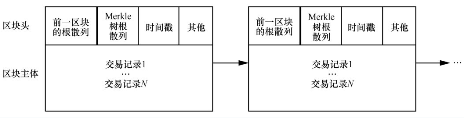
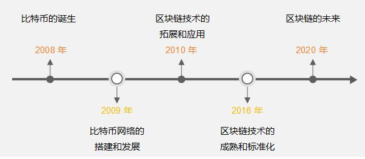
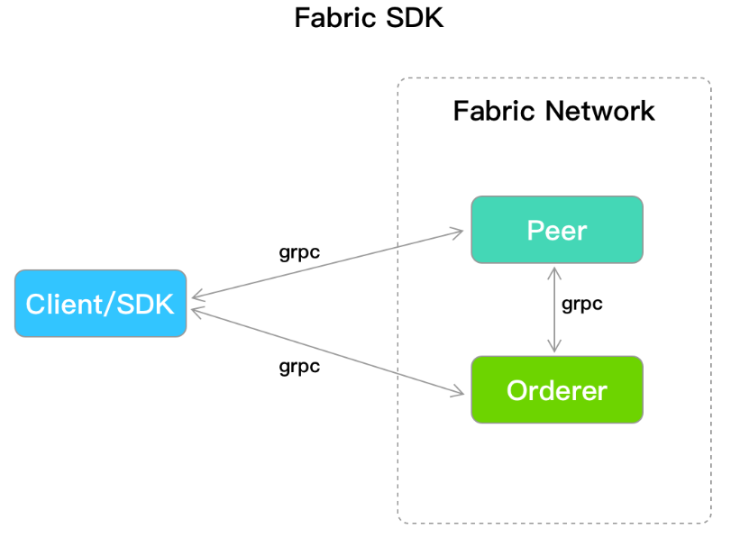

# 区块链

!!!abstract 实质
    区块链可以看作是特殊的分布式 key-value 数据库,信息存储在所有加入到区块链网络的节点当中，节点的数据是同步的。

## 简介

### 特性

- 去中心化：无需第三方机构
- 开放性：系统数据是公开透明
- 信息不可篡改：如果信息存储到区块链中就被永久保存，是没办法去改变
- 匿名性：区块链上面个人的信息都是加密的

### 组成

区块链并非全新的技术，而是现有技术的组合，它整合了以下技术：

- 密码学
  - 哈希算法：单向加密函数，能将任意长度的输入数据转化为固定长度、唯一的字符串（哈希值）。
  - 公钥密码学：每个参与者拥有一对密钥：公钥（公开，作为地址）和私钥（自己保密，作为身份证明和签名工具），实现了身份认证和信息加密。
- 点对点网络：网络中的每个节点（参与者）都地位平等，共同维护整个网络。每个节点都存储着一份完整的或部分的账本副本。当一个节点产生新的数据时，它会广播给网络中的所有其他节点。
- 共识机制
  - 工作量证明：节点（矿工）通过解决复杂的数学难题（挖矿）来竞争记账权，获得奖励。
  - 权益证明：节点通过抵押自身持有的代币来竞争记账权，抵押越多，被选中的概率越大。
  - 此外还有委托权益证明、拜占庭容错等多种机制...
- 智能合约：智能合约是存储在区块链上的自执行程序，当预设条件被触发时自动执行合约条款。

## 原理

### 区块

区块包含两个部分：

1. 区块头（Head）：记录当前区块的元信息,如数字货币的转账记录、智能合约的执行结果等。
2. 区块体（Body）：实际数据,包括了对上一个区块的引用、时间戳、随机数以及用于验证区块内容的哈希值等信息。

### 链

区块链是由一系列按照特定顺序连接而成的区块构成的链条。每个区块中都包含了指向前一个区块的哈希值，形成了一个不可篡改的数据链。这种连续的链接保证了区块链中的数据不可逆地被记录和保存。

### 账户

区块链上的账户就像唯一身份，可用于发送和接收交易或资产。在基于智能合约的区块链中，如以太坊，主要有两种类型的账户：

- 外部拥有账户（EOA）：这些账户由私钥控制，没有与之关联的代码。这些账户拥有代币余额，可以发送和接收交易，这些交易可以是资产转移交易或智能合约交互交易。
- 合约账户：这些账户由智能合约拥有，只有在EOA或另一个智能合约触发时才能执行操作或交易。

### 交易

交易是账户发起的将资产从一个账户转移到另一个账户、与智能合约交互或部署智能合约的操作。账户在区块链上的每次数据添加/修改都以交易的形式进行。区块链中的交易通常包括以下信息：

- Nonce：表示从账户发送的交易数量的计数器。
- To：接收账户地址（可以是EOA或合约地址）。
- From：发送者的账户地址（可以是EOA或合约地址）。
- Amount：这是正在转移的代币数量（通常是该区块链的原生代币）
- Signature：这是用发送者的私钥生成的加密签名。这证明交易未被篡改，确实是由发送者的账户地址发起的。
- 交易哈希：这是交易的唯一标识符，通过对交易的详细信息进行哈希处理生成。它就像交易的指纹，确保其完整性和唯一性。

## 发展历程

### 区块链发家史

!!!note 区块链和比特币的关系？
    如上图所示：比特币2008年被中本聪提出，然后参考了比特币的实现提炼出了区块链的技术。它们的实际关系是比特币用到了区块链技术，而区块链技术还可以做更多事情。

### 不同类型的区块链

- 公有链：完全开放的，任何人都可以参与其中，而且所有的数据都是公开可见的。
- 私有链：由单个组织或实体控制和管理的区块链网络，参与者需要经过授权才能加入。
- 联盟链：联盟链是由多个组织或实体共同控制和管理的区块链网络，参与者需要经过授权才能加入。

## Hyperledger Fabric

### 简介

Hyperledger Fabric 是一个企业级的、开源的分布式账本技术（DLT）平台，专为企业环境设计，它是联盟链，参与者需要经过身份验证和授权才能加入网络。

### 核心架构

区块链的基础概念就不再复述，Hyperledger Fabric 的架构大致如下：

1. 账本（Ledger）：
   - 区块链：以区块形式存储的、不可变的交易顺序记录。
   - 世界状态：是一个键值（Key-Value）数据库（通常使用 LevelDB 或 CouchDB），保存了链码操作数据的当前最新状态。它使得查询数据非常高效。
2. 智能合约/链码（Chaincode）：业务逻辑的核心。它是在网络节点上运行的软件，用于初始化和管理账本状态（通过“get”、“put”、“delete”等操作）。链码定义了交易的规则。
3. 对等节点：网络的基本单元，负责维护账本和运行链码。
   - 提交节点（Endorsing Peer）： 专门负责模拟执行交易（执行链码但不提交结果）并生成背书签名。
   - 提交节点（Committing Peer）： 验证从排序服务接收的区块，然后将其提交（写入）到本地的账本副本中。所有 Peer 都是提交节点。
4. 排序服务（Ordering Service）：一个将交易排序并打包成区块的节点集合。它不执行交易，也不维护账本。它的核心职责是就交易的顺序达成共识，并确保所有节点接收到相同的区块序列。
5. 通道（Channel）：每个通道都有一个独立的账本，只有加入该通道的节点才能访问其数据。
6. 成员服务提供商（MSP）：负责管理网络中所有参与者的身份和证书（基于公钥基础设施 PKI），为网络提供准入控制和身份验证。

### 环境部署

Fabric 网络环境：包括 Peer、Orderer、CA 等节点。通常可使用 Docker Compose 部署，参考[官方文档](https://doc-fabric.readthedocs.io/en/latest/getting_started.html)。需要一份配置文件`config.yaml`，用于 SDK 获知客户端身份和网络的拓扑结构。

### web 开发

整个系统可以分为三层：

1. 前端：提供用户交互的 UI，可视化操作结果
2. 后端：响应前端请求，并与区块链网络交互
3. 区块链层：负责处理所有核心业务逻辑、维护账本状态、执行交易并确保一致性

