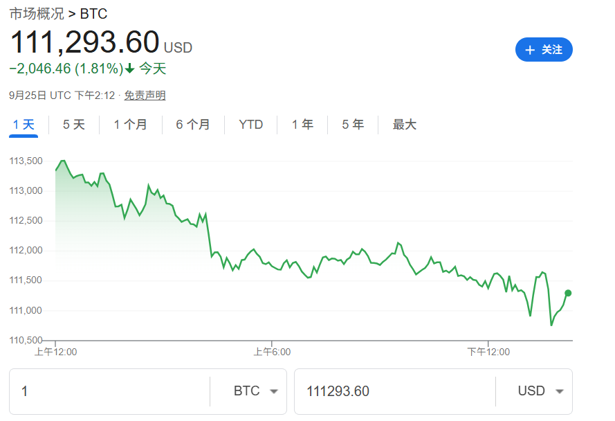

# 区块链

> 因为我因为专业原因上了多门区块链的课，导致区块链这部分的内容变得异常详细，因此分开展示不同种类区块链的笔记。

区块链可以看作是特殊的分布式 key-value 数据库,信息存储在所有加入到区块链网络的节点当中，节点的数据是同步的。

## 货币知识

会有这部分知识是因为加密货币也是货币，货币具有使用价值和交换价值，本质是**信用**，虚拟币更是因信称义，比特币的第一笔交易使用10,000比特币购买了25美元的披萨，而现在比特币的价格如下图所示：

## 特性

- 去中心化：无需第三方机构（不过实际发币的规则还是由某些人决定的）
- 开放性：系统数据是公开透明
- 匿名性：区块链上面个人的信息都是加密的
- 信息不可篡改：如果信息存储到区块链中就被永久保存，是没办法去改变

## 组成

区块链并非全新的技术，而是现有技术的组合，它整合了以下技术：

### 哈希算法

单向加密函数，能将任意长度的输入数据转化为固定长度、唯一的字符串（哈希值）：

- 输入空间是无限的（任意字符串），而输出空间有限（定长），故输入空间大于输出空间
- 两个不同的输入理论上可能产生相同输出，称为碰撞
- 从输入得到输出很容易，反过来由输出推算输入很困难（当前计算机算力无法在有效时间内完成）

hash是一类算法的统称，常见的哈希算法有md5，sha256等，md5目前已经不完全安全了，sha256还是安全的。哈希算法的应用也很多：

- 快速定位：数据库中的哈希索引
- 错误校验：下载大文件之后一般会校验哈希值来确保无篡改
- 唯一性验证：哈希后是唯一的就认为原像唯一

### 公钥密码学

每个参与者拥有一对密钥：公钥（公开）和私钥（自己保密），实现了身份认证和信息加密。使用接收方的公钥加密待发送信息，接收方收到后用自己的私钥解密；使用发出方的私钥签名信息，接收方收到后用发出方的公钥校验签名。

非对称加密一般基于数学问题：

- 基于大素数分解难：RSA
- 基于离散对数难解：椭圆曲线加密

### 分布式账本

网络中的每个节点（参与者）都地位平等，共同维护整个网络，每个节点都存储着一份完整的账本副本。当一个节点产生新的数据时，共识确认的记账节点会把记账区块广播给网络中的所有其他节点，所有节点都对账本数据的合法性和完整性进行验证。

### 共识机制

工作量证明主要用于解决记账权问题，节点（矿工）通过解决复杂的数学难题（挖矿）来竞争记账权，获得奖励。

### 智能合约

智能合约是存储在区块链上的自执行程序，当预设条件被触发时自动执行合约条款。

## 发展历程

### 区块链发家史

中本聪2008年设计了一种加密货币，即比特币，然后次年从比特币中提取出了区块链的思想，现在来看，比特币算是区块链技术的一种应用，但区块链还可以做到更多事情。

比特币(bitcoin)总共将发行2100万枚，目前已生成1800万枚，单价超十万美元，总市值超两万亿美元。比特币是迄今最成功的区块链应用，上线以来没有出现过一次服务暂停，任何交易可被追溯。

### 不同类型的区块链

- 公有链：完全开放的，任何人都可以参与其中，而且所有的数据都是公开可见的。
- 私有链：由单个组织或实体控制和管理的区块链网络，参与者需要经过授权才能加入。
- 联盟链：联盟链是由多个组织或实体共同控制和管理的区块链网络，参与者需要经过授权才能加入。