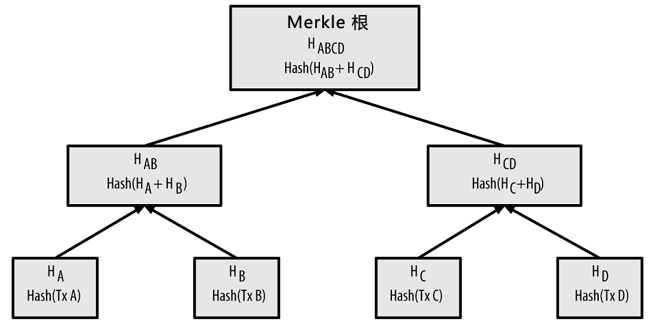
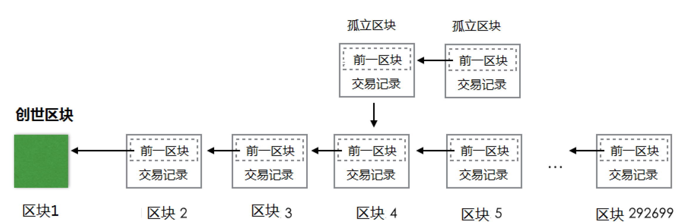

# Bitcoin

## 数据结构

### 区块

区块包含两个部分：

1. 区块头：记录当前区块的元信息和上一区块的哈希值，
2. 交易数据：Merkle树用于对交易数据列表进行快速寻址。

区块的主标识符是它的加密哈希值，一个通过SHA256算法对区块头进行二次哈希计算而得到的数字指纹，不过区块哈希并不包含在区块的数据结构中，毕竟哈希算法的效率很高。第二种识别方式是通过该区块在区块链中的位置，即区块高度，例如高度为0的区块是创世区块，但高度并不唯一，因为可能出现区块分叉。

Merkle 树是一种哈希二叉树，它是一种用作快速归纳和校验大规模数据完整性的数据结构，它并不复杂：

- 叶节点是数据块的哈希值
- 非叶子节点是根据它下面的子节点的值哈希计算得到

注意这里的哈希值指的是两次哈希，比如SHA256(SHA256(交易A))，这样做是为了进一步提高安全性。计算流程如下图所示，从下往上计算，如果出现某一层数量为奇数的情况，比如最底层只有ABC，那么就把C复制一个，计算HASH(A+B)和HASH(C+C)。

计算的次数显然是$1+2+\dots +\lceil \frac{n}{2}\rceil\leq \frac{1-\lceil n\rceil}{1-2}\leq n $，计算是线性时间复杂度的。Merkle的价值如下：

1. 快速比对大量数据：根节点数值相同则可认为两棵树完全相同。
2. 快速定位修改：时间复杂度等于树高($\log_2 n $)，从根节点开始向下比对即可找到被修改的叶子节点。
3. 快速验证其中的数据：只需要提供一条从该交易叶节点开始的路径，即每一层相邻的节点，计算根节点哈希即可，复杂度还是树高。

### 链

区块链是由一系列按照特定顺序连接而成的区块构成的链条。每个区块中都包含了指向前一个区块的哈希值，形成了一个不可篡改的数据链。这种连续的链接保证了区块链中的数据不可逆地被记录和保存。区块链中的数据无法篡改或删除，且区块链越长可信度越高。

区块链中的节点分为：

- 全节点：存储着整个区块链，承担对交易请求进行验证和执行，可以通过挖矿争取发布区块，还承担着向别的节点发送区块和相关信息的义务，同时需要转发交易请求和区块
  - 矿工节点
  - 非矿工节点
- 轻节点：
  - 简单支付节点（SPV）：只存储区块头，不存储区块块体，仍可以对交易请求进行验证
  - 钱包：一个连接区块链的应用软件，记录所有与所有者相关的信息：区块链地址，私钥，账户余额等，不存储账本

## 相关算法

### 共识机制

在比特币中复杂数学问题是高强度哈希计算，即计算当Nonce为多少时哈希值能达到目标的前导0数量，比如需要30位前导0，前缀是`Blockchain@ZhejiangUniversity`，就要遍历`Blockchain@ZhejiangUniversity + Nonce`，直到找到结果，结果应该是`Blockchain@ZhejiangUniversity875618942`，这个求解过程在我的机器上大概跑了20min，由此可见挖矿对算力的要求很高。挖矿的难度会自动在每个完整节点中调整，难度是根据实际时长与期望时长的比值进行相应调整的，省流就是发觉难度低了就调高，发现难度高了就调低。

竞争胜出的节点创建区块并广播，其它独立节点校验新区块，根据父区块的哈希值查找父区块，然后连接到主链上（可能），但是有可能分叉，分支最长的成为主链。

### UTXO 模型

每个比特币有一个160位长度的地址，这个地址是比特币网络中交易的唯一标识，产生的过程：

- 用户生产一对非对称秘钥
- 公钥经hash计算（SHA160）产生160位的地址
- 私钥自己保存，用于数字签名

与一般的银行不同，比特币不维护每个账户的余额，而是维护UTXO(Unspent Transaction Output)。比特币中有两种交易：

1. 常规交易：有交易输入（支付者地址和金额）和交易输出（收入者地址和金额）
2. 挖矿交易：产生比特币，只有交易输出（挖矿着地址和金额）

每个地址的余额就是UTXO的总和（所有收入减去所有支出），但是当然也不可能说查询余额要去遍历整个区块链，这样效率未免太低，实际会存在数据库中，正常情况下是 key-value 的数据库，比如LevelDB。

挖矿交易(coinbase)是每一区块的第一笔交易，也称为生成交易：

- 交易输入为0
- 产生的UTXO=挖矿奖励+区块交易费用
- 区块交易费用=所有输入UTXO-所有输出UTXO

Coinbase交易的UTXO具有特殊条件，即至少个区块内它不能花费。

### 比特币虚拟机

比特币节点软件的一个模块，运行的程序是认领脚本(scriptSig)和招领脚本(scriptPubKey)

### 支付通道

