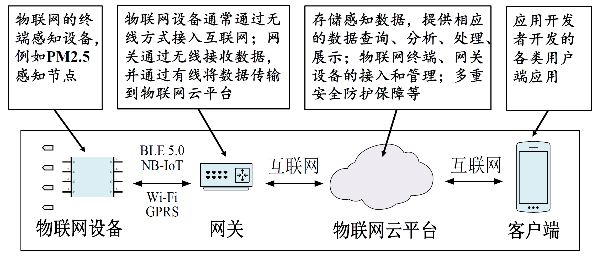
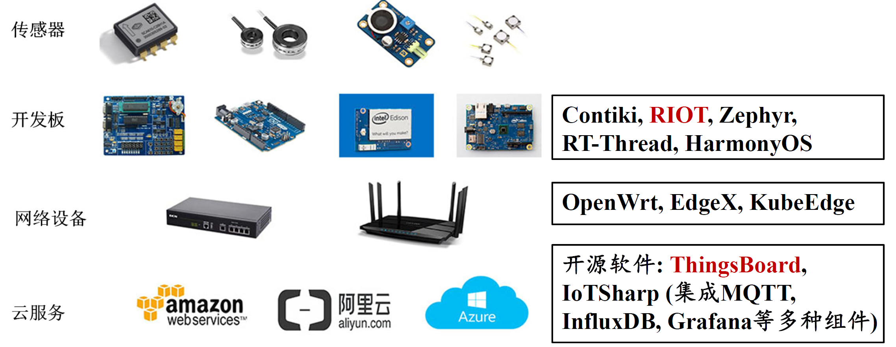
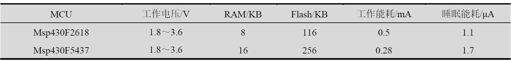
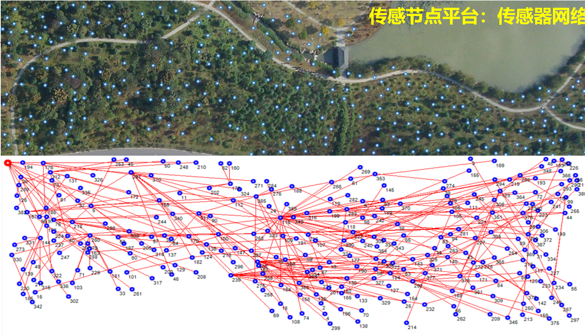

# 物联网硬件平台

## 简介

### 定义

物联网就是物理设备以及其他嵌入了电子器件、软件、传感器的物件组成的网络。这些物件具有感知能力、计算能力以及连接能力，从而能更直接地将物理世界集成到数字世界中。

### 历史

1. Bill Gates 1995年提出物物互联的基本思想
2. 2005年，国际电信联盟指出，无所不在的“物联网”通信时代即将来临
3. 2009年，IBM提出了“智慧地球”的概念
4. 近年来，AI赋能物联网具有广阔发展前景

### 典型架构





### 挑战

1. 开发链长：嵌入式开发、云平台开发以及用户端开发，涉及嵌入式、前端、后端等不同开发技术
2. 物联网领域还没有出现固定的终端类型
3. 目前，物联网应用开发的架构还是属于“垂直一体化”

## 硬件介绍

### 简介

物联网硬件的发展趋势是体积越来越小，价格越来越低。

| 属性 | 类PC的嵌入式设备 | 智能物件 | 物件 |
|:----:|:--------------:|:--------:|:----:|
| 典型处理器 | Intel Core | ARM Cortex-A7, Intel Atom | MCU |
| 典型操作系统 | Windows Embeded,Linux | Linux,Wind River,Android Things | Contiki,RIOT,Harmony OS |
| 典型运行环境 | Win32,Linux | Node.js,Python,C APIs | C APIs |
|典型设备|自动取款机、零售服务点|可编程逻辑控制器、边缘网关|温度传感器、智能灯泡|

狭义的硬件平台只包含开发板和微控制器，广义的硬件平台还包含传感模块、通信模块和执行模块。

### 特性

1. 节点价格低廉，微型化 $\rightarrow $更高的部署密度
2. 功耗/能耗：功耗越低，运行时间越长
3. 运算速度和内存大小：运算速度一般用CPU主频来描述

**问题1**：一个传感器节点电池总的电量为2800mAh。假设节点工作时电流消耗为20mA，休眠时电流消耗0.5mA。
（1）节点工作占空比为1%，节点工作时长为？小时
（2）节点工作占空比为1%，且考虑电池自放电率为0.5%/天时，节点工作时长为?小时 （假设电池每天释放初始电量的0.5%）

> 占空比表示在一个周期内，工作时间与总时间的比值

**解答：**

(1)每小时耗电：$20\times 1\%+ 0.5 \times 99\% = 0.695$

总时长：$2800/0.695 \approx 4028 $

(2)每小时耗电：$20\times 1\% + 0.5\times 99\% + 2800\times 0.5\%/12\approx 1.2783$

总时长$2800/1.2783 \approx 2190 $

**问题2**：下表描述了两块 MCU 的部分属性，基于此表回答以下问题。

* 程序中有如下的代码片段，为了支持该代码片段，应该选择哪块MCU？（MCU1代表Msp430F2618， MCU2代表Msp430F5437, 请填写MCU1或MCU2，同下）
```c
void setup() {
char buf[10240];
memset(buf, 0, sizeof(buf)); … }
```
* 对于一段给定程序，假设在Msp430F2618和Msp430F5437都执行了10s，（假设两个处理器工作电压恒定为3V）当占空比为80%时，谁的能耗低？
* 当占空比为0.1%时，谁的能耗低？

**解答**

* 第一个问题，代码中开了一个数组`char buf[10240];`，需要10kb的空间，数据是存放在RAM上的，所以需要MCU2
* 第二个问题，$MCU1:0.5\times 8+1.1\times 2=6.2,MCU2:0.28\times 8+1.7\times 2=4.072 $，所以MCU2能耗低
* 第三个问题，$MCU1:0.5\times 0.1+1.1\times 9.9=10.94,MCU2:0.28\times 0.1+1.7\times 9.9=16.858 $，所以MCU1能耗低


1. 接口类型
   1. 物理接口：杜邦线，过程复杂且易出错；连接套接口快速且不易出错。
   2. 通信协议：
      1. 模拟信号
      2. 数字信号
      3. PWM
      4. UART
      5. I2C
      6. SPI

**问题3** 如果UART的波特率设置为9600Bd/s，串口的接收中断处理时间为2ms，接收缓存应为?

> 波特率（Baud Rate）是指每秒钟传送的符号（码元）数量，通常用于衡量数据传输速率。

- 传输一位(1 bit)需要的时间$\frac{1}{9600}s $
- 在终端处理时间到达的所有数据$0.002\times 9600=19.2bit $
- 在这些数据中，不考虑标志位和校验位，需要存储的数据位$19.2\times\frac{8}{11}\approx 13.96 $
- 接收缓存大小$13.96/8 $，向上取整为2字节

    3. 可扩展性：开发板对接入外接设备种类和数量的支持程度

## 常见硬件平台

!!!note CPU vs MCU vs MPU
    1. CPU(Central Porcessing Unit)是计算机系统的运算和控制核心，是信息处理、程序运行的最终执行单元。
    2. MCU(Micro Controller Unit)将CPU、内存、I/O接口和时钟电路等基本组件集成在一个芯片上。通常被设计为低功耗设备，适合长时间运行和电池供电的应用。
    3. MPU(Micro Processing Unit)相比MCU，更侧重于高性能计算和复杂任务处理，具有更高的时钟速度、更大的内存和更强大的计算能力。


### 传感节点

分类为物件(Thins)，高度集成，专为低功耗和无线传感网络设计，厂商是UCB



传感器的主要特点是：

1. 低功耗
2. 体积小
3. 集成度高
4. 低成本

### STM32

STM32系列是由意法半导体公司（真的是由一家意大利公司和一家法国公司合并而来）推出的ARM Cortex-M内核单片机：

1. MCU：系列MCU经过多年的发展，衍生出很多系列规格型号`STEM32 F 103 V E T 6`
2. 开发板：由主控芯片、USB电源、扩展接口、电源接口、下载接口、复位按键构成
3. 微控制器：10大产品系列，700余款产品，满足不同需求

主要特点：

1. 开发方便
2. 丰富的通信接口
3. 调试简单
4. 低功耗

### ESP32

ESP32是中国乐鑫公司设计的一种集成2.4GHz Wi-Fi和蓝牙双模的单芯片方案。主要特点如下：

1. 性能稳定
2. 高度集中
3. 超低功耗
4. 双模解决方案

### Arduino

### 树莓派

树莓派是一款微型计算机，性能几乎和一台计算机相同，始终定位在高性能硬件平台，但是功耗也相对高。树莓派有个特别的组件，叫做盾板，能够扩展开发板对外设的支持。树莓派软件开发库支持C和Python，由于这些跨平台的高级语言，树莓派具有快速、易上手的特点，并且树莓派本身就是一台微型计算机，可以接入键盘、鼠标、显示器等外设。

### Jetson

Jetson平台是由NVIDIA推出的一系列嵌入式AI计算平台，NVIDIA是造显卡的，所以它们的开发板有着最好的GPU，提供了强大的计算能力，支持多种AI框架，适合AI模型部署。