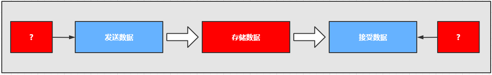

# 消息队列

## 消息队列简介

### 是什么？

消息队列(Message Queue)本质上就是队列，满足先进先出(FIFO)，不过队列中的内容是消息（理论上可以包含任意内容）。此外，消息队列是典型的生产者-消费者（Producer-Consumer）模型，在架构设计中，常被用于解耦。

### 用来做什么？

#### 削峰填谷

在短时间内流量突增（如秒杀活动、整点抢券）时，瞬时请求量往往会远超系统的实时处理能力，直接处理可能导致后端服务瘫痪或数据库宕机。引入消息队列作为“缓冲池”，可以将激增的请求先堆积在队列中，由后端消费服务根据自身的步调匀速处理。

#### 解耦

通过消息队列，上游系统（生产者）只需将消息发送至队列，无需关心下游系统（消费者）的具体实现或运行状态。当需要增加新的消费者或原有消费者进行升级变更时，上游系统无需修改任何代码，从而实现了系统间的业务逻辑剥离，提升了系统的灵活性和可维护性。

#### 异步处理

对于非核心、耗时较长的业务逻辑（如发送邮件、短信通知、更新缓存等），系统可以在处理完核心流程后将消息写入队列并立即返回响应。下游消费者随后异步地处理这些任务，从而显著缩短主流程的响应时间，极大地提升了用户体验。

#### 分布式任务

在分布式架构下，消息队列可以将大型复杂任务拆分为多个子任务，并分发给不同的节点或微服务进行并行处理。通过这种方式，可以实现负载均衡和任务状态的可靠追踪，确保在复杂的分布式环境中任务能够被准确、高效地执行。

#### 数据分发

消息队列支持“发布/订阅”模型，允许一份数据被多个不同的下游系统同时消费。当主系统产生关键数据变更时，只需将一条消息推送到交换机，即可同步分发给搜索索引、数据分析系统、备份存储等多个模块，确保了系统间数据流向的高效与统一。

### 协议

!!!question '为什么不直接使用HTTP？'
    HTTP 用于超文本传输，协议相对比较复杂，对于单个消息的传递而言开销过大。消息队列协议需要简洁、高性能、可靠。

消息队列使用专门的协议来实现数据的传递、存储和分发消费，常用的消息队列协议有：

1. AMQP(Advanced Message Queuing Protocol)：是一个应用层协议，提供统一消息服务。本身是开放标准，基于此协议的客户端与消息中间件可传递消息，不受开发语言等条件的限制。
2. MQTT(Message Queuing Telemetry Transport)：是一种基于发布订阅模式的轻量级协议，常用于计算能力有限、低带宽、网络不稳定的场景，比如物联网云平台
3. Kafka：Kafka 协议是一套基于TCP的二进制协议，专门用于客户端与Kafka Broker之间的通信。它以高效、低延迟为特点，支持消息的发布与订阅、元数据管理、分区分配等功能。

### 存储

消息队列不能因为服务器重启而重置，因此需要持久化存储，自然有两种选择：文件系统和数据库系统，绝大部分的消息队列选择使用文件系统存储。

### 模式

消息队列有如下几个