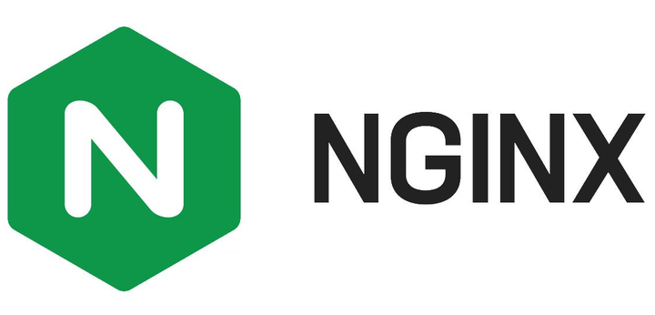
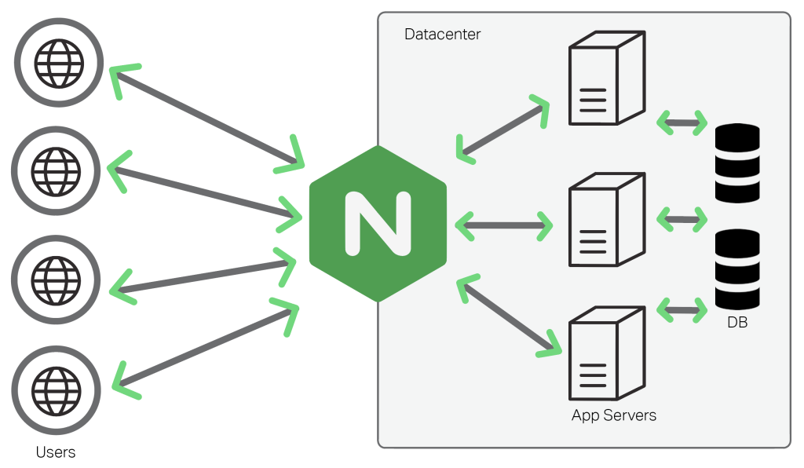

# Nginx

## 简介

Nginx(音同Engine x)，是一个高性能反向代理和Web服务软件，其源代码基于双条款BSD发布，因其资源消耗低、运行稳定且具有高并发处理能力，Nginx在互联网企业中得到广泛应用。

## 功能

### 反向代理

> 正向代理运行在客户端，比如VPN，而反向代理运行在服务端

反向代理(Reverse Proxy)是指代理服务器(Nginx)接收来自客户端的连接请求，然后将请求转发给内部网络上的服务器，并将从服务器得到的结果返回给请求连接的客户端。Nginx适配目前的大部分协议，包括但不限于HTTP/HTTPS，gRPC等。

### 负载均衡

负载均衡(Load Balancing)是指在多个计算资源（比如服务器）之间分配负载的技术，Nginx的内置负载均衡策略有三种：

1. 轮询：依次转发给每个服务器
2. 加权轮询：轮流转发给每个服务器，权重高的服务器每轮中用到的次数更多
3. IP hash：计算客户端IP地址的哈希值，由此决定发送到哪个服务器，看起来可以解决分布式系统中session不一致的问题，但实际会导致可靠性降低（如果某台服务器挂了，该机器上的所有 Session 都会丢失）

### web 缓存

Nginx不仅可以对不同的文件做不同的缓存处理，配置灵活，实现动态内容和静态内容分离，还可以对应用响应的动态结果实现缓存，为响应结果变化不大的应用提供更高速的响应能力。

## 用例

在 B/S 体系结构设计中，针对“网页适配移动端”的跨设备访问需求，使用 Nginx 作为反向代理是解决前后端通信耦合的关键。

**痛点分析**：若前端代码将后端 API 地址硬编码为 localhost，则外部移动设备无法通过局域网访问接口；若使用 PC 的局域网 IP，又会因 IP 动态分配导致配置频繁失效。

**解决方案**：通过 Nginx 配置反向代理，将前端静态资源与后端接口整合在同一端口下。此时，前端仅需使用相对路径（如 /api）发起请求。外部设备只需访问 PC 的局域网 IP，即可由 Nginx 自动完成流量调度，从而屏蔽了底层 IP 变化的复杂性，极大提升了部署的灵活性。