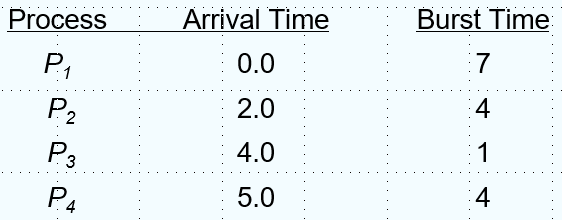
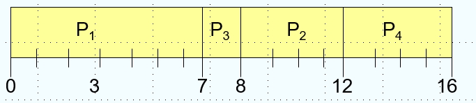

# 进程

## 进程调度

### 定义

操作系统会执行一系列的任务，对于批处理(batch)系统是一系列的任务在CPU上执行，对于Time-Sharing 的系统，多个用户的程序在CPU上执行。


> 这里的栈和堆不是数据结构的栈和堆，只是指一段特定地址空间

进程就是执行中的程序，包括：

1. text section(code)
2. data section(global varibles)
3. stack(function parameters, local varibles, return addresses)
4. heap(dynamically allocated memory)
5. program counter

### 执行状态

进程一共有5种状态：

1. new：进程被创建
2. ready：进程被加载进内存，等到执行
3. running：进程正在执行
4. wating：进程主动退出执行，比如等待IO
5. terminated：进程被结束


这里 interrupt 和 进入 waiting 的区别是前者是被动的，后者是主动的。

进程有属于自己的上下文信息（主要是寄存器），在切换进程时需要保存，使用 Process Control Block(PCB)保存。然后是很经典的切换上下文的流程，先保存当前进程的PCB，再取出待切换进程的PCB，即切换到了对应进程，这个过程是有开销的。


### 进程调度

使用队列来管理调度的信息，队列分为：

1. Job queue：系统中的所有进程
2. Ready queue：主存中的所有进程
3. Device queue：等待IO的进程

需要一个程序来调度进程，这个程序就被称作调度器(scheduler)，有长期的调度器（选择哪个进程到主存，即到ready queue）和短期的调度器（选择哪个进程到CPU）。现在的计算机其实不太需要长期调度器，比如Windows和Linux就都没有。短期的调度器会频繁被使用，长期调度器偶尔被使用，长期调度器控制了 multiprogramming 的程度。

进程可以被描述为 CPU bound process和 IO bound process，即看CPU和IO谁的时间开销更大。

### 进程创建

父进程创建子进程，然后继续创建其它进程，进程最后构成了一个树状结构。父子进程会涉及到：

资源共享：

1. 父进程和子进程共享所有资源
2. 子进程占有父进程的一部分资源
3. 父子不共享资源

执行：

1. 父子进程并发执行
2. 父进程等待子进程结束

地址空间：

1. 子进程复制父进程
2. 子进程加载一个新的程序

在 unix 系统中`fork`会创建一个新进程，`exec`能够用新的程序替换原本的内存空间。

下面是一个Linux中`fork`的例子，子进程拷贝了一份父进程的地址空间，然后父进程等待了子进程的结束。

```c
int main()
{
    pid_t  pid;
    /* fork another process */
    pid = fork();
    if (pid < 0) { /* error occurred */
        fprintf(stderr, "Fork Failed");
        exit(-1);
    }
    else if (pid == 0) { /* child process */
        execlp("/bin/ls", "ls", NULL);
    }
    else { /* parent process */
        /* parent will wait for the child 	to complete */
        wait (NULL);
        printf ("Child Complete");
        exit(0);
    }
}
```

### 进程终结

进程执行了最后一条指令会让操作系统删除它，输出的数据会从子进程传到父进程（通过`wait`），进程的资源会被操作系统回收，父进程可以结束子进程(abort)，因为子进程超出了分配的资源或者任务不再被需要。如果父进程被结束，一些系统也不会允许其子进程存在，会引发级联删除，不过在有些系统子进程会被绑定到 init 进程上。

### 协同进程

Independent process 不会影响或被其它进程影响，而 cooperating process 可以，然后就引出了经典的生产者-消费者问题(producer-consumer problem)，生产者进程能够产生供消费者消费的信息，我们有一个 buffer 来暂存这些信息：

- unbounded buffer：没有边界的 buffer，如果没有 item，消费者需要等待
- bounded buffer：有边界的 buffer，如果buffer满了，生产者必须等待

我们用一个循环队列来表示 buffer（这里是有界的）,in 是队尾， out 是队首

```c
#define BUFFER_SIZE 10
typedef struct {
    . . .
} item;

item buffer[BUFFER_SIZE];
int in = 0;
int out = 0;
```

所以队列满了可以表示为 (in + 1) % BUFFER_SIZE == out，队列空了可以表示为 in == out

### 进程间通信

Interprocess Communication(IPC)有两种模型：

- message passing，可以send(message)和recive(message)
- shared memory，两个进程可以向同一段存储读写


#### 直接交流

直接交流，需要显式声明对方的名称，比如：

- `send(P,message)`：发一个消息给进程P
- `receive(Q,message)`：接收一个来自进程Q的消息

communication link 的性质：

1. 连接时自动建立的
2. 一个链接绑定到一对通信进程
3. 每一对通信进程存在一个链接
4. 链接可以是单向是，但通常是双向的

#### 非直接交流

非直接交流中消息还是定向的，但是是在 mailbox(port) 接收，每个信箱有自己的id，进程间只有在它们共享邮箱时可以通信。

链接的性质：

- 链接只会在进程共享公共邮箱的情况下建立
- 一个链接可能被绑定到多个进程上
- 一对进程之间可能有多个链接
- 可以是单向的，也可以是双向的

涉及到的操作有：

1. 创建一个新信箱
2. 通过邮箱发送和接收消息
3. 销毁一个邮箱

原语定义为：

- `send(A, message)`：发送一个消息到 mailbox A
- `receive(A, message)`：从 mailbox A 接收一个消息

#### 同步

message passing 有可能是 blocking 或者 non-blocking的，blocking是synchronous，发消息者要等到消息被接收，接收者也要等到有消息；non-blocking是asynchronous，发送者发完就可以继续执行其它任务，接收者可以收到有效的或者空的消息。

#### buffering

绑定给链接的消息队列，以以下三种方法实现：

1. zero capacity
2. bounded capacity
3. unbounded capacity

## 线程

### 简介

为了提高系统响应性，需要将操作分的尽可能小，但是为了高效的执行，代码应该较大块地执行，更准确地说，我们希望能够调度更小的操作，这些枯燥的工作可以留给OS去完成，这就是线程。线程可以理解成更轻量级的进程，进程是资源分配的最小单位，而线程是调度的基本单位。


线程可以共享进程的部分资源，包括代码、数据和文件等，但每个线程都有自己的寄存器和栈，栈本质是同一个，但是不同线程的sp指针的位置不同，只要找到地址就可以把值取出。

### 线程管理

用户线程的管理由用户态线程库完成，内核线程由内核直接调度，现在的OS基本都实现了内核线程。如果只有用户线程，那么实际上OS调度的还是进程。

### 多线程基本模型

- many to one的模型将多个用户线程映射到一个内核线程，线程管理非常高效，但是在有线程进行系统调用时，其它线程也会 blocked，原因是OS并不知道有很多个线程，它一次只会调度一个线程
- one to one的模型将一个用户线程映射到一个内核线程，更高的并发，但是创建线程的开销会比较高
- many to many的模型将多个用户线程映射到多个内核线程，折中的方式使它更加灵活

### Two level 模型

类似于many to many的模型，不过它允许一个用户态线程被绑定到一个内核线程上。


### 相关事务

#### fork 与 exec

`fork`一个进程，是会复制所有线程，还是只复制调用它的线程，一些Unix的系统拥有两种实现，而`exec`会替代整个进程。

#### 取消线程

在一个线程完成之前终止它，有两种通用的方法：

1. Asynchronous cancellation 会立刻终止目标线程
2. Deferred cancellation 允许一个线程在需要取消时，通过一个标志被周期性检查

#### Singnal

信号(singnals)在unix系统中用来通知一个进程特定事件发生了，使用一个信号控制器来处理信号，同步或者异步。信号由特定的事件产生，被传送给特定的进程，最终被处理。信号可以选择发给信号应用的线程、进程中的所有线程、进程中的特定线程或者是用一个专门的线程来接收进程所有信号。

#### 线程池

预先创建一系列的线程备用（类似于内存池，避免每次都去系统调用，从而可以节省开销），允许系统中线程的数量绑定到池大小。

#### Thread Specific Data

TLS(Thrwad Local Storage)允许每个线程都有自己专属的数据，和静态变量很像，但是对每个线程来说是独一无二的，在你没有对创建线程的控制的情况下很有用（比如用了线程池）

#### 调度器活动

many to many 和 two level都需要通知内核以维护恰当的内核线程数量，在许多系统中LWP(light-weight-process)充当了用户级线程和内核线程之间的桥梁，可以把它理解为比进程开销小，但比纯粹的用户级线程更直接地得到内核支持的执行单元。

Scheduler Activations 提供了upcall机制能够从kerenl将信息传递到线程库，这种通信使得应用程序能够维持正确数量的内核线程,当一个应用程序线程即将阻塞时就会触发一个 upcall

## CPU 调度

### 基本概念

调度的对象是进程/线程，调度的资源是CPU，调度的目标是 Maximun CPU utilization obtained with multiprogramming 

CPU burst 往往是比较短的，所以调度算法使用的非常频繁，调度需要高效。CPU 调度需要从 Ready 的进程中选一个来执行，CPU 调度发生在：

1. 进程从 running 切换到 waiting 的时候，比如需要IO
2. 进程从 running 切换到 ready 的时候，比如中断
3. 进程从 waiting 切换到 ready 的时候，比如IO结束
4. 进程结束的时候

其中 1 和 4 是 nonpreemptive，因为是主动的，而 2 和 3 是 preemptive，因为是被动的

### dispatcher

> 在多线程编程中，dispatch 一般指将一个任务分配给一个可用线程去执行的过程

dispatcher（调度程序）将CPU的控制交给被短期调度器选中的进程，先切换上下文，然后返回用户态，最后跳转到正确的地方继续执行程序，这个过程存在 dispatchaer latency

### 调度目标

- Max CPU utilzation
- Max throughout（单位时间完成的线程数量）
- Min turnround time（完成一定数量线程所需的时间）
- Min waiting time（进程在ready queue中等待的时间）
- Min response time（从请求被提交到产生首个响应之间的时间，相当于用户感到自己的请求被处理的时间）

### FCFS

First-Come, First-Served（先来先服务）顾名思义是先处理最早到达的请求，即一个典型的 queue

> 这一章要会画甘特图，之前期末有考过


- Waiting time for P1 = 0, P2 = 24, p3 = 27
- Average waiting time: (0+24+27)/3 = 17
- Turnround time: P1 = 24, P2 = 27, P3 = 30
- Throughput: 3/30

但是如果到达的顺序交换


- Waiting time for P1 = 6, P2 = 0, p3 = 3
- Average waiting time: (6+0+3)/3 = 3

可以看到比上面的等待时间小了不少，这个现象被称作护航效应(convoy effect)，当短进程在长进程之后时，平均等待时间会很长，导致IO设备被闲置。所以FCFS有利于长作业，不利于短作业；有利于CPU繁忙型，不利于IO繁忙型。

### SJF

SJF(shortest job first)如果**知道每个任务接下来的CPU burst**，可以选择优先处理CPU burst最短的任务，这个调度算法可以是 preemptive 也可以是 nonpreemptive

- 对于非抢占式，CPU时间分配了就只有等它运行完
- 对于抢占式，当有比在运行的进程剩余时间更短的CPU burst 的进程到达时会发生抢占，这种调度方法也被称为 SRTF(Shorest-Remaining-Time-First)

易知优先处理最短的任务可以得到最小的平均等待时间（平均周转时间应该也是最小的），相当于是一个greedy algorithm

> 这个其实是排序不等式，逆序和 <= 乱序和 <= 正序和，不过这里用更直接的方法证明

证明:
1. 不妨设非最短任务优先调度的序列是$p_1, p_2, \dots, p_n $，$p_i $的时长记作$t_i $，其总的等待时间为$0 + t_1 + (t_1 + t_2)+\dots + (t_1 + t_2 + \dots + t_{n-1})=(n-1)t_1 + (n-2)t_2 + \dots + t_{n-1} $，
2. 因为它不是最短优先调度，所以必定存在$t_i> t_j (i<j) $，那么可以交换$p_i $和$p_j $，总的等待时间变为$(n-1)t_1 + \dots + (n-j)t_i + (n-i-1)t_{i+1}+\dots +(n-i)t_j + (n-j-1)t_{j+1}+\dots+t_{n-1} $
3. 用2中的等待时间减去1中的，结果为$(i-j)t_i+(j-i)t_j=(j-i)(t_j-t_i)<0 $，所以2中的序列等待时间更小，所以对于非最短优先调度序列，总存在一个序列比它的等待时间更短，故最短优先调度具有最小的平均等待时间

假设调度序列如下图所示：



如果使用 nonpreemptive 的 sjf，甘特图如下所示：



- Average waiting time = (0+3+6+7)/4=4
- Schedule times = 4

如果使用 preemptive 的 sjf，即srtf，甘特图如下所示：


- Average waiting time = (9+1+0+2)/4=3
- Schedule times = 6

但是，不可能提前知道进程得到的CPU burst 是多少，真实值一定是发生后才能得到，所以需要一些方法去预测，这里使用指数平均法(exponential averaging)

$$\tau_{n+1}=\alpha t_n+(1-\alpha)\tau_n $$，其中$t_n $是第n次调度真实的CPU burst，$\tau_n $是第n次预测的CPU burst，$\alpha $是一个可以调整的参数。如果我们把这个式子展开，得到的通项公式为：$\tau_{n+1}=\alpha t_n + \alpha(1-\alpha)t_{n-1}+\dots +\alpha(1-\alpha)^{n}t_0+(1-\alpha)^n\tau_0 $，可以看到越早的历史占的权重越小。

但是 sjf 有可能会饿死(starvation)，即有进程会始终得不到执行，且不利于长进程。

### Priority Scheduling

每个进程有一个优先级（数字），CPU优先分配给优先级最高的进程（可以是数字最小优先级最高），可以是 preemtive 也可以是 nonpreemtive 。SJF 同样也是 Priority Scheduling，优先级是进程的CPU burst

静态优先级(static priority)是在进程创建时决定，不会改变，但是会导致饿死，解决方法是老化(aging)，即动态的优先级，优先级会随着时间增长，于是我们有了 Highest Response Radio Next(HRRN)

HRRN（高响应比优先）定义了 response radio = (waiting time + cpu burst)/cpu burst 具体的流程如下：

1. 记录每个进程到达时间和所需的服务时间
2. 对于ready queue中的每个进程计算其响应比
3. 选择最高响应比的进程执行
4. 每次调度后，更新就绪队列中的等待时间，重新计算响应比

### RR

Round-Robin（这个名字没有实意，来源于签名方法，中文一般叫时间片轮转），每个进程得到一小段 CPU 时间，然后在时间耗尽后被抢占，然后添加到 ready queue 末尾。

假设有如下调度：


甘特图如下：


注意执行完一个进程会提前退出，RR 的average wating time 会很大，这里为 [(57+44)+0+(40+17)+40]/4=49.5

如果 time quantum为q，然后有n个进程，任何一个进程的等待时间会小于(n-1)q，如果q很大就变成了先来先服务，如果q很小，q必须相对大于上下文切换的开销，q必须恰当选择，否则过小额外开销会很大，过大交互性会较差，通常选择10~100ms，通常选成有80%的进程能在一个time quantum结束任务

### Multilevel Queue

将 ready queue分为多个queue，比如分成foreground(interactive)和background(batch)，每个队列都有自己的调度算法，比如foreground(RR)和background(FCFS)

队列间也需要调度，可以是固定优先级调度（比如先处理foreground再处理background），但是可能饿死；可以像RR一样分时间片，比如80%的时间给foreground，20%给background

### Multilevel Feedback Queue

相比 multilevel queue，一个进程可以在多个队列间移动，一个多级反馈队列调度器由以下参数决定：

1. 队列的数量
2. 每个队列的调度算法
3. 何时升级一个进程
4. 何时降级一个进程
5. 一个进程需要服务时进入哪个队列

具体而言，给出以下示例：


- 设置多个优先级队列，优先级从高到低
- 优先级高的队列，进程时间片越短
- 每个队列都采用FCFS，若在时间片内完成则撤离系统，未完成转移进下一级队列
- 按照队列优先级调度，仅当上一级为空时，才运行下一级


上图中Q0，Q1和Q2都是FCFS，但是在Q0中运行只有8s的时间片，在Q1中运行只有16s的时间片

### 多处理器调度

> 处理器和CPU还是有差距，比如可以两个CPU在一个主板上，共享L2Cache

在有多个处理器时调度会更复杂，这里有两种架构：

- ASMP(Asymmetric multiprocessing)：只有一个处理器访问系统的数据结构进行调度，其它的处理器都只执行用户代码
- SMP(Symmetric multiprocessing)：每个处理器自己调度自己，多处理器可能访问和更新共同的数据结构

### 实时调度

实时调度器的目标是保证任务在它们的ddl内完成，表现评估的标准是可预测性和可靠性，而不是平均吞吐量和平均周转时间。实时系统可以分为：

- Hard real-time system：必须在规定时间内完成任务
- Soft real-time system：关键进程有高优先级，尽量去完成

具体的调度算法有：
- Earliest Deadline First（最早截止时间优先）
- Least Laxity First（最低松弛度优先），松弛度是除去完成这个任务还剩余的时间
- Rate Monotonic Scheduling（速率单调调度），基于任务周期来分配优先级，周期越短的任务优先级越高

### 线程调度

也叫 Contention Scope，其实就是用户态和内核态的调度：

- local scheduling：线程库决定线程放入可用的 LWP（many to one）
- global scheduling：内核决定执行哪一个内核线程（one to one）