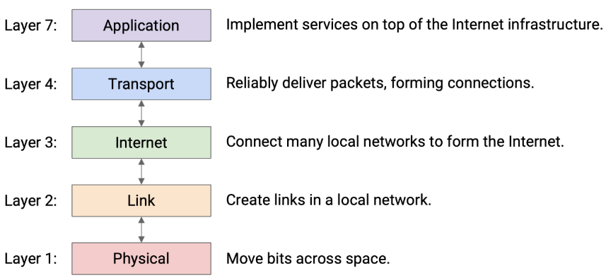
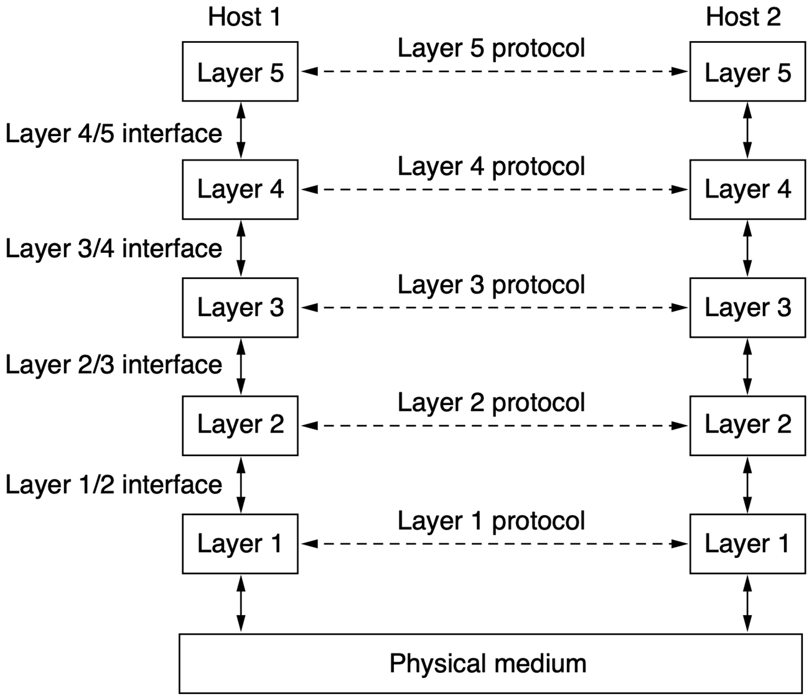

# 计算机网络基础

## 概述

### 一些概念

1. 计算机网络(Computer Networks)：一系列相互连接，有自主权的计算机设备
2. 互联网(Internet)：最知名的网络的网络实例
3. 万维网(World Wide Web)：一个建立在互联网顶层的应用

### 网络的层级

最初的 OSI 模型有 7 层，但现在认为5，6层是没必要的，故实际是五层架构，自下而上依次是：物理层、链接层、网络层、传输层和应用层。

真正的数据传输发生在最底层，其它层级同级之间并不会直接传输信息，但是同级之间最终会实现传输信息的效果，故下图中是虚线，这个被称作虚拟传输(Virtual Communication)。数据的实际发送过程是在发出端自上而下封装，到达最底层后再传输，在接收端自下而上解析，除了最底层外，每一层都只与自己的相邻层交互。

### 网络的作用

* Access to Information：Client-Server Model，客户端发送一个请求，服务器端接收到请求，处理后返回响应。
* Peer-to-Peer Communication：每个人都可以和群组内其它任何一个人通信。因此每个人既是客户端，也是服务器端。
* Electronic Commerce：在线购物，在线拍卖
* Entertainment：流媒体，游戏
* IoT：物联网，这学期的另一门课有学（

### 网络的分类

* Broadband Access Networks：宽带接入网络（Broadband Access Networks），简称接入网，是连接最终用户（如家庭、企业或移动用户）到核心网络（Core Network）的那部分通信网络。

> Metcalfe’s Law
> 网络的价值与用户数量的平方成正比，因为这大致是可能建立的不同连接的数量。

* Mobile and Wireless Acess Networks：无线和移动是有关联的，但并不等同，比如插网线的笔记本是可以移动的，但不是无线的。
* Content Provider Networks：
  * Data-Center Networks / Cloud：数据中心网络（DCN） 是指在一个数据中心内部，用于连接所有服务器、存储设备以及其他网络设备（如路由器、交换机）的网络基础设施。/云计算 是一种通过网络（通常是互联网）提供计算服务的模式。
  * Content Delivery Network: CDN（内容分发网络），主要作用是让用户更快地访问到网站内容。
* Transit Networks（中转网络）：创建一个中心化的网络，作为所有其他“辐条”网络（Spoke Networks）之间的连接枢纽。
* Enterprise Networks:企业网络是指为满足企业或组织内部的通信、数据共享和业务运作需求而设计的复杂计算机网络。
  * 资源共享：VPN
  * 交流媒介：电子邮件、IP电话/ IP语音（VoIP）、视频会议、桌面共享

### 无处不在的网络

#### 个人区域网络

Personal Area Networks：连接个人的设备，比如USB口，蓝牙

#### 局域网

Local Area Networks：在局部（家，办公室，工厂）可以访问的私有网络。
  * 无线局域网会连接到 Access Point(AP)，无线路由器或者基站。
  * 有线局域网会连接到 Ethernet Switch，通常有更低的延迟，更低的丢包率和更高的带宽。
  * 虚拟局域网，把物理局域网划分成更小的逻辑局域网

#### 资源分配

静态分配，使用round-robin（轮询）算法给每台机器分配资源，大概是维护一个队列，给每个机器分配一定的时间片（较短），然后按照队列依次去执行，如果本轮时间片耗尽则自动排到队尾。但是如果有机器不收发信息就会产生浪费。动态分配，根据需求按照中心化或者去中心化的方式分配。

### 城域网

MAN 会覆盖一座城市，比如有线电视网

### 广域网

WAN 会跨越较大的地理区域，会涉及到：

* routing algorithm：网络如何选择使用哪条路径连接两个路由器
* forwarding algorithm：每个路由器如何选择包下一步发往哪里
* 
