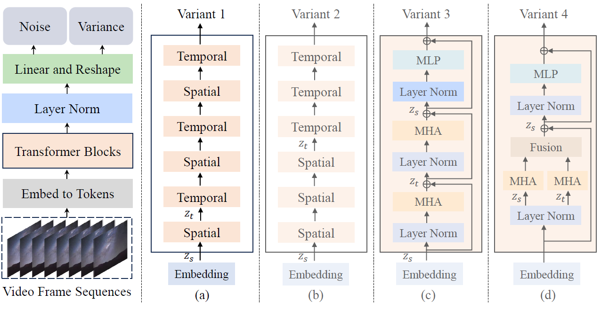

# Latte

!!!abstract
    Latte 是一种新的潜空间 Diffusion Transformer（Sora的同源技术，简单理解为将扩散模型中 U-Net 替换为 Transformer ），用于视频生成。

## 简介

Latte 是全球第一个开源的 Dit 模型，它的全称为 Latent Diffusion Transformer，有个热知识是 Latte 其实是拿铁的发音，也许是因为作者喜欢拿铁起的名。总体上，Latte 包含两个主要模块：预训练 VAE 和视频 DiT。预训练 VAE 编码器将视频逐帧从像素空间压缩到隐空间，视频 DiT 对隐式表征提取 token 并进行时空建模，最后 VAE 解码器将特征映射回像素空间生成视频。

传统的 Diffusion 中在去噪时使用的模型都是 U-Net，U-Net 是基于卷积的模型，但是基于注意力的模型更能捕获视频中更长的上下文关系，因此可以对 U-Net 进行替换。

## 架构和变体

LDM 是在隐空间中执行扩散过程的高效扩散模型，扩散和去噪过程和普通的扩散模型是完全一致的，Latte 在 LDM 的基础上做出了以下扩展：

1. 编码器用于压缩视屏帧至隐空间
2. 扩散过程使用 Transformer 建模隐时空信息

这篇文章提出了四个变体，如下图所示是 Latte 的架构：

以下是一些统一说明：

* video clip 在隐空间中表示为$V_L\in R^{F\times H\times W\times C } $，其中 $F$ 表示帧数，$H$ 表示高度，$W$ 表示宽度，$C$ 表示通道数。
* $V_L $转化为 Token 表示为$\hat{z}\in R^{n_f\times n_h\times n_w\times d} $，其中$t=n_h\times n_w $表示同一时间维度上的token数量，$n_f\times t $表示所有时间维度上的token数量，即token总数，$d $表示token的维度。
* 时空位置嵌入(Spatio-temporal positional embedding)记作$p $，最终输入 Transformer 的token表示为$z=\hat{z}+p $

1. Variant1 使用了两个 Transformer block，一个用于捕获同一时间索引的空间信息，另一个用于捕获时间维度上的信息，简单来说就是在$z_s $和$z_t $之间来回 reshape。
2. Variant2 在一开始只经过spatial Transformer block，来获取空间信息，在最后才经过temporal Transformer block，来获取时间信息。
3. Variant3 分解了多头注意力(multi-head attention)，每一个 Transformer block 都能捕获到时空信息。
4. Variant4 把多头注意力拆分成了并行的两部分，每部分使用一般的注意力，分别处理时间信息和空间信息，最后再拼接起来。

## 最佳架构设计

### Latent video clip patch embedding

