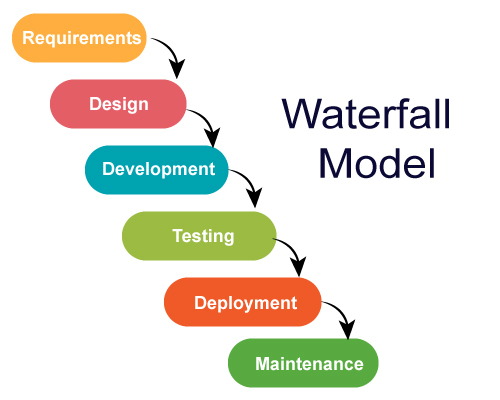
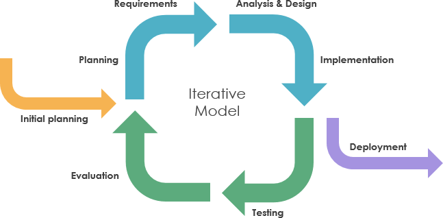
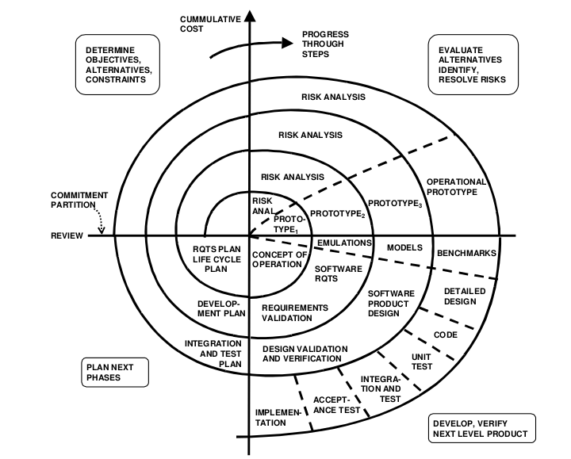
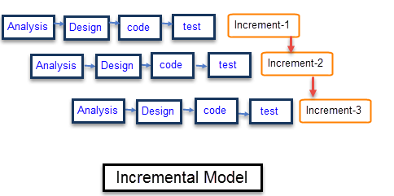
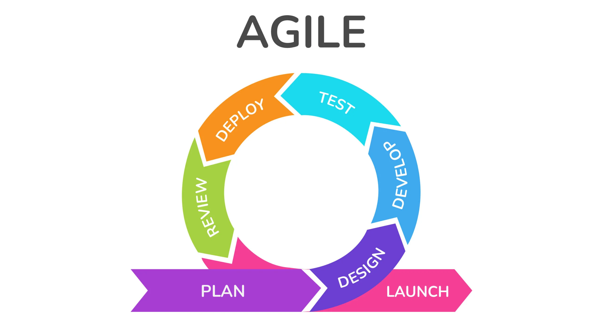

# 开发模式

## 软件的生命周期

软件开发生命周期（Software Development Life Cycle，SDLC）是开发团队用来设计和构建高质量软件的一系列过程，大致可以分为以下几个阶段：

1. 需求分析：获取用户需求
2. 计划：成本效益分析、资源调配等
3. 设计：确定构建软件的方案等
4. 实现：对产品进行编码
5. 测试：自动化测试和手动测试
6. 部署：将最新的构建副本移至生产环境
7. 维护：修复漏洞，解决客户问题，并管理软件变更

## 传统模型

### 瀑布模型

瀑布模型（Waterfall Model）是最早出现的软件开发模型，该模型在完成一个阶段(划分同软件生命周期)的工作以后，会进入下一个阶段的工作，一旦某个阶段被认为完成，就没有修改的余地了，像瀑布往下跌落了一级，不可能倒流回高处。

瀑布模型的缺点是只有在项目后期才能看出结果，失去了尽早纠正的机会，并且中后期没有修改需求的机会。

### 迭代模型

迭代模型(Interative Model)要求团队应从需求的一个小子集着手进行软件开发。然后，随着时间的推移，迭代地**增强版本**，直到软件可以用于生产环境。每一轮迭代都是完整的开发流程（可以认为符合瀑布模型），在每一轮迭代结束时都会生成一个新的软件版本。

迭代模型的缺点是管理的复杂度高，不适合小型项目。

### 螺旋模型

螺旋模型(Spiral Model)将迭代模型的小型重复循环与瀑布模型的线性顺序流相结合，通过反复的循环（螺旋）来逐步深化项目，并且在每个循环中都强调**风险分析**：

1. 目标设定
2. 风险分析与评估
3. 开发与测试
4. 评审与计划下一循环

螺旋模型也很复杂，管理的复杂度同样很高

### 增量模型

增量模型(Incremental Model)不是一次性交付完整的最终产品，而是先将产品划分为一系列相互独立的功能模块（增量），然后按优先级逐个设计、构建和交付这些模块。

增量模型需要将系统拆解成模块化设计，解耦是一件麻烦事，并且每一轮增加模块都需要新的集成测试，对于架构设计要求高是它最大的缺点。

!!!abstract 迭代模型、螺旋模型和增量模型的比较
    它们其实都在“迭代”，但过程中的关注点不同：

    - 迭代模型关注点的是版本的改进，每次迭代都可能对原有功能进行重构和深化。
    - 螺旋模型关注点是通过迭代来降低最大未知风险，每个循环可能包含原型开发、设计和测试等，内容由风险决定。
    - 增量模型每一轮增加的是模块，每次交付都增加了新功能，每个增量都经历完整开发流程。

## 敏捷开发

### 简介

敏捷开发（Agile Development）可以说是当前业界的最佳实践，它是一种迭代式、增量式的开发方法，旨在以更快的速度、更高的适应性和更少浪费的方式交付高质量的软件。它并不是一个方法，而是遵循敏捷宣言指导思想的一系列方法的集合。

敏捷开发和迭代模型虽然都会有迭代，但是存在一定区别。以房地产开发商修建10栋楼房为例，迭代模型每次迭代都修一层楼，至第N次迭代修完，要修完后开发商才能把楼房交付消费者。而敏捷开发可以第一次迭代先修1栋楼，这栋楼就可以拿去交付了，然后再依次修完剩下9栋。

敏捷开发的历史可以追溯到2001年的一场有关轻量开发的技术会议，到会的有17名轻量开发领域的大牛，他们最终起草了敏捷宣言(Agile Alliance)，原文如下：

- Individuals and interactions over processes and tools
- Working software over comprehensive documentation
- Customer collaboration over contract negotiation
- Responding to change over following a plan

### 方法论

这里仅列举部分方法

#### Scrum

Scrum框架是一种轻量级的敏捷开发框架，它通过迭代的方式逐步构建产品。Scrum框架的核心思想是**将复杂的开发任务分解为多个小的迭代周期**，每个迭代周期称为一个Sprint。在每个Sprint中，团队会完成一部分可工作的软件，并根据客户反馈和市场变化调整开发计划。Scrum框架强调团队的自组织和持续改进，通过定期的回顾会议和调整计划，确保项目能够快速适应变化，提高项目的成功率。

#### Kanban

Kanban是一种基于看板的敏捷开发方法，它通过可视化工作流程和限制在制品数量来提高团队的效率和质量。Kanban强调工作的可视化，通过看板将工作任务展示出来，让团队成员能够清晰地了解项目的进展情况。同时，Kanban还强调在制品数量的限制，通过限制在制品数量来减少任务的切换和浪费，提高团队的效率和质量。

#### Extreme Programming

XP是一种以技术为核心、以实践为基础的敏捷开发方法，它通过一系列的工程实践来提高软件的质量和开发效率。XP的核心实践包括结对编程、持续集成、测试驱动开发等。

- 结对编程（Pair Programming）：结对编程是指两个开发人员共同完成一个开发任务。
- 持续集成（Continuous Integration）：持续集成是指开发人员将代码频繁地集成到主分支中，并通过自动化测试确保代码的质量。
- 测试驱动开发（Test-Driven Development, TDD）：测试驱动开发是指开发人员在编写代码之前先编写测试用例，然后通过测试用例驱动代码的开发。
- 重构（Refactoring）：重构是指对代码进行优化和改进，以提高代码的可读性和可维护性。
- 用户故事（User Stories）：用户故事是XP中需求的表达方式，它以用户的角度描述需求，能够帮助开发人员更好地理解用户的需求。
- 短迭代周期（Short Iterations）：XP强调短迭代周期，通常为1-2周。短迭代周期能够快速交付可工作的软件，及时响应客户需求。