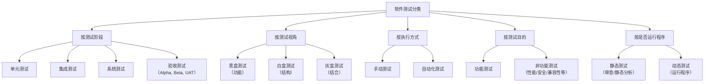

# 软件测试

## 测试分类

用一张图省流：



### 按照开发阶段

> 这里叙述的是 Policy，即要做什么，但具体实现可以多种多样，比如CI能够覆盖到很多东西，单元测试在CI中要跑，然后冒烟测试也可以在CI中跑，回归测试更是完美契合CI每次提交都触发检查的思想。

#### 单元测试

单元测试是对软件组成的最小单元进行测试，这个单元具体会因语言和编程范式有所区别，比如在OOP的语言中一般会按照类的方法来进行单元测试。单元测试理论上讲要完全解耦，但实际操作下来可能会存在困难，比如数据库就很难模拟，里面有很多一致性约束。单元测试在编码时会使用单元测试框架编写，比如Java的`JUint`，一般遵循AAA原则，即:

- Arange：组织测试需要的数据
- Act：执行核心方法
- Assert：验证结果是否符合预期（使用断言

#### 集成测试

集成测试，也称为联调，将多个存在依赖的模块按照合适的策略组合起来测试，测试对象实际上是模块间的接口。集成测试正常情况下发生在单元测试之后。

#### 系统测试

对功能、性能以及软硬件环境进行测试，其中包括：

- 冒烟测试：快速检查核心功能是否有问题，比如程序是否能运行
- 回归测试：确保后续提交不会导致先前代码出错

#### 验收测试

按照项目需求向客户展示软件效果，实际当中这一步的问题很多，因为没有一个统一的形式，在有的企业中也许向领导/客户展示一下前端最终效果即可，有的可能还会问更多的东西，比如把测试覆盖率当作KPI。


### 二分法

软测的老师也说二分法是很无聊的，事实确实如此，比如：

- 按照测试实施方：
  - $\alpha $测试：内测
  - $\beta $测试：公测
- 按照执行方式
  - 静态测试：比如扫描代码，检查是否符合代码规范
  - 动态测试：比如编译并执行单元测试
- 按照是否查看代码（虽然这个看起来是三分
  - 黑盒：完全不看代码，只管输入和输出
  - 白盒：知道全部代码，可以去研究代码细节
  - 灰盒：知道部分代码：介于黑白盒之间
- 自动化测试和手工测试
- 功能测试和非功能测试

## 实践

### 前端

前端一般没必要模块的测试，简单的项目都是看看UI和响应就可以了，毕竟平时的项目前端只是做一个简单的展示。

### 后端

#### 静态检查

一般会有对应的库，最常见的就是各种`lint`工具，比如`pyliny`，`eslint`等，静态检查和代码规范息息相关，实际上很多规则不需要完全人为遵守，会使用相应的`format`工具，比如`go fmt`。

#### 单元测试

单元测试自然是使用单元测试框架编写，比如现在需要测试一个`add_two`方法（这里拿`py`不使用测试框架简单模拟下流程），定义如下

```py
# canculate.py
add_two(a:int, b:int) -> int{
  return a + b
}
```

然后这里设计一个测试`2+3=5`

```py
from canculate import add_two

# 实际当中这个函数应该是测试类的一个方法
add_two_test(){
  # Arange
  a = 2
  b = 3
  # Act
  res = add_two(a, b)
  # Assert
  assert res==5, "The result is incorrect!"
}
```

测试环境应该和开发环境分离，如果需要数据库的话，关系型数据库就直接去新建一个`database`，当然，新开一个`contianer`也是可以的。