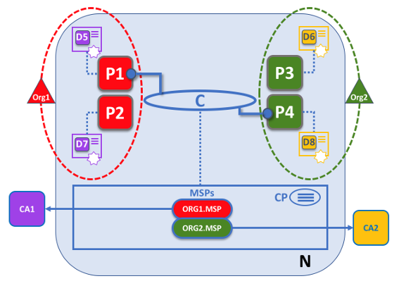

# Hyperledger

## 超级账本

### 简介

创立于2015年，由30个创始公司会员和一套技术和组织治理机构构成，是一个为了提高跨行业的区块链技术的开源项目。宣称“自从互联网诞生以来，除了互联网本身，没有比区块链技术更广泛、更根本的革命性技术了”。

### 发展历程

Hyperledger Fabric 是一个企业级的、开源的分布式账本技术（DLT）平台，专为企业环境设计，它是**联盟链**，参与者需要经过身份验证和授权才能加入网络。**Hyperledger Fabric 不是公链，也不发行加密货币。**

Hyperledger 最重要的项目就是2015年发布的 **Hyperledger Fabric**


### 架构

Fabric 的架构可以分为三个部分：

1. 成员服务(Membership Service)：会员注册、身份保护、内容保护、交易审计功能
2. 区块链服务(Blockchain Service)：节点的共识管理、账本的分布式计算、账本的存储以及节点间的P2P协议功能的实现
3. 合约代码服务(Chaincode Service)：提供智能合约的服务

## 成员服务

### PKI & MSP

区块链本身是去中心化的，但是身份管理无法去中心化，还是需要一个中心化机构发放证书。

- Hyperledger Fabric 支持一个交易网络，在这个网络中，**所有参与者都拥有已知的身份**。
- 公钥基础设施(PKI)用于生成与组织、网络组件以及终端用户或客户端应用程序相关的加密证书。
- 成员服务提供者(MSP)分发证书，可以定义身份概念，同样可以定义管理和认证这些身份的规则。

### 主体

主体(principle)是一个数字身份（类似于现实中的身份证）

- 封装在X.509 数字证书中的一个数字身份及其相关属性
- Fabric里的一个参与者
- 体现为公私钥，但是证书不仅仅是公私钥

### CA 体系

Fabric有一个独立的Fabric CA模块，用来管理证书服务，专门进行证
书发放、管理和身份验证，当然Fabric也允许第三方CA机构的接入。

CA 签发的证书并不只有一对公私钥，否则用户自己也可以生成，需要有发放证书的机构的背书。一个CA证书（X.509标准）中大致有以下内容：

1. 一个自签名（X.509）CA 证书列表来组成信任根（root of trust）
2. 一个X.509证书列表来代表证书验证时需要考虑的中间证书
3. ......

如下图所示，证书的签发是逐层向下的过程，证书中包含了所有上级节点的签名，所以证书的关系会构成一棵树，这和现实中的身份证不一样，


## 区块链服务

### 简介

区块链服务用于维护分布式账本。区块链服务包括P2P协议、分布式账本和共识机制管理。

1. P2P协议：Fabric网络中，Peer和Orderer采用gRPC对外提供远程服务，供客户端进行调用。网络中的节点之间通过Gossip协议进行同步
2. 共识机制：Fabric允许根据实际业务需求选择合适的共识机制，目前支持SOLO、Kafka和Raft三种共识机制
3. 分布式账本：包含两个组件，世界状态和交易日志。世界状态是最新的分布式账本状态，而交易日志记录的是世界状态的更新历史，一经创建就无法修改
4. 账本存储：支持LevelDB和CouchDB

### 结构

Fabric 面向的是现实当中的场景，它的机制设计的相比比特币和以太坊更加复杂。如下图所示，Fabric 引入了通道(channel)的概念，通道可以理解为子链


一个通道可以由多个组织构建，每个组织里面可以有若干个节点，当然，这些节点的权限可以不一样，这体现了联盟链的概念。


组织中节点的身份需要认证，还需要加入上文提到的CA体系，每个组织可以有自己的MSP和CA，下图中的CP是Channel Policy，指的是通道需要遵守的政策（本质也是一组链码）



### 节点

总的来说，Fabric 的节点包括：

1. Client：最终用户，至少连接一个Peer节点或一个Oederer节点，一般只保存与自己有关的账户数据
2. Orderer：相当于共识节点，不过fabric中的共识是被拆解了的，它接收包含背书签名的交易，对未打包的交易进行排序生成区块，并广播给Peer节点
3. Peer：负责通过执行链码实现对账本的读写操作，所有Peer节点都是提交节点，负责维护状态数据和账本的副本
4. Endorser：背书节点，部分Peer节点根据背书策略的设定会执行交易并对结果进行签名背书，充当了背书节点

#### Peer 节点

> 智能合约的背书策略明确了在交易被接受并且记录到提交节点的账本之前，需要哪些组织的Peer 节点为交易签名。

所有的Peer 节点都是一样的，Peer 节点能够担当多个角色：

- 提交节点：每个Peer 节点都是一个提交节点。他们会接收生成的区块，在这些区块被验证之后会以附加的方式提交到Peer 节点的账本副本中。
- 背书节点：每个安装了智能合约执行引擎的Peer 节点都可以作为一个背书节点，但要根据合约的背书策略来进行选择。
- 主节点：负责将交易从排序节点分发到其它的提交节点
- 锚节点：如果一个Peer节点需要与其他组织的Peer节点通信，那么可以使用对方组织通道配置中定义的锚节点

### 通道

Fabric的通道(channel)是构建在Fabric区块链网络上的由若干个节点所组成的一条链，实现了**数据的私有和保密**。

一个Peer节点至少接入一个通道，可以接入多个通道，每个通道拥有自己单独的账本，且仅对通道成员节点共享。

### 账本

- 世界状态是一个数据库，它存储了一组账本状态的当前值。默认情况下以键值形式表示，可以创建、修改、删除状态，所以**世界状态是可以频繁修改的**
- 区块链是交易日志，它记录了促成当前世界状态的所有改变，一旦写入数据就是**不可篡改**的

#### 世界状态

采用key-value数据库实现，如LevelDB, CouchDB等，存储的格式大致如下，具体的内容取决于应用场景

```c
{
    key = K,
    value = V
} version = 0
```

#### 区块链

区块链的结构和比特币大同小异，一个区块包含：

- 区块头：
  - 区块编号：编号从0（初始区块）开始，每增加一个新区块加1。
  - 当前区块的哈希值：当前区块中包含的**区块数据(交易)** 的哈希值。
  - 前一个区块头的哈希值：区块链中前一个**区块头**的哈希值。
- 区块数据：这部分包含了一个有序的交易列表。区块数据是在排序
服务创建区块时被写入的。
- 区块元数据：这个部分包含了区块被写入的时间，还有区块写入者的
证书、公钥以及签名。


交易的结构：

1. 头：记录了关于交易的一些重要元数据，比如，相关链码的名字以及版本。
2. 签名：包含了一个由客户端应用程序创建的加密签名。
3. 提案：负责对应用程序供给智能合约的输入参数进行编码，随后该智能合约生成提案账本更新。
4. 响应：以读写集（RW-set）的形式记录下世界状态之前和之后的值。
5. 背书：是一组交易签名响应，这些签名都来自背书策略规定的相关组织，并且这些组织的数量必须满足背书策略的要求。

## 合约代码服务

### 链码

!!!note
    链码和智能合约的概念还是有点不一样，一个链码可以包含多个智能合约

Fabric没有像以太坊那样有一个自己的虚拟机，而是利用docker容器，在宿主机上创建一个虚拟环境来运行链上的代码，因此链上代码可以是任意语言。链上的代码是图灵完备的，为了防止死循环，为代码执行设置了一个计时器。


### 背书

每个链码都有一个背书策略与之相关联，该背书策略适用于此链码中定义的所有智能合约。背书策略非常重要，它指明了区块链网络中哪些组织必须对一个给定的智能合约所生成的交易进行签名，以此来宣布该交易**有效**。

### 交易验证

智能合约提取一组名为交易提案的输入参数，并将其与程序逻辑结合起来使用以读写账本。对世界状态的更改被捕获为交易提案响应，该响应包含一个读写集，其中既含有已读取的状态，也含有还未书写的新状态。注意，**在执行智能合约时世界状态没有更新！**

一项交易被分发给网络中的所有节点，各节点通过两个阶段对其进行验证。首先，根据背书策略检查交易，确保该交易已被足够的组织签署。其次，继续检查交易，以确保当该交易在受到背书节点签名时它的交易读集与世界状态的当前值匹配，并且中间过程中没有被更新。如果一个交易通过了这两个测试，它就被标记为有效。**所有交易，不管是有效的还是无效的，都会被添加到区块链历史中，但是仅有效的交易才会更新世界状态。**

下图展示了一个交易的流程，有两个组织 ORG1和ORG2，背书策略是同时需要ORG1和ORG2的签名。下面那调用了`transfer`方法将CAR1从ORG1转移到了ORG2，产生了交易t3，这笔交易是成功的。此外，t4是失败的，但它也被包含进了区块。


智能合约以编程方式访问账本，在世界状态中将状态写入（put）、读取（get）和删除（delete），还可以查询不可篡改的区块链交易记录。

### 链码的部署

> 链码定义是一个结构，其中包含控制链码运行的参数

首先需要打包链码（打包成tar），这个过程可以由一个组织完成，也可以由每个组织完成，然后在peer节点上安装链码，建议是每个组织使用同一份打包后的链码进行安装。

接下来由peer administrator发起批准，通过后提交给ordering服务，然后分发给所有peer节点。即使一个组织有多个peer，也只需为组织批准一次链码，而且是每个组织各批准各的，这体现了去中心化的思想。

最后由peer administrator发起链码定义的提交transaction（系统级别的交易），经通道中的peer节点背书通过后提交给ordering服务，然后把该链码的定义提交给通道。

## 共识机制

> fabric 中不存在转账交易，只有合约交易，所有交易都是对智能合约的调用。

### 简介

Fabric的共识是广义的共识，不仅仅是就交易顺序达成一致，其被定义为组成区块的一组交易的正确性的闭环验证。Fabric 的设计依赖于**确定性**的共识算法，账本**不会**像其他分布式的以及无需许可的区块链中那样**产生分叉**。

Fabric 共识组成：

1. 提案和背书（proposal and endorsement）
2. 排序（ordering）
3. 验证和提交（validation and commit）

### 提案和背书

fabric 中交易并不完全由发起者决定，提案响应和背书都是由相应Peer节点生成的，在经历提案和背书后交易就是完整的了，注意此处并不会对账本直接进行修改。

- 交易提案：客户端应用程序提交已签名的交易建议(通过其连接到的Peer节点的网关服务)
- 交易执行：网关服务选择peer节点(验证节点)来执行提案中指定的链码，生成提案响应（包含读写集），并在对提案响应签名后将其返回给网关
- 交易背书：网关为链码背书策略要求的每个组织（背书节点）重复执行交易，收集已签名的提案响应并创建一个事务信封，最终将其返回给客户端

### 排序

排序服务保证了一个区块中的交易是严格有序的，并且在不同账本副本中是一致的，注意排序节点并不会检查交易的内容，它只机械地进行排序。并不是每个Peer节点都需要连接到一个排序节点，Peer节点可以使用gossip协议将区块关联到其他节点。

- 交易发送：客户端将已签名的事务信封（即上一步得到的完整交易）发送到网关服务。网关将信封转发到排序节点，并向客户端返回成功消息
- 交易排序：排序节点验证签名，对交易进行排序，并将其与其他排序交易打包成区块，然后将区块分发给通道中的所有节点

### 验证和提交

- 交易验证：每个peer节点检查交易信封上的客户签名是否与原始交易建议书上的签名匹配，所有读写集和状态响应是否等效，以及背书是否满足背书策略，然后将每笔交易标记为有效或无效。
- 交易提交：每个Peer节点将排序的交易块提交到通道账本，提交是对通道账本的不可变账本更新，而通道的世界状态仅使用有效交易的结果进行更新。
- 提交事件：每个提交到账本的Peer节点都会向客户端发送一个提交状态事件，其中包含账本更新的证明。


### 排序服务

Fabric将排序服务设计成了可插拔模块，可以根据不同的应用场景配置不同的共识选项：

- Solo是一种部署在单个节点上的简单时序服务，它只支持单链和单通道。
- Kafka（就是平时说的那个消息队列）是一种支持多通道分区的集群共识服务，可以支持CFT
- Raft是一个分布式崩溃故障容错共识算法
- Fabric 的 BFT 排序实现是SmartBFT 协议，该协议本身可以被认为是PBFT 协议的非流水线版本。

### Raft 协议

Raft是一个管理复制日志的共识算法，复制日志是复制状态机的组成部分。

1. 客户端向主导节点发送包含命令的请求
2. 主导节点将收到的请求追加到其日志中，并将该请求发送给所有的跟随节点。跟随节点也会将该请求追加到自身的日志中并返回一个确认消息
3. 一旦主导节点收到大部分跟随节点的确认消息，就会将命令日志提交给其管理的状态机(区块链中可以认为是账本)。一旦主导节点提交了日志，跟随节点也会将日志提交给自身管理的状态机
4. 主导节点向客户端返回响应结果


节点的三个状态：

1. 跟随状态：初始情况下，所有的节点都处于跟随状态，如果相互通信发现找不到主导节点，就将自己的转为候选状态
2. 候选状态：处于候选状态的节点会发起选举，如果它收到集群中大多数成员的投票认可，就转换为主导状态。
3. 主导状态：处理客户端请求并确保所有的跟随节点具有相同的日志副本。主导节点不可以重写其自身的日志。
4. 如果候选节点发现已经选出了主导节点，它就会退回到跟随状态。同样，如果主导节点发现另一个主导节点的任期值（一个单调递增的整数值，用来标识主导节点的管理周期）更高，它也会退回到跟随状态。

Raft使用心跳机制来触发主导节点的选举，主导节点会周期性发送心跳消息给所有的跟随节点来维持其主导地位，如果某个跟随节点在一段时间内没有收到心跳消息，就发生选举超时事件，该节点就认为目前没有主导节点并发起选举来选出新的主导节点。