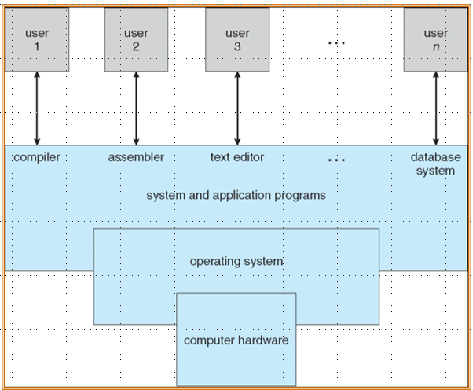
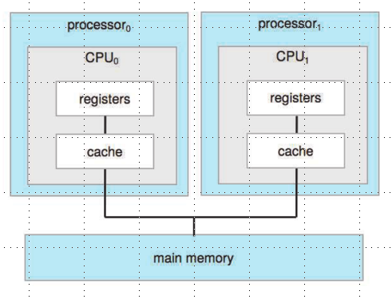
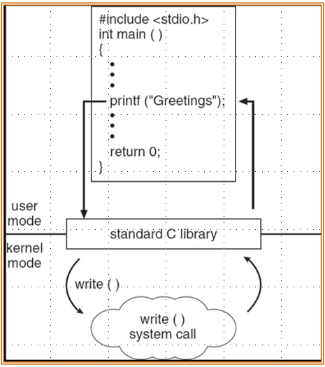
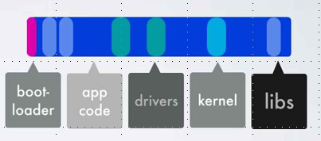

# 概述

## 基本概念

### 定义

操作系统是用户和硬件的媒介，目标是执行用户的程序，让解决用户问题更简单,和使计算机系统方便使用。操作系统的层级如下图所示，可以有多个用户（Linux是真支持同时多用户，Win和Mac不是）使用。操作系统在系统和应用程序之下工作，严格意义上的操作系统就是指操作系统内核。

{width="400"}

操作系统不存在统一的定义，可以大概等价操作系统厂商给你的东西
，一直在运行的是操作系统内核(kernel)，其它的最多都只能算系统软件。在电脑开机和重启时，需要先加载 bootstrap program，它通常保存在 ROM 或者 EPROM 中，作用是初始化系统，加载操作系统内核，然后从固定位置开始执行。

### 组织

一个或多个CPU和设备控制器(device controller)通过公共总线连接，可以访问共享的内存，因而CPU和其它设备的并发(concurrent)执行会竞争内存。

具体而言，每个设备控制器负责特定的类型，有自己的local buffer，CPU可以向主存和local buffer读写数据。所谓的I/O是数据从设备传输到控制器的local buffer，设备控制器在完成IO操作时会通过中断(interupt)通知CPU

### 中断处理

> 中断(interupt)在不同架构下有不同的说法，在RICV架构下，中断统称trap，分为 exception(ecall) 和 interupt

操作系统是中断驱动的(interupt-driven)

1. 中断通常会通过中断向量(interupt vector，即interupt routine的地址)将控制权交给 interupt service routine(ISR)
2. 中断架构必须保存中断发生的地址，以便中断处理结束后程序继续执行程序
3. 当一条中断在处理时，新来的中断会被禁止，以免丢失当前中断信息

在中断处理时操作系统会保存寄存器（CPU的状态），中断系统有两种：

1. Pooling（轮询）：当中断信号产生时，不知道是哪个设备触发了中断，会去依次检查可能触发中断的设备，一旦找到了设置了中断标志的设备，就会跳转到特定的ISR去处理它
2. Vectored（向量中断）：当中断发生时，会附带上中断向量（数字），中断向量有可能是中断处理程序的地址或者中断向量表的索引，这样就可以直接跳转到对应的 ISR

### IO 架构

#### 同步IO

在IO开始后，CPU会一直等待，直到IO结束才会将控制权返还用户程序，让它执行下一条指令。这个过程中CPU会不断循环检查IO设备的状态寄存器(wait loop)，这样一次只能处理一个IO请求，效率比较低。

#### 异步IO

在IO开始后，控制权会立刻返还给用户程序，让它继续去执行后面的计算。尽管控制权返回了，但某些特定操作可能需要IO结果，如果IO此时未完成，会通知操作系统将用户程序设置为等待状态。

为了管理多个设备，操作系统维护了一个设备状态表(Device Status Table)，表中记录了所有设备的IO详细信息（类型、地址和状态），当IO完成工作后，它会发一个中断给操作系统，操作系统收到中断信号后，会查找IO状态表，修改对应的状态。

{width="400"}

#### DMA

DMA(Direct Memory Access)是指设备控制器不经过CPU直接将 local storage 中的数据发送到主存，每个块只会产生一次中断（经过CPU是1byte一次），对于高速IO设备来说能够以接近主存的速度传输信息。

### 存储级别

还是那个见了无数次的计算机存储结构图，这里不赘述

{width="400"}

### 多CPU架构

#### SMP

SMP(Symmetric Multiprocessing)，每个CPU有自己的寄存器和Cache，所有CPU共享主存，从图上看是对称的

{width="300"}

此外，可以把两个CPU放在同一个主板上，共享L2 Cache，这样开销更小

{width="300"}

#### NUMA

- 不同CPU通过共享的 system interconnect 连接
- 在处理器不断增多的情况下扩展起来是高效的
- 通过interconnect进行远程内存访问是较慢的

{width="250"}

### 分类

这里需要区分 Multiprogramming 和 Multitasking 这两个概念。

- **Multiprogamming** 是为了**提高CPU利用率**，因为单一用户并不能保证CPU任意时间都在运行，multiprogamming通过组织任务（多个程序同时在内存中）保证CPU持续工作，当一个任务需要IO时，CPU可以去处理其它任务。
- **Timesharing(Multitasking)** 是指CPU切换任务非常频繁，用户可以跟运行中的任务**交互**，每个用户至少有一个任务在内存中需要执行。如果许多任务同时ready，就需要进行调度，此外，如果一个进程无法直接放入内存，那就只有一点点地加载，不过虚拟内存允许执行的进程不完全在内存中。

### 内核状态

为了保护内核和其它系统软件，操作系统区分了内核态和用户态，硬件会提供对应的状态位，因而可以区分系统是在运行用户代码还是内核代码，并且在设计时，一些指令是 privileged ，只能在内核态下执行。可以通过系统调用改变内核的状态，进入/退出内核态。

### 计时器

计时器能够避免无限循环和进程耗尽资源，操作系统会减少计数器的值，当减少到0产生中断，并在调度线程重新获得控制权前或超出分配的时间时重新设置计数器。

### 功能模块

具体的功能就是操作系统这门课后面要学习的，大的方面包括

1. process management
2. memory management
3. (mass) storage management
4. IO subsystem(IO 也可以当做文件，Linux就是这么干的)

## 结构

### UI

CLI 和 GUI 相比更加精准，CLI在内核或者系统程序实现的，也可能是混合实现。CLI执行的指令有些是内置的（DOS），有些仅仅是程序的名称（Unix），后者在扩展新功能时不需要调整Shell

### 系统调用

系统调用本质是 OS 服务在用户态的接口，但程序通常会使用 API 而不是直接使用系统调用。通常，每个系统调用会有自己的数字编号，调用者用这个编号就可以去执行对应的系统调用，然后得到返回值，故不需要知道系统调用是如何实现的。

总的层级是这样的：

1. 最底层：硬件
2. 第二层：操作系统内核（提供系统调用）
3. 第三层：标准库/运行时环境（提供用户API）
4. 最上层：应用程序

用户API提供了进一步的抽象，比如C的`fopen`可以在Windows或Linux上使用，但由各自平台的标准库实现去调用对应的系统调用。

{width="300"}

系统调用相当于是执行了一个内核态的函数，故需要传递对应的参数，这里有三种方式传参：

1. 寄存器
2. 内存地址
3. 栈

### 系统程序

系统程序提供了程序开发和执行的便利环境，包括：

1. 系统调用的用户接口
2. 系统工具，如文件管理、磁盘管理和设备驱动程序等
3. 开发工具，如编译器、汇编器、链接器和调试器

### 架构

#### 微内核

微内核(Microkernel)将尽可能多的功能移到了用户空间，用户模块之间通过 messaging passing 交流。微内核的优点如下：

1. 容易扩展，容易迁移到新的架构，因为大量操作是在用户态
2. 更可靠，更安全，因为更少的代码跑在内核态

缺点是用户模块之间的通信开销大

{width="400"}

#### 分层架构

像网络一样分层，最高层是用户接口，最底层是硬件，每一层只使用其下一层的接口，但实际做不到。

#### 模块化

大部分现代操作系统实现了 kernel module:

- 使用面向对象的方法
- 每个核心组成都是独立、可装载的，换言之，只需要加载需要的模块
- 相互直接通过接口交流（函数调用）

{width="400"}

#### 外核

外核(Exokernel)是指高度简化kernel，只负责资源分配和提供低级硬件操作，必须通过定制library供应用使用，高性能但兼容性差，所以工业界不可能用。

#### Unikernel

Unikernel 是指将kernel当做库，静态链接到需要的地方

#### 例子

MS DOS 没有模块划分，以最少的空间提供最多的功能

{width="200"}

Unix 被硬件限制住了结构，只有独立的两层：

1. System Program
2. The kernel：包含系统调用之下，硬件之上的所有内容

{width="350"}

Darwin（mac和ios的底层）使用的是混合架构（微内核和宏内核），Mash 是微内核，BSD 是宏内核

{width="200"}

## 虚拟机

虚拟机(Virtual Machine)将真实硬件和操作系统内核都视为硬件，为底下的裸机提供了独立的接口。Hypervisor 是虚拟机和底层物理硬件之间的中介，主要有两种：

1. Type-1 Hypervisor（原生型）：直接运行在物理硬件上，取代了传统的主操作系统，比如 Microsoft Hyper-V
2. Type-2 Hypervisor（托管型）：作为应用程序运行在传统的操作系统之上，比如 Vmware workstation

下面是一些技术的示意图，最左边是 Type-1 Hypervisor 的虚拟机，中间是容器技术，容器技术本质上是对Linux的分区，最右边是 unikernel，内核代码和应用程序代码直接在一起。

{width="400"}