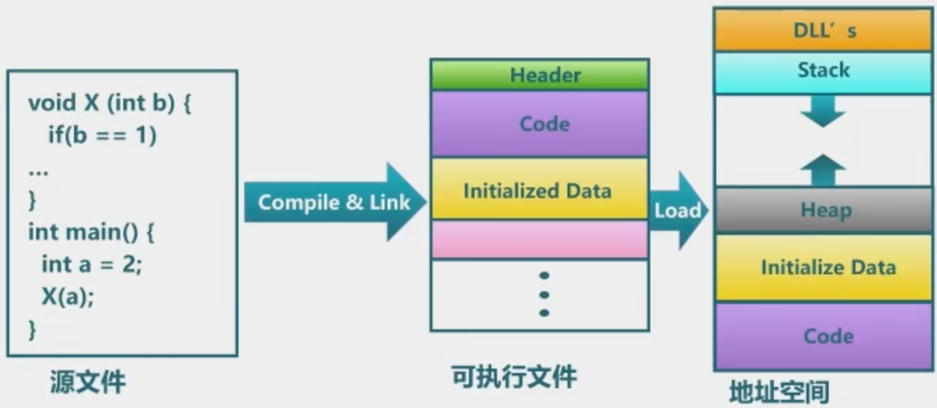
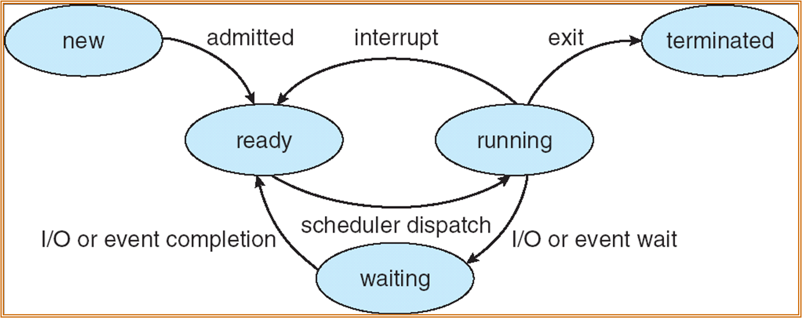
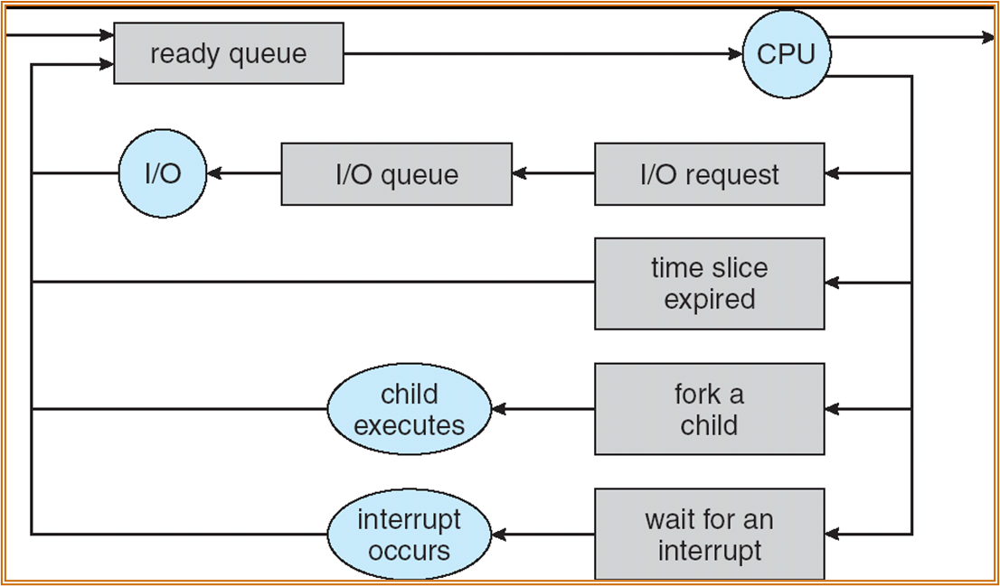
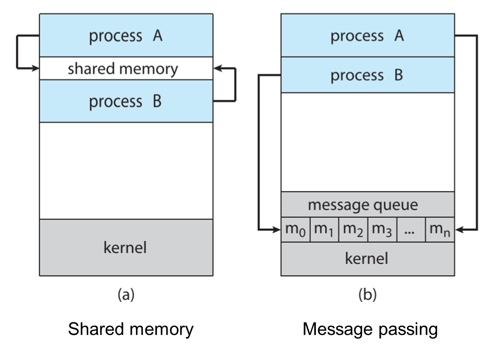

# 进程

## 概念

### 什么是进程？

> job 在教材中几乎和 process 等价

操作系统执行一系列的程序，可以分为：

- 批处理系统(batch system)：一种非交互式的操作系统，操作员将多个等待处理的作业组织成一个批次（batch），然后由系统自动按顺序执行。一旦作业开始执行，用户就不能再干预或与程序进行交互，直到整个作业完成。
- 分时系统(time-sharing system)：是一种交互式的操作系统，系统会把CPU分配给每个用户进程，用户可以实时地输入命令并得到响应。（通常会用到CPU调度中的RR）


> 这里的栈和堆不是数据结构的栈和堆，只是指一段特定地址空间

进程，顾名思义，就是进行中的程序，进程必须按照线性方式运作。一个进程通常包含：

- text section(code)
- data section(global vars)
- stack(function parameters, local vars, return addresses)
- heap(dynamically allocated memory)
- program counter

{width="400"}

### 进程状态

!!!note "什么情况下会到 waiting？"
    到waiting都是主动停止执行的，被动停止执行是到ready态

进程在执行中会改变状态，其可能的状态有：

- 新建(new)：新创建的进程
- 运行中(running)：指令被执行
- 就绪(ready)：进程等待被加载进内存
- 等待(waiting/blocked)：进程在等待一些事件
- 结束(terminated)：进程结束执行

{width="500"}

### 进程控制块

进程控制块(Process Control Block, PCB)中存储了每个进程相关的信息：

- 进程状态
- PC位置
- 寄存器的值
- CPU调度信息
- 被分配的内存
- I/O 状态

在切换进程时实际是切换PCB，将当前进程的PCB保存，加载新进程的PCB

{width="400"}

## 进程调度

### 调度队列

进程调度涉及到的数据结果是进程调度队列，进程在执行过程中会在以下队列中变动

- Job queue：系统中的所有进程
- Ready queue：已经在主存中等待执行的进程
- Device queue：等待I/O的进程

{width="400"}

### 调度器

调度器本质是一段代码，可以分为：

- 长期调度器：选择哪些进程应该被移入内存（ready queue）
- 短期调度器：选择哪些进程应该接下来被分配CPU

短期调度器使用的非常频繁，长期调度器使用的非常不频繁，长期调度器控制了multiprogramming的程度。

进程可以被描述为：

- I/O-bound process：花费更多时间在I/O上
- CPU-bound process：花费更多时间在计算上

---

实际上 Unix/Windows都不使用长期调度器，主要原因是：

- 在早期的计算机中，内存是稀缺资源，但如今有较大的内存，并且会有虚拟内存之类的管理技术
- Unix/Windows 都是分时系统，如果由长期调度器来决定哪些进程在内存中，用户的体验会很差

取而代之的是有中期调度器，其负责换出或换入内存中的进程，以控制内存中的进程总数。

### 上下文切换

当CPU切换到另一个进程时，系统必须保存旧进程的状态，并加载新进程的状态。上下文切换是纯粹的开销，因为期间系统不能完成任何有效工作。

## 针对进程的操作

### 进程创建

父进程创建子进程，子进程可以继续创建自己的子进程，形成树状结构：

- 资源共享：
  - 父子进程共享所有资源
  - 子进程共享父进程的部分资源
  - 父进程和子进程不共享资源
- 执行：
  - 父进程和子进程并发执行
  - 父进程等到子进程结束
- 地址空间：
  - 子进程复制父进程的
  - 子进程加载一段新的程序

在Unix中`fork`系统调用能够创建新的进程，而`exec`系统调用能够用新程序替换进程的内存空间。

可以用C写一段示例代码：

- `fork`产生了子进程，其设计成了在父进程中返回子进程进程号，在子进程中返回0
- 父进程等待了子进程的结束，一旦子进程结束，会将其资源回收

```c
int main()
{
    pid_t pid;
    // fork another process
    pid = fork();
    if(pid < 0){
        fprintf(stderr, "Fork Failed");
        exit(-1);
    }
    else if(pid == 0){
        execlp("bin/ls", "ls", NULL);
    }
    else{
        wait(NULL);
        printf("Child Complete");
        exit(0);
    }
}
```

### 进程结束

进程执行完最后一条语句后，会请求操作系统删除它：

- 将子进程的数据输出到父进程（通过`wait`）
- 子进程的资源被操作系统回收

父进程可能会主动结束子进程的执行(`abort`)：

- 子进程使用超出了分配的资源
- 分配给子进程的任务不再需要了

一些操作系统不会允许父进程结束后子进程继续执行，而在另一些操作系统中这种情况下子进程会被重新分配一个父进程（比如起始进程`init`）

## 协作进程

独立(Independent)的进程不能影响或被其它进程的执行影响，而协作(Cooperating)进程可以影响或被其它进程的执行影响。进程协作的好处有：

- 信息共享
- 计算加速
- 模块化
- 便捷

### 生产者-消费者问题

协作进程的范式：

- 生产者生产信息
- 消费者消费信息

分为两种情况：

- 无界缓冲区：生产者不需要等待，因为可以不断向缓冲区存入信息，但消费者必须等待缓冲区中有内容
- 有界缓冲区：生产者在缓冲区满了时必须等待，消费者在缓冲区空了时必须等待

由于无界情况可以看做特殊的有界情况（缓冲区非常大），所以这里主要讨论有界情况，这个问题可以用如下代码抽象：

被共享的数据：

```c
#define BUFFER_SIZE 10
typedef struct {
    ...
}item;

item buffer[BUFFER_SIZE];
int in = 0;
int out = 0;
```

生产者的伪代码：

```c
while(true) {
    // Produce an item
    while(((in + 1) % BUFFER_SIZE) == out);
    buffer[in] = item;
    in = (in + 1) % BUFFER_SIZE;
}
```

消费者伪代码

```c
while(true) {
    while(in == out) ;
    // Remove an item from the buffer
    item = buffer[out];
    out = (out + 1) % BUFFER_SIZE;
    return item;
}
```

上面这种实现是正确的，不过实际只能使用`BUFFER_SIZE - 1`的空间，原因是`in == out`是初始状态，表示的是缓冲区为空，改进方案是增加一个变量维护目前缓冲区中的元素数目。

## 进程间通信

进程间通信(Interprocess Communication)是用于进程间沟通和同步行为的机制，有两大模型：

- 消息传递(message passing)：提供两种操作`send(message)`和`receive(message)`
- 共享内存(shared memory)

{width="400"}

这里主要讨论消息传递

### 直接交流

进程必须知道彼此的名字：

- `send(P, message)`：发送一条消息到进程P
- `receive(Q, message)`：从进程Q接收一条消息

链接(link)的性质：

- 链接是自动建立的
- 一个链接被分配给一对沟通进程
- 每对沟通进程间有且仅有一个链接
- 链接可以是单向的，但通常是双向的

### 非直接交流

使用邮箱，每个邮箱有一个唯一id，进程只有在共享邮箱时可以交流。链接的性质如下：

- 链接只有在进程间共享邮箱时才会建立
- 一个链接可以被分配给多个进程
- 每对沟通进程之间可能共享多个链接
- 链接可能是单向的，也可能是双向的

操作：

- 创建新邮箱
- 通过邮箱发送接收消息
- 销毁邮箱

通信原语(Primitive)被定义为：

- `send(A, message)`：发送一条消息到邮箱A
- `receive(A, message)`：从邮箱A接收一条消息

但是这样会出问题，比如$P_1 $、$P_2 $和$P_3 $共享邮箱A，$P_1 $发送，$P_2 $和$P_3 $接收，这样是无法确定到底谁收到了消息的？

解决方法（以下任一）：

- 只允许一个链接被分配给至多两个进程（感觉有点退化成了直接交流）
- 只允许同时有一个进程执行接收操作
- 允许系统随机选择接受者，并反馈给发送者谁收到了消息

### 同步

消息传递要么是同步(Synchronization)的，要么是异步(Asynchronization)的。阻塞式(blocking)被认为是同步的：

- blocking send：发送者必须等到消息被接收
- blocking receive：接受者必须等到有消息

非阻塞式被认为是异步的：

- non-blocking send：发送者发完消息就可以去干别的事了
- non-blocking receive：接收者可以接收有效消息或者空值

### 缓冲区

缓冲区是指消息的队列，有三种实现：

- zero capacity：发送者必须等待接收者
- bounded capacity：发送者在缓冲区满了时必须等待
- unbounded capacity：发送者无需等待