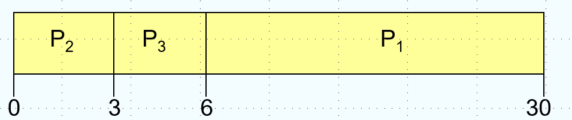
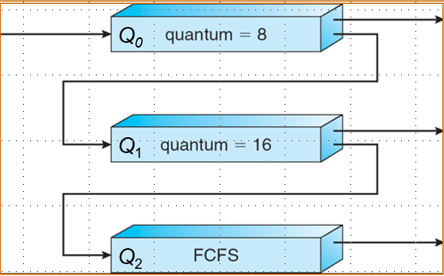

# CPU调度

## 基本概念

调度的对象是进程/线程，调度的资源是CPU，调度的目标是 Maximun CPU utilization obtained with multiprogramming 

CPU burst 往往是比较短的，所以调度算法使用的非常频繁，调度需要高效。CPU 调度需要从 Ready 的进程中选一个来执行，CPU 调度发生在：

1. 进程从 running 切换到 waiting 的时候，比如需要IO
2. 进程从 running 切换到 ready 的时候，比如中断
3. 进程从 waiting 切换到 ready 的时候，比如IO结束
4. 进程结束的时候

其中 1 和 4 是 nonpreemptive，因为是主动的，而 2 和 3 是 preemptive，因为是被动的

### dispatcher

> 在多线程编程中，dispatch 一般指将一个任务分配给一个可用线程去执行的过程

dispatcher（调度程序）将CPU的控制交给被短期调度器选中的进程，先切换上下文，然后返回用户态，最后跳转到正确的地方继续执行程序，这个过程存在 dispatchaer latency

### 调度目标

- Max CPU utilzation
- Max throughout（单位时间完成的线程数量）
- Min turnround time（完成一定数量线程所需的时间）
- Min waiting time（进程在ready queue中等待的时间）
- Min response time（从请求被提交到产生首个响应之间的时间，相当于用户感到自己的请求被处理的时间）

## 调度算法

### FCFS

First-Come, First-Served（先来先服务）顾名思义是先处理最早到达的请求，即一个典型的 queue

> 这一章要会画甘特图，之前期末有考过

- Waiting time for P1 = 0, P2 = 24, p3 = 27
- Average waiting time: (0+24+27)/3 = 17
- Turnround time: P1 = 24, P2 = 27, P3 = 30
- Throughput: 3/30

但是如果到达的顺序交换

- Waiting time for P1 = 6, P2 = 0, p3 = 3
- Average waiting time: (6+0+3)/3 = 3

可以看到比上面的等待时间小了不少，这个现象被称作护航效应(convoy effect)，当短进程在长进程之后时，平均等待时间会很长，导致IO设备被闲置。所以FCFS有利于长作业，不利于短作业；有利于CPU繁忙型，不利于IO繁忙型。

### SJF

SJF(shortest job first)如果**知道每个任务接下来的CPU burst**，可以选择优先处理CPU burst最短的任务，这个调度算法可以是 preemptive 也可以是 nonpreemptive

- 对于非抢占式，CPU时间分配了就只有等它运行完
- 对于抢占式，当有比在运行的进程剩余时间更短的CPU burst 的进程到达时会发生抢占，这种调度方法也被称为 SRTF(Shorest-Remaining-Time-First)

易知优先处理最短的任务可以得到最小的平均等待时间（平均周转时间应该也是最小的），相当于是一个greedy algorithm

> 这个其实是排序不等式，逆序和 <= 乱序和 <= 正序和，不过这里用更直接的方法证明

证明:
1. 不妨设非最短任务优先调度的序列是$p_1, p_2, \dots, p_n $，$p_i $的时长记作$t_i $，其总的等待时间为$0 + t_1 + (t_1 + t_2)+\dots + (t_1 + t_2 + \dots + t_{n-1})=(n-1)t_1 + (n-2)t_2 + \dots + t_{n-1} $，
2. 因为它不是最短优先调度，所以必定存在$t_i> t_j (i<j) $，那么可以交换$p_i $和$p_j $，总的等待时间变为$(n-1)t_1 + \dots + (n-j)t_i + (n-i-1)t_{i+1}+\dots +(n-i)t_j + (n-j-1)t_{j+1}+\dots+t_{n-1} $
3. 用2中的等待时间减去1中的，结果为$(i-j)t_i+(j-i)t_j=(j-i)(t_j-t_i)<0 $，所以2中的序列等待时间更小，所以对于非最短优先调度序列，总存在一个序列比它的等待时间更短，故最短优先调度具有最小的平均等待时间

假设调度序列如下图所示：

如果使用 nonpreemptive 的 sjf，甘特图如下所示：

- Average waiting time = (0+3+6+7)/4=4
- Schedule times = 4

如果使用 preemptive 的 sjf，即srtf，甘特图如下所示：

- Average waiting time = (9+1+0+2)/4=3
- Schedule times = 6

但是，不可能提前知道进程得到的CPU burst 是多少，真实值一定是发生后才能得到，所以需要一些方法去预测，这里使用指数平均法(exponential averaging)

$$\tau_{n+1}=\alpha t_n+(1-\alpha)\tau_n $$，其中$t_n $是第n次调度真实的CPU burst，$\tau_n $是第n次预测的CPU burst，$\alpha $是一个可以调整的参数。如果我们把这个式子展开，得到的通项公式为：$\tau_{n+1}=\alpha t_n + \alpha(1-\alpha)t_{n-1}+\dots +\alpha(1-\alpha)^{n}t_0+(1-\alpha)^n\tau_0 $，可以看到越早的历史占的权重越小。

但是 sjf 有可能会饿死(starvation)，即有进程会始终得不到执行，且不利于长进程。

### Priority Scheduling

每个进程有一个优先级（数字），CPU优先分配给优先级最高的进程（可以是数字最小优先级最高），可以是 preemtive 也可以是 nonpreemtive 。SJF 同样也是 Priority Scheduling，优先级是进程的CPU burst

静态优先级(static priority)是在进程创建时决定，不会改变，但是会导致饿死，解决方法是老化(aging)，即动态的优先级，优先级会随着时间增长，于是我们有了 Highest Response Radio Next(HRRN)

HRRN（高响应比优先）定义了 response radio = (waiting time + cpu burst)/cpu burst 具体的流程如下：

1. 记录每个进程到达时间和所需的服务时间
2. 对于ready queue中的每个进程计算其响应比
3. 选择最高响应比的进程执行
4. 每次调度后，更新就绪队列中的等待时间，重新计算响应比

### RR

Round-Robin（这个名字没有实意，来源于签名方法，中文一般叫时间片轮转），每个进程得到一小段 CPU 时间，然后在时间耗尽后被抢占，然后添加到 ready queue 末尾。

假设有如下调度：

甘特图如下：

注意执行完一个进程会提前退出，RR 的average wating time 会很大，这里为 [(57+44)+0+(40+17)+40]/4=49.5

如果 time quantum为q，然后有n个进程，任何一个进程的等待时间会小于(n-1)q，如果q很大就变成了先来先服务，如果q很小，q必须相对大于上下文切换的开销，q必须恰当选择，否则过小额外开销会很大，过大交互性会较差，通常选择10~100ms，通常选成有80%的进程能在一个time quantum结束任务

### Multilevel Queue

将 ready queue分为多个queue，比如分成foreground(interactive)和background(batch)，每个队列都有自己的调度算法，比如foreground(RR)和background(FCFS)

队列间也需要调度，可以是固定优先级调度（比如先处理foreground再处理background），但是可能饿死；可以像RR一样分时间片，比如80%的时间给foreground，20%给background

### Multilevel Feedback Queue

相比 multilevel queue，一个进程可以在多个队列间移动，一个多级反馈队列调度器由以下参数决定：

1. 队列的数量
2. 每个队列的调度算法
3. 何时升级一个进程
4. 何时降级一个进程
5. 一个进程需要服务时进入哪个队列

具体而言，给出以下示例：

- 设置多个优先级队列，优先级从高到低
- 优先级高的队列，进程时间片越短
- 每个队列都采用FCFS，若在时间片内完成则撤离系统，未完成转移进下一级队列
- 按照队列优先级调度，仅当上一级为空时，才运行下一级

上图中Q0，Q1和Q2都是FCFS，但是在Q0中运行只有8s的时间片，在Q1中运行只有16s的时间片

### 多处理器调度

> 处理器和CPU还是有差距，比如可以两个CPU在一个主板上，共享L2Cache

在有多个处理器时调度会更复杂，这里有两种架构：

- ASMP(Asymmetric multiprocessing)：只有一个处理器访问系统的数据结构进行调度，其它的处理器都只执行用户代码
- SMP(Symmetric multiprocessing)：每个处理器自己调度自己，多处理器可能访问和更新共同的数据结构

### 实时调度

实时调度器的目标是保证任务在它们的ddl内完成，表现评估的标准是可预测性和可靠性，而不是平均吞吐量和平均周转时间。实时系统可以分为：

- Hard real-time system：必须在规定时间内完成任务
- Soft real-time system：关键进程有高优先级，尽量去完成

具体的调度算法有：
- Earliest Deadline First（最早截止时间优先）
- Least Laxity First（最低松弛度优先），松弛度是除去完成这个任务还剩余的时间
- Rate Monotonic Scheduling（速率单调调度），基于任务周期来分配优先级，周期越短的任务优先级越高

### 线程调度

也叫 Contention Scope，其实就是用户态和内核态的调度：

- local scheduling：线程库决定线程放入可用的 LWP（many to one）
- global scheduling：内核决定执行哪一个内核线程（one to one）