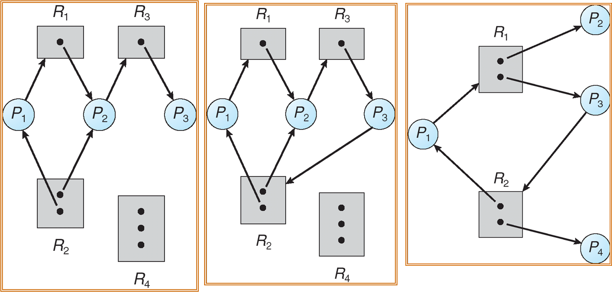
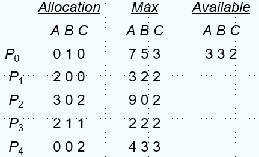

# 死锁

## 背景

### 跨桥问题

{width="300"}

如图所示桥中央只能允许一辆交通工具通过，如果同时有双向来车则会堵在中间，破局方法是一些辆车后退。

### 描述

> A set of blocked processes each holding a resource and waiting to acquire a resource held by another process in the set.

死锁是指多个进程因竞争共享资源而造成相互等待的一种僵局，若无外力，这些进程都将永远不能在向前推进。死锁产生需要同时满足四个条件（**必要条件**）：

1. Mutual exclusion（互斥条件）：同一时间只有一个进程能使用同一资源
2. Hold and wait（请求并保持条件）：一个进程拥有至少一个资源，然后在等待获取被其它进程持有的资源
3. No preemption（不剥夺条件）：一个资源只有在持有它的进程执行完后才能被释放
4. Circular wait（循环等待条件）：这里存在一个等待进程的集合{$P_0$，$P_1$，...，$P_n$}，满足$P_0$等待$P_1$，$P_1$等待$P_2$，...，$P_{n-1}$等待$P_n$，$P_n$等待$P_1$

### 建模

对于死锁问题建模如下：

- 各类资源（包括但不限于CPU、内存和I/O设备等），记作$R_1 $，$R_2 $，...，$R_m $
- 每类资源$R_i $有$W_i $份实例
- 每个进程利用资源如下：
  - 请求
  - 使用
  - 释放

**资源分配图**：

- 顶点有两类：
  - $P$ = {$P_1$，$P_2$，...，$P_n$}，是系统中所有进程的集合；
  - $R$ = {$R_1$，$R_2$，...，$R_m$}，是系统中所有资源类型的集合
- 边也有两类：
  - 请求边：有向边$P_i \rightarrow R_j$
  - 分配边：有向边$R_j \rightarrow P_i$

下面是三个资源分配图的示例（从左到右）：

1. 无环 无死锁
2. 有环 有死锁
3. 有环 无死锁

环和死锁的关系：

- 无环一定无死锁
- 有环不一定有死锁：
  - 每种资源只有一份实例，则有死锁
  - 每种资源有多份实例，可能有死锁

## 死锁处理

死锁处理有三大思考方向：

1. 保证系统永远不会陷入死锁：
   1. 死锁预防(Prevention)
   2. 死锁避免(Avoidance)
2. 允许系统陷入死锁，不过有方法恢复
   1. 死锁检测(Detection)
   2. 死锁解除(Recovery)
3. 忽略存在的死锁，假装没发生死锁
   1. 鸵鸟算法

!!!tip "反直觉，真正用的多的是鸵鸟算法？！"
    因为保证系统不会陷入死锁，会降低并发，而检查死锁并恢复也有不小的开销，权衡之下，干脆不管，实在死机了可以重启系统。

### 死锁预防

!!!warning "预防和避免不一样，中文容易混"
    死锁预防总的来说很鸡肋，不管破坏哪个条件都不太现实

死锁预防：通过**破坏死锁产生的必要条件之一**来防止死锁发生：

1. 互斥条件：对于可共享资源不要求互斥，对于不可共享资源要求互斥
2. 请求并保持条件：保证当一个进程请求资源时，它不持有任何其他资源，要求进程需要一次性被分配其需要的所有资源（在请求任何额外资源前要释放全部现有资源），这种方案的资源利用低，并且可能饿死
3. 不剥夺条件：如果一个进程请求了不能马上获得的资源，要立刻释放这个进程当前持有的资源，只有当进程得到所有需要的资源才能重新开始，但是有些进程被突然剥夺资源的后果可能会非常严重
4. 施加一个total ordering到全部资源类别上，要求每个进程获取资源时必须按增序获取，这样会导致进程持有不需要的资源

### 死锁避免

#### 思想

死锁避免：通过**动态地检测资源分配的安全性**，确保系统不会进入不安全的状态。死锁避免需要一些额外信息：

1. 每个进程需要声明需要的资源的种类和最大数目
2. 死锁避免算法动态监测资源分配状态，保证其不会满足循环等待条件
3. 资源分配状态由空闲和分配资源的数目，以及进程对资源的最大需求定义

#### 安全状态

当一个进程请求空闲资源时，系统必须判断立刻分配资源会不会导致系统处于不安全的状态。当存在序列<$P_1$，$P_2$，...，$P_n$>满足$P_i$能够从系统当前空闲资源和$P_j$(j<i)持有的资源获取到需要的资源，则系统处于安全状态，因此这个序列也被称作安全序列。

安全状态的示例（从左到右）：

1. 安全 比如 P3 P2 P1
2. 不安全
3. 安全 比如 P2 P4 P3 P1

安全状态和死锁的关系：

- 如果系统处于安全状态，则没有死锁
- 如果系统处于不安全状态，则可能死锁
  - 如果后续进程运气好，及时释放了资源，可能躲避死锁。
  - 如果进程坚持请求资源且不释放，则必然滑向死锁

#### 资源分配图算法

每类资源都只有一份，使用资源分配图：

- Claim edge： $P_i\rightarrow R_j$表示进程$P_i$可能请求资源$R_j$，使用虚线表示
- 当进程真正请求资源时，Cliam edge转化为Rquest edge
- 当进程被分配资源时Request edge转化为Assignment edge
- 当一个资源被进程释放时，Assignment edge转化回Cliam edge
- 系统中的资源必须被预先claim

请求能够被满足当且仅当将Request edge转化为Assignment edge后不会导致资源分配图中出现环

#### 银行家算法

每类资源可能有多份，使用银行家算法，假设：

- 多份资源实例
- 每个进程必须预先声明资源最大用量
- 当进程请求资源时可能需要等待
- 当进程获取到它需要的资源时，它必须要在有限时间内结束

n个进程，m种资源：

- Available：$m$维向量，`available[j] = k`表示有$k$份$R_j $的实例空闲
- Max：$n \times m$维矩阵，`max[i, j] = k`表示进程$P_i $最多请求$k$份资源$R_j $
- Allocation：$n\times m$维矩阵，`allocation[i, j] = k`表示进程$P_i $已经被分配$k$份资源$R_j $
- Need：$n\times m$维矩阵，如果`need[i ,j] = k`表示进程$P_i $可能还需要$k$份资源$R_j $

满足`need[i, j] = max[i, j] - allocation[i, j]`

安全算法的具体流程如下，定义`work`和`finish`分别为长度为m和n的向量

1. 初始化`work`为`available`，`finish[i] = false for in range(n)`
2. 找到一个i满足，如果不存在这样的i，则跳转到4：
   1. `finish[i]=false`
   2. `needi<=work`
3. `work = work + allocation[i]`; `finish[i] = true` 返回2
4. 如果`finsh`已经全部为true，则系统处于安全状态，反之处于不安全状态

对于进程Pi的资源请求算法，Request = $P_i $的request向量:

1. 如果$request_i\leq need_i $，则进入下一步，否则报错，因为请求超过了上限
2. 如果$request_i\leq available $，则进入下一步，否则需要等待
3. 将资源预分配给$P_i $，然后执行安全算法，如果系统安全则可以分配，否则回滚

!!!question "系统目前的状态如下，请问存在安全序列吗？"
    {width="300"}

    这种题一般不会真的把所有东西都给出来，知道了`allocation`和`max`，就可以算出`need`，做题时一般凑一下就能得出结果，此处的答案可以是$P_3 $，$P_1 $，$P_4 $，$P_2 $，$P_0 $

### 死锁检测

#### 等待图

适用于每种资源只有一个实例的情况，顶点是进程，有向边$P_i\rightarrow P_j$表示$P_i$正在等待$P_j$，这个在数据库中也学过。需要周期性检测环，如果发现环，则说明发生了死锁，当时在minisql中是跑了一个后台线程，每隔一段时间检测一次，环检测可以使用dfs，时间复杂度是$V^2$

#### 多实例资源类型

类似安全算法，不过只有`available`、`allocation`和`request`：

1. 初始化`work`为`available`，`finish[i]=false`for i in range(n) if allocation[i]!=0 else true
2. 找到一个索引i满足`finish[i]==false`且`request[i]<=work`，如果找不到则跳到4
3. `work += allocation[i]`，`finish[i]=true`，跳转到2
4. 如果存在`finish[i]==false`，则系统陷入了死锁，并且是$P_i $陷入了死锁

这个算法的时间复杂度是$m\times n^2 $

!!!question "系统陷入死锁了吗？"
    {width="300"}

    没有，可能的执行顺序是$P_0$，$P2$，$P1$，$P3$，$P_4$

这个算法相当于判断资源分配图是否为可完全化简图，可完全化简图是指可以分配系统当前剩余的资源给某个非独立非阻塞的进程，让它执行完后释放资源，将它涉及的边消去，直到消去所有边。

什么时候使用和多久使用一次取决于系统发生死锁的频率，每个产生死锁的环需要回滚一个进程，如果随意使用这个算法，系统中可能会存在许多环，以至于无法判断是哪个进程出了问题。

#### 进程结束

释放(absort)所有死锁的进程，在死锁消除前每次回滚一个进程，顺序取决于很多因素，比如：

1. 进程的优先级：先选低优先级
2. 进程执行了多久，还需要多久：先选执行时间短，还需时间多的
3. 进程使用的资源量：先选使用资源量多的
4. 进程还需要多少资源：先选还需要资源量多的
5. 需要结束多少个进程：选择需要结束进程少的
6. 交互进程还是批处理进程：先选批处理进程

#### 资源剥夺

相比于彻底结束一个进程，部分回滚的开销可能更小，需要选择一个受害者，以最小化开销，将进程部分回滚到安全状态，一些进程可能总被选为受害者（饿死），需要把回滚次数纳入优先级。