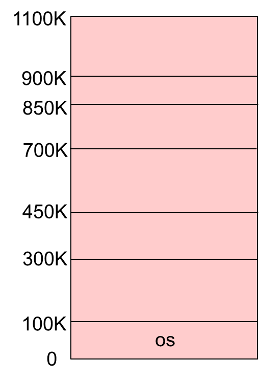
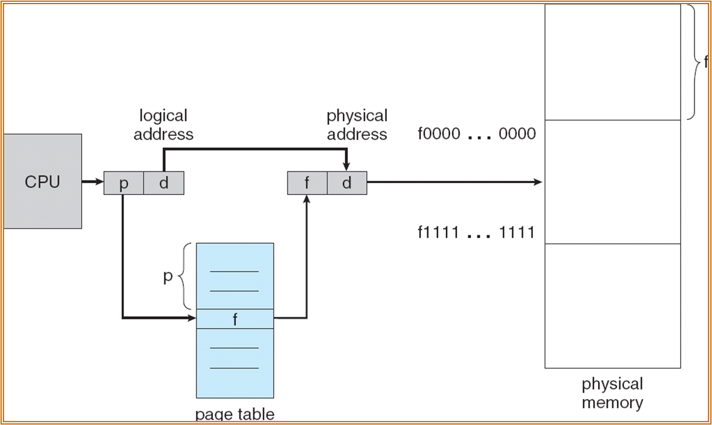
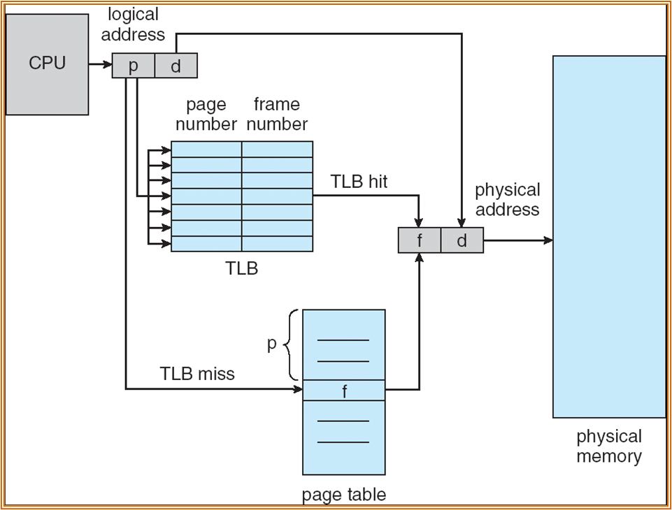
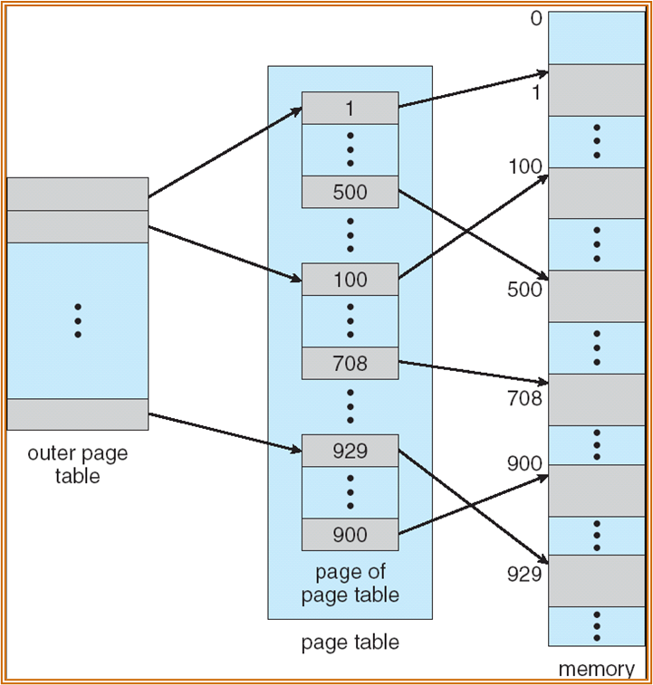
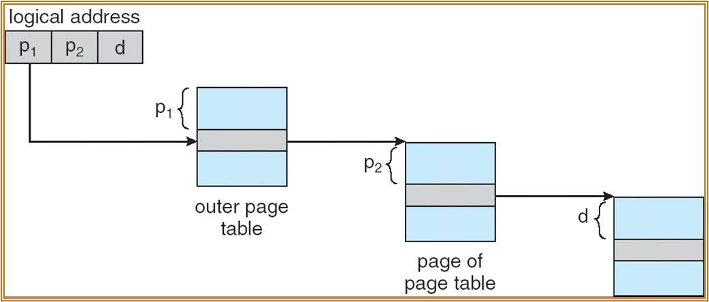
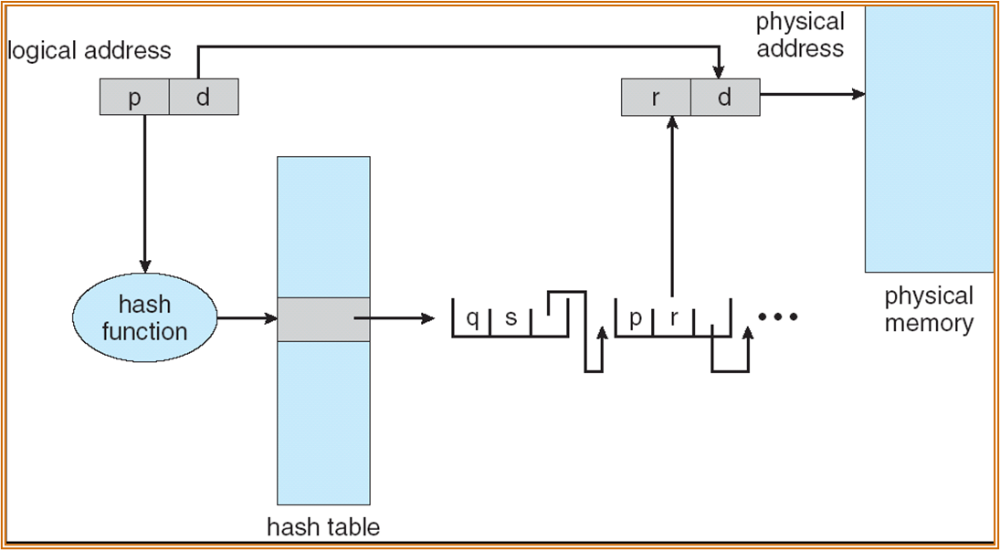
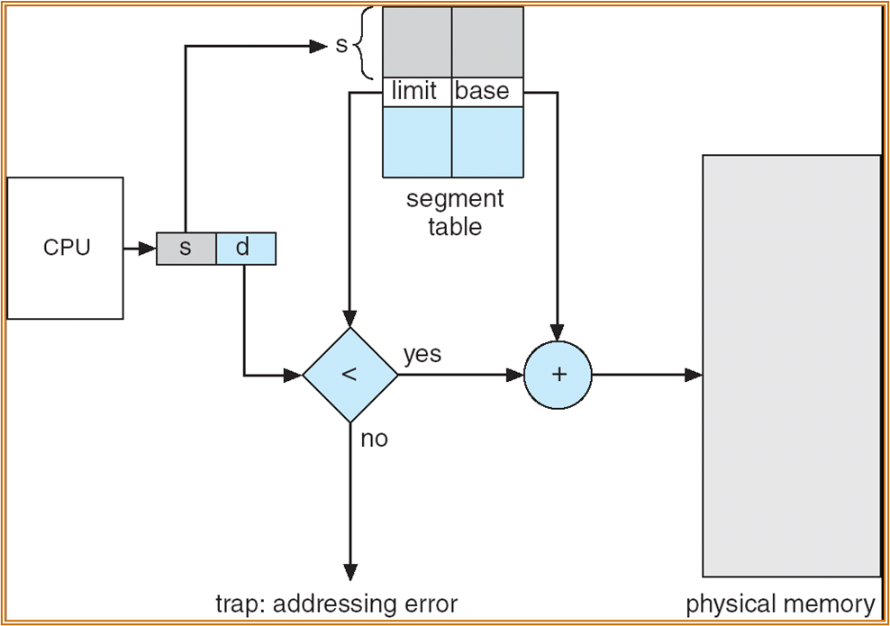

# 主存

## 背景

> 此处不区分主存和内存这两个称呼

### 内存发展史

略，只需要知道DRAM、SRAM和ROM分别是什么，以及内存的发展速度赶不上处理器

### 内存的作用

- 程序必须被加载到内存，放入进程才能执行，进程本质是active的内存
- 主存和寄存器只能够被CPU直接访问
- 访问寄存器只需要一个时钟周期（或者更少），访问主存需要多个时钟周期，所以主存和寄存器之间存在Cache
- 内存需要被保护来确保操作正确

### 编译与执行

以C这种纯粹的编译型语言为例，编译的过程如下：

1. 源代码(.c)编译为目标文件(.obj)，对于高级语言来说一般包含两个过程
   1. 源代码被编译为目标平台的汇编(.asm)
   2. 汇编语言被编译为二进制目标文件
2. 链接器将不同目标文件链接起来得到可执行文件(.exe)
3. 运行时目标文件被加载器装入内存

涉及如下软件：

- 编译器(compiler)是一个计算机程序，它能够将源代码转化为另一种计算机语言（往往是二进制形式，称作目标代码）
- 链接器(linker)是一个程序，它能够加载一个或多个由编译器生成的目标，把它们整合进一个可执行文件
- 装载器(loader)加载可执行文件到内存中执行

存在三种地址：

1. 符号地址(Symbolic Address)：源程序中的地址通常是符号地址，比如变量名
2. 可重定位地址(Relocatable Address)：编译器通常绑定它们的符号地址到可重定位地址（比如距离这个模块开头14byte）
3. 绝对地址(Absolute Address)：链接器或者装载器将可重定位地址绑定到绝对地址（比如0x1000）

代码和数据绑定到内存地址可以在三个不同阶段发生：

1. 编译时刻(Compile time)：编译出来的代码已经是绝对地址，如果地址变化必须重新编译
2. 装入时刻(Load time)：如果在编译时刻代码地址未知，必须生成可重定位代码
3. 执行时刻(Execution time)：绑定被推迟到了执行时，绑定的地址可以在执行时变动，需要硬件的支持

### 逻辑地址和物理地址

基址(base)寄存器和限长(limit)寄存器定义了逻辑地址空间：

{width="300"}

- 逻辑地址空间指的是CPU生成的空间
- 物理地址空间指的是MMU能看到的地址

逻辑地址和物理地址对于编译时和装载时绑定是相同的，对于执行时绑定是不同的。

### MMU

MMU(Memoey Management Unit)是负责映射虚拟地址到物理地址的硬件设备，在MMU机制下，在访问内存前，可重定位寄存器的值会被添加到每个由用户进程生成的地址上（这是最简单的虚拟内存机制）

{width="300"}

用户进程只能处理逻辑地址，它永远不可能看见真实的物理地址。

### 动态装载/链接

动态装载是指程序只有在被调用时才会被装载，这样可以更好利用内存，不使用的程序不会被装载，在有大量代码低频出现的场景下非常有用，并且不需要操作系统特别支持。

动态链接是指链接延迟到了执行时，一小份代码（称作stub）被用来装载 memory-resident library routine，本质是将stub的地址替换为了routine的地址，从而去执行routine。动态链接的好处有：

- 节省主存空间
- 减少可执行文件大小
- 不需要重新链接到新库

动态链接和共享库需要操作系统的支持，共享库在Windows中是`dll`文件，所以绝对不能随便删除`dll`文件

## 内存管理

### 内存保护

主存通常被两部分使用，即OS和用户进程，可以将OS放在低地址或者高地址，很多OS，包括Windows和Linux选择放在高地址。需要防止进程访问它不拥有的地址，重定位寄存器被用来保护用户进程相互之间不干扰，以及不能改变OS的代码和数据。

- 重定位寄存器中包含了最小物理地址
- 限长寄存器包含了逻辑地址的范围，所有逻辑地址都小于限长寄存器的值
- MMU通过改变重定位寄存器中的值动态映射逻辑地址

{width="400"}

???question "为什么不用软件实现limit reg和relocation reg？"
    因为访问内存是非常普遍的操作，使用软件效率太低，而且软件不够安全。

### 连续分配

连续内存分配(Contiguous memory allocation)：每个进程都被包含在了单一内存段中，紧邻的内存段包含的是下一个进程。具体分为：

- 单一连续分配(Single Cotinous Allocation)：内存分为系统区和用户区，用户区每次只调入一道程序运行，也就是说没有并发
- 多分区分配(Multiple-partition allocation)：将内存划分为若干个连续区域，称为分区，每个分区只能存放一个进程：
  - 固定分区(fixed partition)
  - 动态分区(dynamic partition)

固定分区就是把每个分区的大小提前划分好

{width="150"}

动态分区是在程序装入内存时把可用内存“切出”一个连续的区域分配给该进程，且分区大小正好适合进程的需要（不一定是刚刚好，一般会多分配点）：

- 空洞(hole)：可用的内存区块，不同大小的空洞散布在内存中
- 当有进程抵达时，它会被分配足够容纳它的内存
- OS维护已分配的分区和空闲分区(hole)的信息

上面说了hole是散布在内存中的，所以需要选择一块合适的分配给进程，一般情况OS维护的空洞信息可以看做是一个线性表，有三种选择算法（在ads装箱问题中学过，此处不赘述）：

1. First-fit
2. Best-fit
3. Worst-fit

此外，还可以选择优化所维护空洞信息的数据结构：

1. 快速适应算法：将空闲分区按大小进行分类，设置索引表项，每一类型对应一项，挂成链（把原来的一根变成多根），分配时查找索引，取出适合类的第一块进行分配。
2. 伙伴系统（buddy system）：每个空闲分区必须是2的$n$次幂字节，对进程占用的空间$n$计算一个$i$值使$2^i>n $，从剩余空闲分区找最适合的，若无则逐层拆分，释放时则逐层合并。lab4 中给出了伙伴系统的实现。
3. 哈希算法：根据空闲分区链表的分布规律，建立哈希函数，构建一张以空闲分区大小为关键字的哈希表，根据所需空间大小计算得到哈希表的位置。

### 碎片

内存中可能都存在一些细小的空洞，无法分配给任何进程，这造成了内存的浪费：

- 外部碎片：存在于不同的分区间，这些碎片的总和可能可以满足一个请求，但是不连续
- 内部碎片：分配的内存可能比请求的内存稍大，多出来的那部分有实际可能未被使用

减少外部碎片可以通过整合(compaction)，将所有碎片集中至一处，比如将所有进程移动至内存空间的一侧，空洞移动至另一侧，整合只有在执行时刻绑定地址才适用。此外，移动进程的地址会导致I/O问题，可以选择锁住正在进行I/O的进程，也可以选择仅在OS buffer中进行I/O

## 分页

### 思想

分页显然不是凭空造出来的方案，它是基于：

- 非连续分配：分配给一个进程的内存可以物理上不连续，以此来减少外部碎片，提高内存利用率
- 虚拟内存：进程看到的内存最好是连续的，这样可以简化进程执行的逻辑，于是选择将不连续的物理地址映射为连续的逻辑地址
- 查找效率：访问的逻辑地址一定需要被翻译成物理地址，如果映射非常随机，那么翻译的开销会很大，所以一次要映射一小段连续内存(一页)

这里将物理内存划分为帧(frame)，大小是2的幂次，逻辑内存也划分为相同大小，不过称作页(page)，不过都称为页也可以。

- 跟踪所有的空闲帧，在运行一个大小为n页的程序时，分配n帧来加载程序
- 建立一个页表(page table)来将逻辑地址翻译为物理地址
- 仍有内部碎片

### 页表

!!!question "如何找到页表"
    页表在内存中，有自己的逻辑地址，而访问逻辑地址需要先访问页表，那要怎么找到页表呢？答案是MMU会用物理地址找，根页表的物理地址会以某种方式存在内存/寄存器中。

由CPU生成的逻辑地址被划分为了两部分：

- 页号(page number)：用作在页表中的索引，包含了每一页在物理内存中的基地址
- 页偏移(page fault)：与基址组合以确定实际物理地址

实现分页的硬件如下：

- 页表驻留在主存中
- 页表基址寄存器(page-table base register)指向页表
- 页表长度寄存器(page-table length register)指示页表的大小
- 访问数据/指令需要两次内存访问，一次访问页表，另一次才是访问数据/指令

{width="400"}

### TLB

为了减少访问时间，引入一种特殊的fast-lookup hardware cache，称作TLB(translation look-aside buffer)，某些TLB在每个Entry中存储了ASID(address-space identifier)用于唯一标识每个进程来为进程提供地址空间保护。TLB 支持并发查找，如果没在TLB中找到才去页表中找。

在引入TLB后的地址翻译硬件如下：

{width="400"}

定义Effective Access Time(EAT) = $(1+\epsilon)\alpha + (2+\epsilon)(1-\alpha)=2+\epsilon-\alpha$，其中$\alpha$代表命中率(hit ratio)，$\epsilon$代表访问TLB的时间。

### 内存保护

在每个PTE中添加Valid-invalid bit，valid表示这一页在进程的逻辑地址中，是合法的，invalid则是相反的，表示这一页不再进程的逻辑地址中。

### 共享页

- shared code：一份只读代码在所有进程间共享（比如文件编辑器、编译器和OS）
- private code and data：每个进程有代码和数据的独立备份，可以出现在逻辑地址的任何位置

### 结构

#### 多级页表

页表也在内存中，可以对页表所在内存建立页表，即多级页表。Linux使用四级页表，Windows(32位)使用的二级页表。下面是一个二级页表的示例：

{width="300"}

一个逻辑地址(32位)被分为：

- 22 b 页号：
  - 12b 页号 p1
  - 10b 偏移量 p2
- 10b 偏移量 d

具体翻译流程如下：

{width="400"}

多级页表的**优点**是：
- 离散存储页表：不同的页表块可以物理上不连续
- 节省页表内存：可以只为实际使用的地址申请页表

**缺点**是增加了查询页表的次数，且如果真的映射满了，页表占用的内存还变多了（实际不太可能）

#### 哈希页表

在地址空间大于32bit的场景下常见，页表中的索引是虚拟页号的哈希值，值是物理地址，冲突解决方案为链表，对于稀疏的地址空间很有用。

{width="400"}

#### 反转页表

!!!warning "这是一种非主流设计"

正常的页表是从虚拟地址到物理地址，反转页表是从物理地址到虚拟地址（包含对应的进程），这样整个系统只需要一张页表，节省了存储页表的开销，但增加了虚拟地址翻译的开销。

{width="400"}

## 分段

### 交换

交换(swaping)是指一个进程可以暂时从内存交换到后备存储（足够容纳所有用户全部内存镜像的高速磁盘）中，之后在适当时间点换回内存以继续执行。

Roll out和roll in是交换在优先级调度算法的变体，可以将低优先级的进程交换出去，以执行高优先级的进程。交换的主要时间开销是传输时间(transfer time)，总的传输时间可以由交换的内存数量估计。

### 段

段(Segment)是指支持用户视图的内存管理机制，程序可以看做段的集合，段是一个逻辑单元(比如主程序、函数、本地变量、全局变量、栈...)

{width="300"}

逻辑地址现在可以写成`<segment-number, offset>`，段表(segment table)映射物理地址，每个表项有：

- base：包含段在物理内存中的起始地址
- limit：段的长度

Segment-table base register指向段表在内存中的起始地址，Segment-table length register指示程序使用的段数。段表同样有保护位，包括validtion bit和read/write/execute privilege

- 代码共享发生在段级别
- 段长度是变化的，所以内存分配是一个动态问题

分段的硬件实现如下：

{width="400"}

### 实例

分段和分页是可以一起使用的，先分段，再分页，实例是Intel Pentium

- 逻辑地址：
  - selector 16b
    - segment 13
    - GDT 1
    - Protection 2
  - offset 32b
- 线性地址：
  - p1 10b
  - p2 10b
  - d 12b