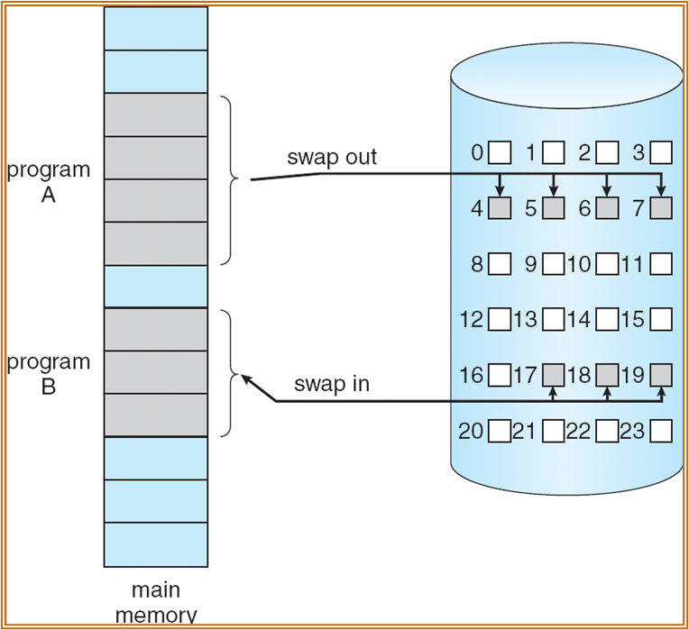
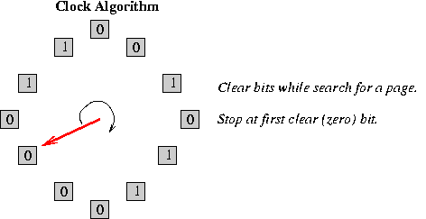

# 虚拟内存

## 背景

### 虚拟内存

虚拟内存隔离了用户的逻辑地址和物理地址，由于同一时间只有部分程序能在内存中执行，所以逻辑地址空间实际远小于物理地址空间，允许多个进程同时在内存中执行和更高效的进程创建。

虚拟内存可以比物理内存大，因为只有部分程序在内存中，还存在换入换出操作

虚拟内存的其他优点还有：

- 系统库可以被共享，通过映射到同一物理地址
- 支持共享空间
- 在程序创建的过程中可以共享页（COW），提高了进程创建的效率

### 局部性原理

局部性原理(Principle of Locality)，指程序在执行中的一个较短时间执行的指令地址和指令的操作数地址，分别局限于一定区域，表现为：

- 时间局部性：一条指令的一次执行和下次执行，一个数据的一次访问和下次访问都集中在一个较短时期
- 空间局部性：当前指令和临近的几条指令，当前访问的数据和临近的数据都集中在一个较小区域

### 内存映射文件

将文件的内容映射到进程地址空间，可以像访问内存一样访问文件内容，而无需显式地进行读写操作，这种技术在处理大文件、提高文件访问性能以及实现进程间通信等方面非常有用。

### 写时复制

写时复制(Copy on Wirte)是指父子进程可以在创建之初共享相同的物理页，直到需要修改页的内容时才复制页，通过延迟拷贝可以提高进程创建的效率，复制用的空闲页来自清零的内存池。

这部分在今年的lab5中可选，难度不是很大，建议做一下，具体的操作是（这里没考虑分段，只考虑了分页）：

1. 在`fork`时子进程的虚拟地址映射到和父进程相同的物理页，需要将页表项的权限改成不可写
2. 当有进程要写这些页时，会触发异常（因为上一步已经改为了不可写），在中断处理中拷贝错误页
3. 拷贝的新页已经是可写的了，原来的页保持不可写被其它进程共享（一个可能优化是如果发生错误时页引用数已经为1，可以不拷贝，直接修改页为可写）

## 请求分页

> 这部分在lab5中集中体现

### 思想

只有在需要时才将一页加载到内存中：

- 更少的I/O需求
- 更少的内存需求
- 更快的响应
- 更多用户

Lazy Swapper：只有在页被需要时才将一页换入内存

### 标志位

页表中的每一页有一位有效位，初始化为`i`(invalid)，如果访问到`i`页表项，会产生异常，`trap`到内核处理。

此外，还有一些附加位：

- 状态位P：用于指示该页是否已经调入内存
- 访问字段A：用于指示该页在一定时间内被访问的次数，或最近已有多长时间没被访问，用于页置换时参考
- 修改位M：表示该页在被调入内存后有没有被修改后（R/W）
- 外存地址：用于指示该页在外存上的地址，用于调入页时参考

### 缺页异常

当引用到一页时，会产生缺页异常，trap到内核态，然后按照如下流程处理：

- 查找PCB中的另一张表（段表，在Linux中是vam），如果是无效地址则终止，否则就是仅仅不在内存中
- 获取空物理帧
- 交换页到帧
- 重新设置页表
- 将有效位设为1
- 重新执行产生错误的指令

!!!question 进程出现缺页异常时处于什么状态？
    阻塞(blocked)或者叫等待(waiting)，因为是进程主动进入的

但是重新执行指令其实是存在问题的：

- 数据的地址有可能改变，因为页的位置改变了
- 部分执行的指令需要回滚

### 效率

Effective Access Time = (1-p)\*memory access + p\*(page fault overhead + swap page out + swap page in + restart overhead)，其中p是缺页率

## 页面置换算法

如果没有空闲物理帧该怎么办？进行页面置换，找到内存中暂时没有使用的页，将它们置换出去，可以避免过度分配内存。

页面置换算法在数据库中学过，这里也大差不差，目标是尽可能产生少的缺页异常，可以使用dirty bit来减少页面置换的开销，因为只有改过的页需要写回去。算法比较时使用的页访问序列可以只有页号，比如0100, 0432, 0101, 0612, 0102, 0103可以写成1 4 1 6 1 1（页大小为100）

因为是很多地方都有的算法，这里不赘述：

1. FIFO：队列，存在Belady’s Anomaly，帧数越多反而缺页数越多，这是因为帧数增多反而使访问序列满足最差情况
2. Optimal Algorithm：替换未来最长时间不被使用的页，但是这不可能做到，因为无法预测未来，所以最佳算法只用来比较不同替换算法效率
3. LRU：替换最久没有使用的页，这是基于局部性原理，性能接近最佳算法，但是由于要记录页面没有使用时间，硬件开销大

### LRU

LRU有多种不同实现：

1. 每一页有一个计数器，每次访问页时更新计数器（上次被访问到的时间），需要替换时区计算哪一页最久没被访问
2. 栈实现（严格来说不是栈）：使用双向链表，当页被访问时移动到表头，表尾是最久未使用的页
3. 移位寄存器：被访问的页左边最高位置1，定期右移，寄存器值最小的是最久未访问页面

### LRU 近似算法

#### 时钟算法

second-change(clock)算法：

- 需要一个引用位
- 当页被访问时，引用位置1
- 循环替换时遍历，如果页的引用位为1，将其置0，并保留在内存中，然后继续尝试下一页，直到找到引用位为0的页替换

#### 增强的时钟算法

再增加一个修改位，（引用位，修改位）一共有四种可能状态：

1. (0, 0) 最佳的替换，因为较久未使用且不需要写回
2. (0, 1) 不好的替换，因为一定需要写回
3. (1, 0) 下一轮会被使用
4. (1, 1) 最糟糕的

淘汰顺序：(0, 0) > (0, 1) > (1, 0) > (1, 1)

当需要置换一个页面时，循环遍历页框列表，进行最多两次扫描：

1. 第一次扫描：寻找最佳候选者(0, 0)，在扫描过程中遇到了 (1, X) 的页面将它们的引用位清零
2. 第二次扫描：如果第一次扫描没有找到(0, 0)的页面，再扫一次，因为上一次扫描将(1, 0)都被变成了(0, 0)
3. 如果还是没有，则说明所有页都是脏的，而且引用位都为0了，直接任选一页替换即可

### 基于计数的算法

需要记录每个页面的引用计数，有两种算法：

- LFU 算法：替换引用计数最小的页面
- MFU 算法：替换引用计数最大的页面，这是由于考虑到引用计数小的页面有可能是刚交换进内存

### 页面缓冲算法

Windows、Linux页面置换算法是基于页面缓冲算法：

- 用FIFO算法选择被置换页，把被置换的页面放入两个链表之一: 如果页面未被修改，就将其归入到空闲页面链表的末尾，否则将其归入到已修改页面链表。
- 需要调入新的页面时：将新页面内容读入到空闲页面链表的第一项所指的页面，然后将第一项删除。
- 空闲页面和已修改页面，仍停留在内存中一段时间，如果这些页面被再次访问，这些页面还在内存中。
- 当已修改页面达到一定数目后，再将它们一起调出到外存，然后将它们归入空闲页面链表。

## 页分配

### 背景

每个进程有自己最少需要的页数，通常是由体系结构决定，有两种主要的分配策略——固定分配和优先级分配。

### 固定分配

最简单的想法是平分，这个没什么好说的。稍微复杂一点可以按比例分配，通常是按进程的大小（逻辑内存大小）

### 优先级分配

其实还是按比例分配，不过是按进程的优先级，如果进程发生了缺页，从比它优先级低的进程剥夺一物理页。

### 全局 VS 局部

- 全局：物理页是从全局选择，可以剥夺分配给其它进程的物理页，缺陷很明显，被剥夺的进程更可能发生缺页了，导致缺页异常率不可控
- 局部：每个进程只能从分配给自己的物理页选择，缺点是空闲的物理页不能共享

**从定义看的出来局部分配不可能和优先级分配组合**

### 抖动

抖动(Trashing)是指一个进程没有足够的物理页，导致缺页率很高，这会导致：

1. 低CPU利用率
2. ready queue中的进程减少
3. OS认为CPU利用率低说明内存中的进程不够多，反而会增加multiprograming程度
4. 另一个进程被加载进内存，加剧了内存紧张

解决方案，需要反过来，减少内存中的进程数：

1. <del>增加物理内存</del>
2. 优化页面置换算法
3. 在cpu调度中引入工作集算法
4. 动态调整进程的内存分配
5. 限制并发进程数
6. 内存压缩