# 文件系统

???note "为什么Linux中一切皆文件？"
    在Linux中，无论是硬件设备（硬盘、键盘、显卡）、网络连接（Socket）、还是进程间通信（Pipe），都被抽象成了一个“文件”，可以用一套统一的接口调用，这么设计是为了api的简洁性和一致性。

## 接口

### 简介

- File System is the way that controls how data is stored and retrieved in a storage medium.
- File is a sequence of bits,bytes,lines, or records.

### 文件

#### 文件结构

- None:sequence of words,bytes
- Simple record structure：
  - Lines
    - Fixed length
    - Variable length
- Complex Structures
  - Formatted document
  - Reloacatable load file

文件的结构由操作系统和应用软件定义。

#### 文件属性

- 名称：人类可读
- 标识符：系统内的唯一标识符
- 类型：在支持不同类型文件的系统中需要
- 位置：指向文件位置的指针
- 大小：当前文件的大小
- 保护：谁可读、可写、可执行
- 时间、日期和用户标识符

文件的信息被存储在目录结构中，维护在磁盘上。

#### 文件操作

文件是一种抽象的数据类型，包含以下方法：

- Create
- Write
- Read
- Reposition within file
- Delete
- Truncate
- Open(Fi)
- Close(Fi)

#### 打开文件

Open( )系统调用返回了一个指向打开文件表(open-file-table)中的项的指针：

- 每个进程的打开文件表：包含当前的文件指针和访问权限等内容
- 系统打开文件表：打开数等

需要以下信息来管理打开的文件：

- 文件指针(File Pointer)：指向文件最后一次读写的位置
- 文件打开数(File-open count)：当前文件被打开的次数
- 文件在硬盘上的位置(Disk location of the file)：缓存数据访问信息，因为不是所有操作都需要从磁盘读取
- 访问权限(Access right)：每个进程访问模式信息

从上面的内容不难看出，当有多个进程打开同一个文件时，是存在冲突的，所以部分操作系统和文件系统提供了文件锁(Open File Locking)来协调多个进程对文件的访问：

- 共享锁
- 互斥锁

锁还可以分为：

- 强制(mandatory)：windows的做法，不满足持有锁则会被禁止访问
- 建议(advisory)：linux的做法，不满足持有锁，仍自行决定是否访问

#### 文件类型

扩展名只能起到提示应该拿什么软件处理这个文件的作用，也可以被看做文件名的一部分，所以之后的讨论都忽略扩展名

- MS-DOS
- MAX OS X：每个文件都拥有一个创建者属性，其中包含创建它的程序名
- Unix：使用魔数(magic number)，但不是所有文件都有魔数，所以不能拿魔数来判断文件类型

#### 访问方法

- 线性访问(sequencial access)
- 随机访问(random/direct access)

### 文件组织

#### 目录

目录可以被看做用于翻译文件名到文件控制块(File Control Block, FCB)的符号表，目录和文件都在磁盘上。

典型的文件系统组织如下，磁盘上可以分出很多卷(Volumn)，卷是逻辑存储单元，分区(Partition)是物理磁盘的划分

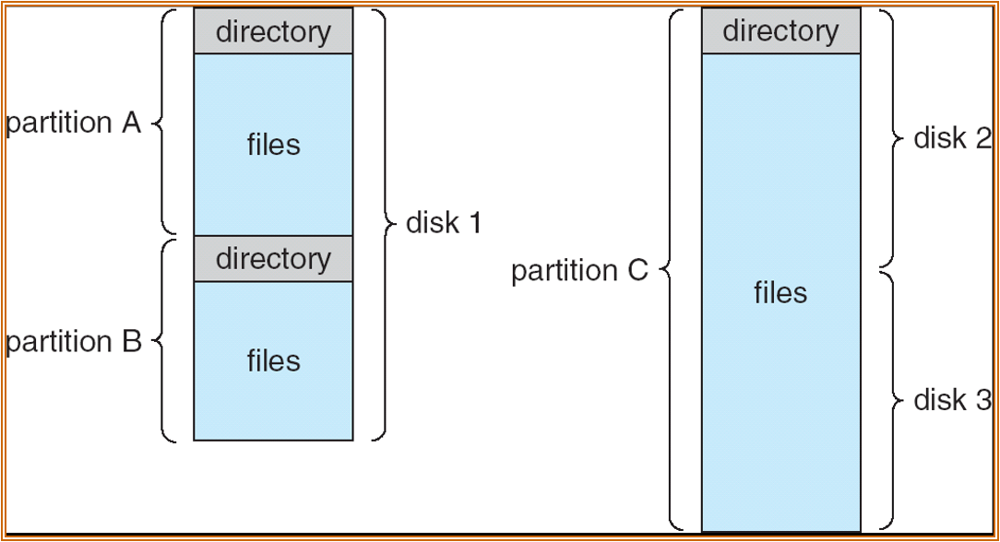{width="400"}

#### 目录上的操作

- 搜索文件
- 创建文件
- 删除文件
- 列出目录内容
- 重命名文件
- 遍历目录

#### 目录的目标

- 高效：快速定位一个文件
- 命名：方便用户
  - 两位用户可以为不同的文件取同一个名字
  - 同一份文件可以有多个不同的名字
- 分组：根据的文件的性质分组

### 不同的目录组织

#### 单级目录

所有用户共用一个目录：

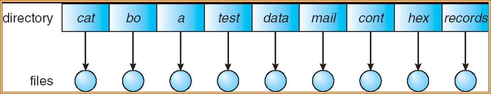{width="400"}

但这会引发命名问题和分组问题，不过lab6为了简化实现就是这么干的

#### 二级目录

每个用户有不同的目录：

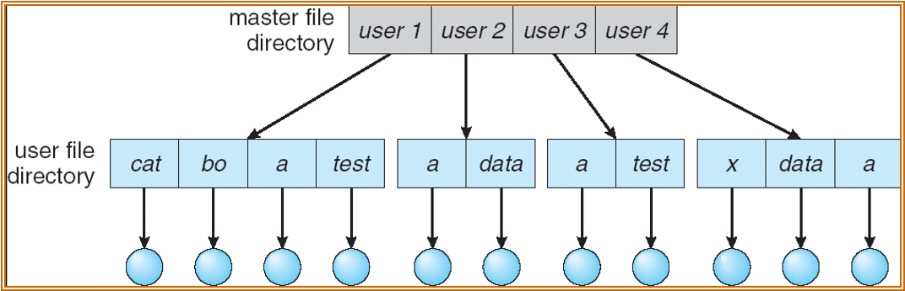{width="400"}

- 不同的用户可以有相同文件名
- 高效搜索
- 没有分组能力

#### 树形目录

{width="400"}

- 每个目录项包含了1 bit说明它是目录还是文件
- 高效搜索
- 分组能力
- 当前工作目录(current working directory)
- 绝对路径和相对路径

#### 无环图目录

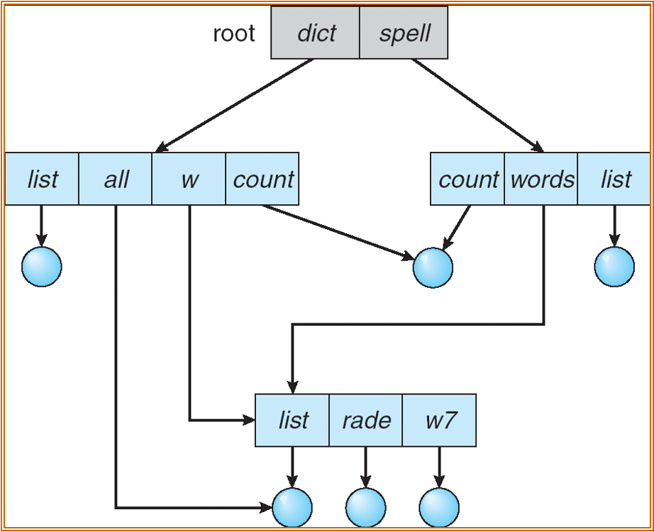{width="400"}

- 解决对于文件共享的要求，支持共享子目录和文件
- 支持两个不同名字（别名）
- 如果文件被删除可能会导致悬空指针(dangling pointer)
  - 解决方案：维护文件的引用数，以便删除所有指针
- 新的目录类型
  - 链接（link）：已经存在的文件的另一个名字（指针）
  - 解析链接：跟随指针去找到文件

#### 通用图目录

{width="400"}

如果允许环，会导致：

- 重复搜索同一个对象，因为遍历陷入了循环
- 文件删除问题，未被使用引用数也不为0

需要通过一些限制来避免环：

- 不允许硬链接到目录
- 垃圾回收
- 每当添加一个链接，都运行一次环检测算法

### 软链接和硬链接

- 软链接是一个独立的文件，其中存储到原始文件的路径；而硬链接是一个已经存在文件的别名，它会增加一个文件的链接数。
- 软链接有自己的inode，硬链接和原来的文件共用一个inode
- 软链接能够跨越不同的文件系统，因为它只是路径；硬链接不能创建到目录上，以免出现环

### 挂载

挂载（Mounting） 是指将一个存储设备（如硬盘分区、U盘、光盘等）的内容连接到文件系统中某个特定目录的过程。简单来说，硬件设备本身只是“一块砖”，挂载就是给它安一个“入口”，让你能通过文件夹看到里面的数据。

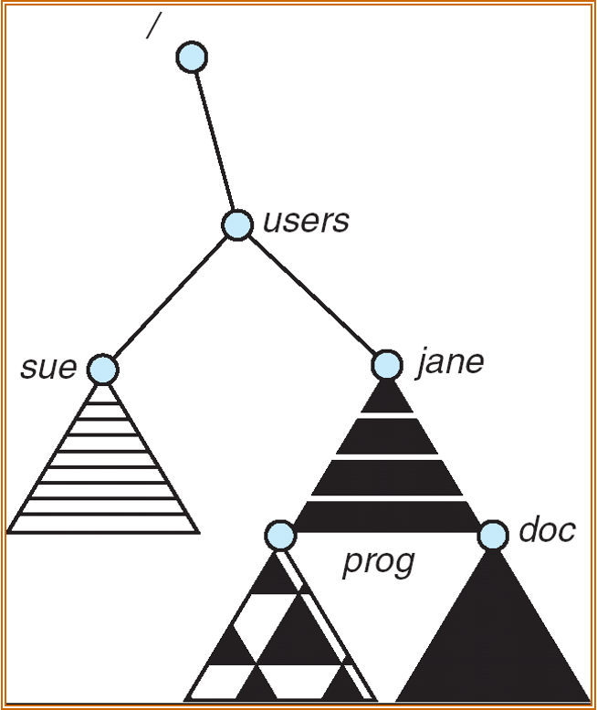{width="300"}

挂载并不会影响到原来目录中的内容，毕竟挂载的是其它存储设备，原本的存储设备是不受影响的。

### 文件共享

#### 多用户共享

- User ID：用于标识用户，规定每位用户的权限
- Group ID：允许组中的用户访问资源

#### 远程文件系统

使用网络使文件系统在不同系统中共享：

- 通过程序手动进行，比如FTP
- 自动无缝地进行，使用分布式文件系统
- 半自动地进行，使用world wide web

### 保护

???note "可以将文件的权限修改为不可读、写和执行吗？"
    可以的，当然对于root用户来说无所谓，依然可以强行读取或写入该文件，也可以随时把权限改回来

- 文件的拥有者/创建者需要能够控制谁能够做什么，比如读、写和执行
- 可以创建不同的用户组，并将用户组绑定到文件上

## 实现

### 文件系统结构

文件系统位于二级存储（比如硬盘）之上，按照分层结构组织：

1. 应用程序：发出读写filepath的指令
2. 逻辑文件系统：控制文件的元信息，将读写filepath转化为读写逻辑块
3. 文件组织模块：将逻辑块翻译为物理块
4. 基础文件系统：缓存，如果未命中则调用I/O
5. I/O控制：将读写指令翻译成更底层的磁盘读写指令

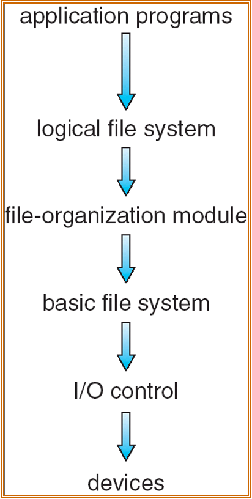{width="150"}

### 数据结构

磁盘上的数据结构：

- Boot control block(per volumn)：虽然每个卷都有，但除了启动卷都为空
- Volumn control block per volumn(superblock in Unix)
- Directory structure per file system
- Per-file FCB(inode in Unix)

内存中的数据结构：

- In-memory mount table about each mounted volumn
- Directory cache
- System-wide open-file table
- Per-process open-file table

#### FCB

文件控制块中保存了文件的信息

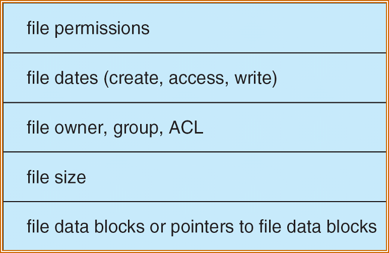{width="300"}

内存中的文件系统如下图所示：

- 打开文件：
  - 用户态使用了`open(file name)`，执行系统调用trap到内核态
  - 在内核态，先从磁盘上的目录取出文件信息，再取出FCB
- 读文件：
  - 用户态使用了`read(index)`，执行系统调用trap到内核态
  - 在内核态，根据索引在进程的打开文件表中找到对应的文件（系统表的索引），然后根据系统表的信息（FCB）取出数据块

{width="400"}

### VFS

虚拟文件系统(Virtual File System)提供了一种面向对象的方式实现文件系统，也就是把具体文件系统再封装一层，以屏蔽不同文件系统的差异。具体而言，VFS允许同一个系统调用接口被用于不同类型的文件系统（多态）。

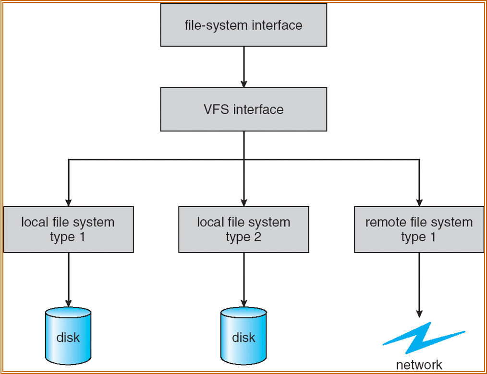{width="400"}

VFS的四个主要对象类型：

1. superblock object：具体挂载的文件系统，对应到（但不等于）磁盘结构中的superblock
2. inode object：一个特殊的文件，对应磁盘结构中的FCB
3. dentry object：一个独立的目录项
4. file object：和进程相关打开的文件相关，只要文件是打开的就一直存在

### 目录

- 线性表，文件名和指向对应数据库的指针：
  - 易于编程
  - 执行费时
- 哈希表:
  - 减少目录搜索时间
  - 可能存在哈希碰撞，可以选择链式冲突解决或者再哈希

### 分配方法

#### 线性分配

> 按照块分配可能会导致支持的最大容量不足（如今的磁盘不少是TB级的），所以不少新的系统调整为了按照extent/cluster（多个连续的块）分配

线性分配(contiguous allocation)：
- 每个文件都占据磁盘上连续的块
- 简单，只需要起始地址（块号）和长度（块数）
- 支持随机访问
- 浪费空间，因为随着不断地创建和删除会产生很多外部碎片
- 不支持文件增长

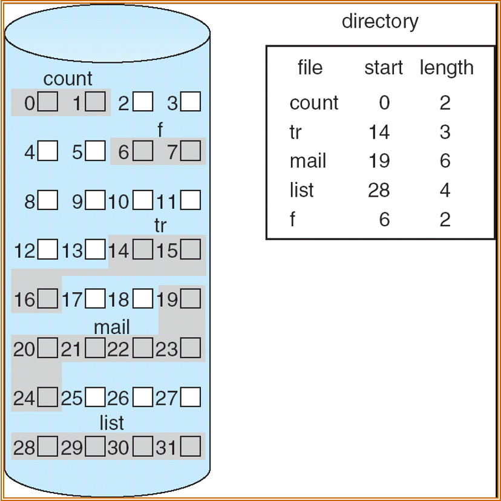{width="300"}

有一种方案可以支持增长，即在块后面加指针，指向另一块，更直接一点就是下面的链接分配。

#### 链接分配

每个文件是磁盘块构成的链表，分配的块可以散布在磁盘中：

- 简单，只需要起始地址
- 能够管理空闲空间，不会造成空间浪费
- 不支持随机访问

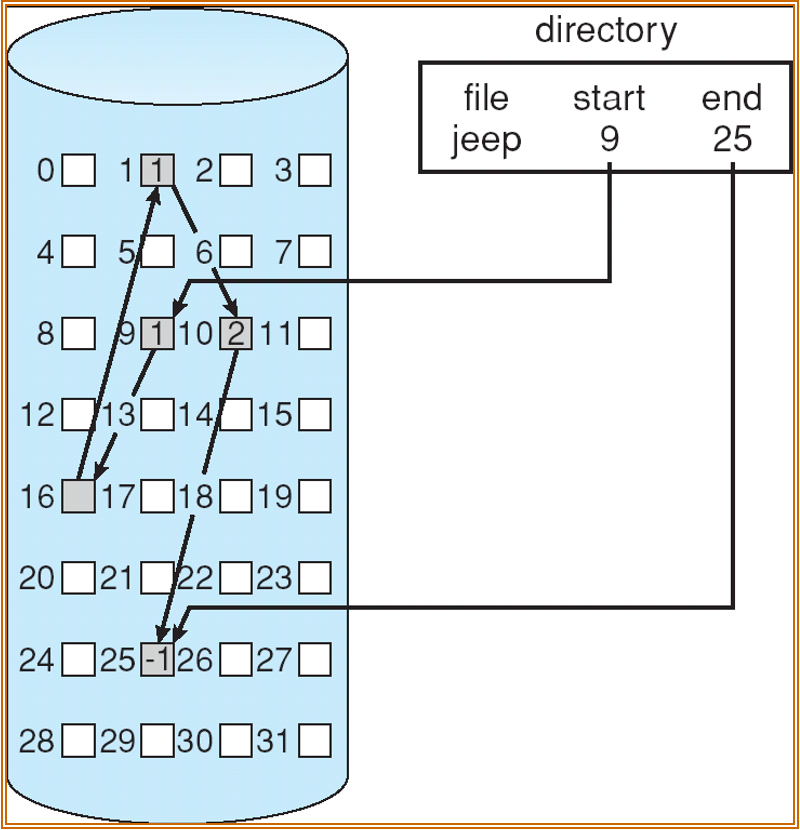{width="300"}

微软在此基础上想到可以把链表的信息集中在一起，然后缓存到内存中，从而提高访问地址的速度，这个想法被称作文件分配表（file allocation table），在lab6中会用到FAT32。不过这样做也带来一个问题，要是FAT损坏了，那文件信息不就全部丢失了吗？所以FAT实际会存储多份。

???question "应该先写FAT还是先写数据？"
    应该先写数据，因为假设先写FAT，写完后立刻出错了，某些簇已经被标为占用，但数据还未写入，这会导致文件看起来存在，但某些内容全是磁盘上原有的“垃圾数据”。

#### 索引分配

建立逻辑视图，存储虚拟的连续编号到真实分配的块序号的映射：

- 需要索引表
- 支持随机访问
- 没有外部碎片，但是存储索引块有开销
- 可以建立多级索引

{width="300"}

这样对于小文件来说开销非常大，因为始终至少要多用一块去存索引；对于大文件来说，一个块中的索引可能不够用。为了实现大文件存储，有以下三种方案：

1. 将索引块链起来，组成一个链表，显然这样已经支持无限大文件了
2. 使用多级索引（类似多级页表）
3. 混合方案（Linux实际使用）

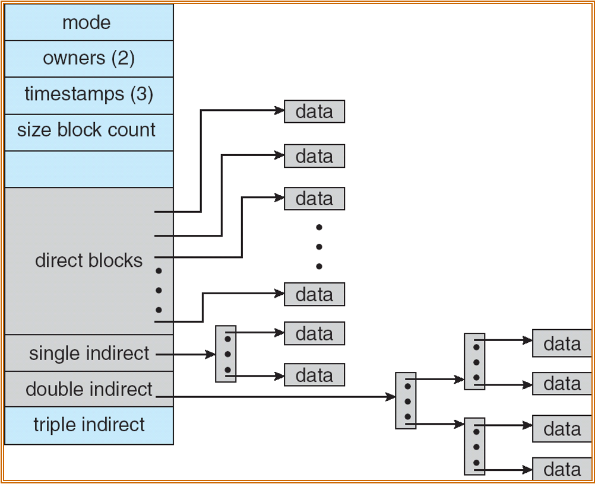{width="400"}

???question "double indirect索引中，假设每个块大小为4kiB，索引项大小为8B，请问最多能存多大的文件？"
    每个块能存4kiB/8B=512条索引，512\*512\*4kB=1GB

### 空闲空间管理

#### 位图

每个bit代表磁盘上对应block的空闲状态

{width="300"}

#### 空闲链表

在内存池中见过，维护一个链表记录所有的空闲块

{width="300"}