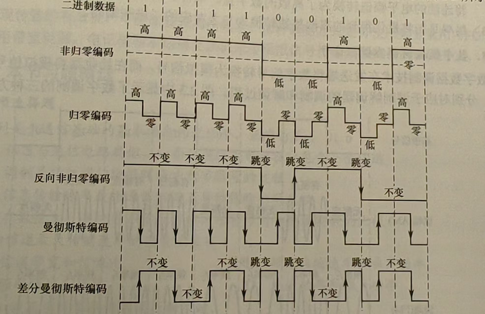

# 物理层

## 通信基础

### 码元

数据是指传送信息的实体，信号则是数据的电气或电磁表现，是数据在传输过程中的存在形式。数据和信号都有模拟和数字之分，模拟取值是连续的，数字取值是离散的。

在通信系统中，常用一个固定时长的信号波表示一个k进制数，这个时长内的信号称为**码元**，而该时长称为码元宽度，即码元是一次采样的结果，这个结果可能代表多位的信息。码元传输的速率称为波特率，单位是波特(Baud)，它乘上码元的位数可以得到比特率。

### 信道

信道是信息传输的介质，在信道上传输的信号有基带信号和宽带信号之分，基带信号是由信源发出的未经过调制的原始电信号，当在信道中直接传输基带信号时，称为基带传输；宽带信号首先将基带信号进行调制，形成频分复用模拟信号，然后送到信道上传输，称为宽带传输。

### 信道的极限容量

任何信道都不是理想的，信号在信道上传输时会不可避免地产生失真。但是，只要接收端能够从失真的信号波形中识别出原来的信号，这种失真对通信质量就没有影响。但是，若信号失真很严重，接收端就无法识别出每个码元。

#### 奈奎斯特定理

理想低通（没有噪声，带宽有限）信道的极限数据传输率=$2W\log_2 V $（单位为b/s）其中$2W $是码元的极限传输速率，同时是采样速率的下限，要保证采样频率高于这个值。

#### 香农定理

带宽有限，且有高斯噪声干扰的信道的极限数据传输率= $W\log_2(1+ S/N) $（单位为b/s）其中$S/N $代表信噪比，可能会使用分贝表示，分贝是没有量纲的比值，$1dB = 10\log_{10}(S/N) $

## 编码与调制

为了传输数据，需要将数据转化为信号。将数据转化为数字信号的过程称为编码，将数据转化为模拟信号的过程称为调制。

### 基带传输

数字数据编码用于基带传输中，即在不改变数字数据信号频率的情况下，直接传输数字信号。具体用什么样的数字信号表示0及用什么样的数字信号表示1，就是所谓的编码。

常用的数字编码有以下几种：

1. 归零(RZ)编码：用高电平表示1，低电频表示0，在每个码元中间均跳变到零电平，接收方根据跳变调整本方的时钟基准，但归零会占用一定带宽，会影响到传输速率。
2. 非归零(NRZ)编码：一个时钟全用来传输数据，编码效率最高，但是存在同步问题（一连串的0或1区分不出来到底有多少个）
3. 反向非归零(NRZI)编码：与NRZ编码的区别是用电平的跳变表示0、电平保持不变表示1，但是连续的1还是有问题
4. 曼彻斯特编码：每个码元中间都发生电平跳变，电平既作为时钟信号，又作为数据信号，可用向下跳变表示1，向上跳变表示0
5. 差分曼彻斯特编码：每个码元中间都发生电平跳变，与曼彻斯特编码的不同是跳变仅表示时钟信号，而不表示数据。数据表示在于每个码元开始处是否有电平跳变，无跳表示1，有跳表示0

!!!question 曼彻斯特编码能够增大带宽吗？
    肯定不能，使用曼彻斯特编码一个周期内实际只能传输非归零编码一半的信息

### 宽带传输

采样是指对模拟信号进行周期性扫描，将时间上连续的信号变成时间上离散的信号。根据奈奎斯特定理，采样频率必须大于或等于模拟信号最大频率的两倍。数字调制技术在发送端将数字信号转换为模拟信号，而在接收端将模拟信号还原成了数字信号。有如下几种调制方法：

1. 调幅(AM)：容易实现，但抗干扰能力差
2. 调频(FM)：容易实现且抗干扰能力强
3. 调相(PM)
4. 正交幅度调制(QAM)：在频率相同的前提下，将AM和PM结合起来，形成叠加信号

## 信道复用

### TDM

时分复用，是把信道传输时间划分为一段段等长的时间片，称为TDM帧，每个用户在每个TDM帧中占用固定序号的时隙，即所有用户会在不同时间占用同样的信道资源。由于是按固定次序给用户分配时隙，当用户在某段时间暂无数据传输时，其它用户也无法使用这个暂时空闲的线路资源。

### FDM

频分复用是将信道总频带划分为多个子频带，每个子频带作为一个子信道分配给用户，每个子信道分配的频带可不相同，但总和不能超过信道总频带。在实际应用中，为了防止子信道之间相互干扰，相邻信道间还要加入“隔离频带”。

### CDM

码分复用是采用不同的编码来区分各路原始信号的一种复用方式，它更常见的名称是码分多址（Code Division Multiple Access，CDMA），它的原理来自线性代数的正交基。

其做法是：

- 将一个比特时间再划分为m个短的时间槽，称作码片（Chip），唯一分配给每个站一个m维向量（码片），要求不同站的码片之间两两正交
- 一个站若要发送1则发送码片本身，如果要发送0则发送码片的反码。每个时间的信号是所有站的信号叠加。
- 接收端通过规格化内积可以求解出每个站到底是发了0还是1

!!!question 案例
    举个例子，比如现在有A、B和C三个站，它们的码片分别是(1, 1, 1, 1)、(1, 1, -1, -1)和(1, -1, 1, -1)，某一时刻它们分别发送0, 1, 1

实际发出的信号为(-1, -1, -1, -1) + (1, 1, -1, -1) + (1, -1, 1, -1) = (1, -1, -1, -3)，比如接收方需要知道B发了什么，直接 [(1, -1, -1, -3) * (1, 1, -1, -1)]/4 = 1，其它也同理。

## 传输介质

> 传输介质才是真正的最底层（第0层），物理层关心的是如何在传输介质上传输比特流，并屏蔽不同传输介质之间的差异。

有线介质：

1. 双绞线(Twisted Pair Cable)：在局域网和传统电话网中普遍使用，绞合可以减少对相邻导线的电磁干扰，为了进一步提高抗干扰能力，还可以在导线外加上屏蔽层。
2. 同轴电缆(Coaxial Cable)
3. 光纤(Optical Fibre)：利用全反射

无线介质：

1. 无线电波
2. 微波、红外线和激光

## 设备

### 放大器

放大器的作用是放大模拟信号，其原理是放大衰减的信号。

### 中继器

中继器(repeater)的作用是放大、整形并转发数字信号，以消除信号经过一段电缆后产生的失真和衰减，使信号波形和强度达到所需的要求，进而扩大网络传输距离。其原理是信号再生，而非简单地放大衰减的信号。

中继器有两个端口，数据从一个端口输入，另一个端口输出，中继器两端的网络部分是网段，而不是子网，使用中继器连接的若干个网段仍是一个局域网。

!!!question 中继器可以无限用吗？
    显然不行，因为网络标准中会对信号的延迟范围做具体规定，比如下一章会讲的IEEE 802.3以太网

### 集线器

集线器(Hub)本质上是一个多端口的中继器，数据从一个端口输入，转发至其它所有端口，如果同时有两个端口输入将产生冲突，致使这些数据都无效。