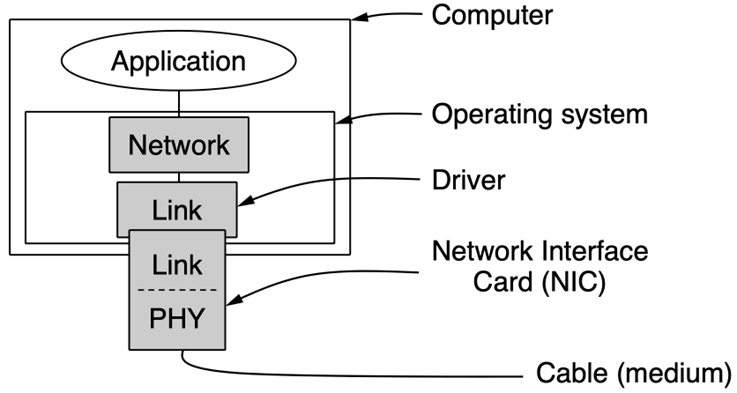

# 链路层

> 链路层由 Logical Link Control和Medium Access Control两部分组成，包含了达成可靠、高效传输的算法。

## LLC

### 成帧

以帧（frame）的形式传输来自网络层从源机器到目标机器的数据

### 服务分类

链路层为网络层提供如下三种服务：

1. 无确认无连接(Unackonwledged Connectionless)：不会侦测和处理丢包，适合于错误率很低的实时传输。
2. 有确认无连接(Acknowledged Connectionless)：每个帧都会收到确认，未应答的帧会重发。
3. 有确认面向连接(Ackonwledged Connection-oriented)：发送的帧会被编号，适合于距离很长不可靠的信道。

### 确认帧的开头

1. 字节计数法：在header中包含一个字段声明字节数，但是存在失去同步的问题，所以一般不会采用

2. 标志字节法：使用特殊的字节(Flag Byte)来标识帧的首尾，为了避免混淆数据位和标志位需要引入 ESC 转义

3. 编码违禁法：使用编码规则中的保留组合来作为标志符，这样没有转义的开销，但是这样存在与物理层的耦合

### 检错和纠错

> 数据链路层是距离错误最近的层次，可以是检出错重发，也可以是本身就有纠错能力。

#### 纠错码分类

前向纠错码(Forward Error Correction)指包含足够的冗余信息保证接受者能够推断出正确的原始数据。适合于噪声较高的信道，因为重发也会受到噪声的干扰。分为：

1. 块码(Block Code)：根据某种映射函数计算
2. 线性码(Linear Code)：使用线性映射函数，比如异或和模2加法
3. 系统码(System Code)：数据位和校验位是分开没有交叉的

#### Hamming Distance

- (n, m) code:n = m + r
- 码率：m/n
- Hamming Distance：两个编码之间相差的比特数

需要d+1位去侦测d位错，这样一来错d位不会是任何有效的编码；需要2d+1位去纠d位错，哪怕出了d位错，正确编码也是离错误编码最近的。

#### Hamming Code

设计一种纠错码(n, m)，纠正所有的1bit错误，$2^m $种合法编码每个都有n种错误版本，因为n位每一位都可以分别反转。故需要满足：$(n+1)2^m\leq 2^n\Rightarrow (m+r+1)\leq 2^r $

#### Conventional Code

卷加码是一种与前k位（包含当前输入）相关的纠错码，k称作限制长度(Constraint Length)，也叫记忆深度，下图中：

- $\Sigma $表示对二取余求和
- S表示移位寄存器，初始值是确定的，比如都为0
- 输入一位，输出两位
  - 第一位是对输入，S2，S3，S5，S6求和
  - 第二位是对输入，S1，S2，S3，S6求和
- 每输出一次移位寄存器右移一位，输入的值移入S1

反向使用维特比算法，这是一个最大似然算法，找出出错最少的路径。可以分为：

- 硬抉择：首先将接收到的模拟电压样本数字化（即将模拟信号转化为离散的0和1的比特序列）。在数字化后，系统根据这些比特序列来恢复传输的数据。
- 软抉择：软判决解码直接使用模拟电压样本，未先将其转换为比特序列。它不仅考虑比特的二进制值（0或1），还考虑了接收到的信号的“质量”或“可信度”。

#### Reed-Soloman Code

利用了一个n次多项式由n+1个点决定的性质，比如$Ax+B $，代入x=1,2,3,4计算，假设结果为73,249,321,393，接收者在收到这4个数后尝试解方程解出$A$和$B$，两两一组求解方程，选择数量最多的公共解。

一般形式为求解如下的线性方程组，$v $是已知量，比如上面的1,2,3,4，$m $才是带求解的序列

RS 解码与纠错是在有限域（Galois Field，简称 GF）上完成的，就像拟合多项式一样，RS 把一段数据看成在有限域上采样的一条多项式曲线，解码就是从带有错误的点中重新拟合出原始多项式。

RS(n, k)，符号的大小是m bit，在 m 比特有限域中：

- RS 码的最大码长为$2^m - 1 $
- 一个 RS 码字包含k字节数据 + (n-k)比特字节校验=k字节数据 + 2t比特字节校验
- 能够纠正t位错误

#### LDPC Code

LDPC 码是一类线性块码，其特点是：

- 校验矩阵$H $非常稀疏（大部分元素为 0）
- 每一个输出码比特（校验比特）只依赖于部分输入信息比特
- 用一个近似算法迭代出最佳匹配的数据

#### 检错码

检错码(Error Detecting Code)只关心如何发现错误，如果错误则重传。适用于低噪声的信道，这样重传大概率不会出错。常见的有：

- Parity：奇偶校验，添加一位使所有位的和为偶（或奇），一位奇偶校验只能发现一位错误
- Checksum：像是扩展版的奇偶校验，规则可以更复杂
- CRC：将比特串看作表示多项式的系数为0/1，比如110001，表示$1x^5 + 1x^4 + 0x^3 + 0x^2 + 0x^1 + 1x^0 $

多项式的计算是模2的，加减都相当于异或，长除法的减法也是模2的。发送者和接受者会约定一个r 比特的生成多项式$G(x) $，m比特的数据对应一个多项式$M(x) $，帧错码的具体计算流程如下：

- 在m比特数据帧后添加$r $位0
- 用$x^rM(x) $除以$G(x) $，使用模2除法
- 用模2减法算出余数，作为校验和帧

### 数据流

#### 假设

1. 独立的进程
2. 无方向的交流
3. 可靠的机器和进程

frame 会有四个域：

- header
  - kind：是否有数据在帧中
  - seq：用于编号
  - ack：用于应答
- info：包含一个packet

#### Utopia

- 没有流控制和纠错，只有 info field 被使用
- 有流控制，但没有纠错：停等，阻止组织发送者洪泛接受者，接收者需要给发送者反馈
- 有流控制和纠错：

## 介质访问控制子层

### 简介

介质访问控制子层要解决的问题是如何允许多位用户高效公平地共享广播介质？

- 多访问/随机访问信道
- 决定多访问信道的下一位使用者是谁

### 选择

#### 静态信道分配

对单通道进行多路复用