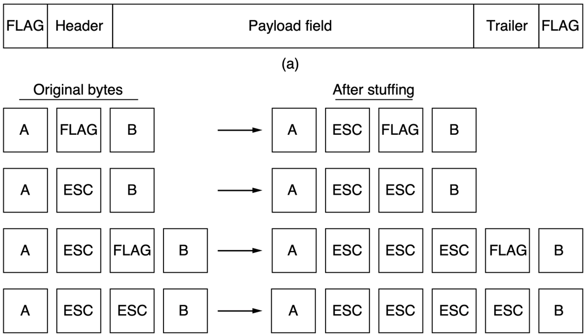
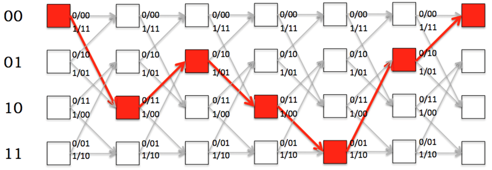
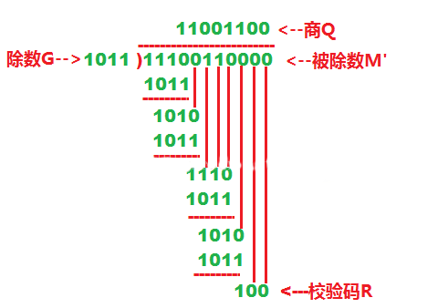

# 逻辑链路控制子层

!!!warning 混乱的计网？！
      不同地方对同一个东西的描述可能存在出入，这个在计网中尤为明显，遇到有问题的地方最好还是去核对下教材。

## 逻辑链路控制

### 成帧

以帧（frame）的形式传输来自网络层从源机器到目标机器的数据

### 服务分类

链路层为网络层提供如下三种服务：

1. 无确认无连接(Unackonwledged Connectionless)：不会检测和处理丢包，适合于错误率很低的实时传输。
2. 有确认无连接(Acknowledged Connectionless)：每个帧都会收到确认，未应答的帧会重发。
3. 有确认面向连接(Ackonwledged Connection-oriented)：发送的帧会被编号，适合于距离很长不可靠的信道。

### 确认帧的开头

1. 字节计数法(Byte Count)：在header中包含一个字段声明字节数，但是存在失去同步的问题，所以一般不会采用

2. 标志字节法(Flag Byte)：使用特殊的字节(Flag Byte)来标识帧的首尾，为了避免混淆数据位和标志位需要引入 ESC 转义

3. 零比特填充法：可以使用特殊的比特组合来作为标志，比如0111 1110，需要在数据位中的连续5个1后插入0，以避免出现连续的6个1，在接收数据时复原

4. 违规编码法：使用物理层编码规则中的保留组合来作为标志符，这样没有转义的开销，但是这样存在与物理层的耦合

## 检错和纠错

检错和纠错在理论上任意一层都可以做，不过数据链路层是距离错误最近的层，在这里完成可以保证交付给上层正确的数据。

#### 纠错码分类

前向纠错码(Forward Error Correction Code，FEC)指包含足够的冗余信息保证接收者能够推断出正确的原始数据。适合于噪声较高的信道，因为重发也会受到噪声的干扰。分为：

1. 块码(Block Code)：根据某种映射函数计算
2. 线性码(Linear Code)：使用线性映射函数，比如异或和模2加法
3. 系统码(System Code)：数据位和校验位是分开没有交叉的

#### Hamming Distance

- (n, m)
- code：n = m + r
- 码率：m/n
- Hamming Distance：两个编码之间相差的比特数

需要d+1位去侦测d位错，这样一来错d位不会是任何有效的编码；需要2d+1位去纠d位错，哪怕出了d位错，正确编码也是离错误编码最近的。

#### Hamming Code

!!!tip 具体怎么设计出来的不用管（

设计一种纠错码(n, m)，纠正所有的1bit错误，$2^m $种合法编码每个都有n种错误版本，因为n位每一位都可以分别反转。故需要满足：$(n+1)2^m\leq 2^n\Rightarrow (m+r+1)\leq 2^r $，这个公式可以用于计算需要的校验比特数

Hamming Code的算法不止一种，本质是相通的，推荐wiki上的算法，比如输入1001 1101，计算流程是：

1. 2的幂次位都是校验位，将其空出，写成_ \_1\_ 001\_ 1101
2. 然后将为1的位的序号写成二进制，即
   1. 0011
   2. 0111
   3. 1001
   4. 1010
   5. 1100
3. 将上一步的二进制数异或起来，为1011
4. 将结果依次填入校验位，**注意是反的**，1110 0011 1101

假设第三位发生了错误，收到的是1100 0011 1101，校验的方式也是将为1的位的序号写成二进制：
1. 0001
2. 0010
3. 0111
4. 1000
5. 1001
6. 1010
7. 1100

将这些二进制数异或起来，为0011，所以问题位是1+2=3，即第3位

#### Conventional Code

卷加码是一种与前k位（包含当前输入）相关的纠错码，k称作限制长度(Constraint Length)，也叫记忆深度，下图中：

- $\Sigma $表示对二取余求和
- S表示移位寄存器，初始值是确定的，比如都为0
- 输入一位，输出两位
  - 第一位是对输入，S2，S3，S5，S6求和
  - 第二位是对输入，S1，S2，S3，S6求和
- 每输出一次移位寄存器右移一位，输入的值移入S1

解码使用维特比算法，这是一个最大似然算法，找出出错最少的路径。可以分为硬抉择和软抉择。

#### Reed-Soloman Code

利用了一个n次多项式由n+1个点决定的性质，比如$Ax+B $，代入x=1,2,3,4计算，假设结果为73,249,321,393，接收者在收到这4个数后尝试解方程解出$A$和$B$——两两一组求解方程，选择数量最多的公共解。

RS 解码与纠错是在有限域（Galois Field，简称 GF）上完成的，就像拟合多项式一样，RS 把一段数据看成在有限域上采样的一条多项式曲线，解码就是从带有错误的点中重新拟合出原始多项式。

#### 检错码

检错码(Error Detecting Code，EDC)只关心如何发现错误，如果错误则重传。适用于低噪声的信道，这样重传大概率不会出错。常见的有：

- Parity：奇偶校验，添加一位使所有位的和为偶（或奇）
- Checksum：像是扩展版的奇偶校验，规则可以更复杂
- CRC：将比特串看作表示多项式的系数为0/1，比如110001，表示$1x^5 + 1x^4 + 0x^3 + 0x^2 + 0x^1 + 1x^0 $

CRC会考计算，发送者和接受者会约定一个$r$比特的生成多项式$G(x) $，$m$比特的数据对应一个多项式$M(x) $，帧错码的具体计算流程如下：

- 在m比特数据帧后添加$r $位0
- 用$x^rM(x) $除以$G(x) $，使用模2除法
- 用模2减法算出余数，作为校验和帧（商不重要）

## 流量控制与可靠传输

> 这里至少是半双工信道，因为要返回ACK

### 思想

理想的情况下不需要管流量控制和可靠传输，但这在现实中是不可能的，所以需要针对具体问题改进：

- 接收方处理能力有限，发送方不能一直发，需要引入确认机制（停等），发送方每发出一帧都需要收到接收方返回的确认帧后才能发送下一帧
- 信道不是理想的，发送方发出的帧可能丢失，需要引入超时重传机制，发送方发出帧后开启一个计时器，同时在缓冲区存储已经发送的帧，如果计时器到了则重发
- 接收方返回的确认帧也可能丢失，发送方收不到确认帧，会触发超时重传，但接收方实际又是已经收到了这一帧，这将导致重复，所以需要对帧进行编号，在停等的情况下用1bit编号即可

### 滑动窗口

在任意时刻，发送方都维持一组连续的发送帧号，称作发送窗口，接收方也维护一组允许接收的帧号，称为接收窗口。发送方每按序收到一个确认帧，就将发送窗口向前滑动一个位置，这样发送方就有一个新的帧可以发送，当发送窗口中没有数据帧可以发送时，发送方便停止发送。接收方也是类似的，每按序收到一个确认帧，就将接收窗口向前滑动一个位置，这样接收方就有一个新帧可以接收，如果收到的帧序号落在窗口外，则一律丢弃。

滑动窗口具有以下重要性质：

1. 只有接收窗口向前滑动时，发送窗口才有可能向前滑动
2. 三个ARQ协议都可以看做滑动窗口
   1. 停等：$W_T = W_R = 1 $
   2. 回退N：$W_T > 1, W_R = 1 $
   3. 选择重传：$W_T > 1, W_R > 1 $
3. 窗口大小是固定的，和传输层不同

### ARQ

使用确认和超时重传两种机制的可靠传输协议称为自动重传请求（Auto Retransmission reQuest，ARQ），它意味着重传是自动进行的，不需要接收方发起。

在有线网络中，链路层错误率较低，为了降低开销，并不要求数据链路层向上提供可靠传输，而无线网络易受干扰，因此要求数据链路层必须向上提供可靠传输。

#### 停等协议

基本就是上面思想中的内容，此处不赘述。停等协议由于每发一个数据帧就要进入等待，传输效率通常较低。

#### 回退N协议

回退N(Go Back N，GBN)协议中允许发送方将发送窗口中的数据帧全部发出，若发现这N个帧中的前一个数据在计时器超时时仍未收到确认消息，则该帧被判定为出错或丢失，此时发送方不得不重传该出错帧随后的N个帧。

GBN允许累积确认，接收方可以在连续收到多个确认帧后，对最后一个确认帧发回确认信息，表示这一帧及之前的所有数据帧均已准确无误地收到。接收方必须按序接收，也就是必须丢弃提前到达的后续帧。

若使用n bit对帧进行编号，则其发送窗口应满足$1<W_T\leq 2^n-1 $，否则将造成接收方无法分辨新旧数据帧。

#### 选择重传协议

为了进一步提高信道利用率，可以设法只重传出现差错和计时器超时的数据帧，但需要加大接收窗口，以便收下失序但正确到达且落在接收窗口内的那些数据帧，等到所缺序号的数据帧收齐后，再一并送交上层。这就是选择重传(Selective-Retransmission)协议。

不能使用累积确认，必须对每个数据帧分别确认，接收方需要设置足够的帧缓冲区来暂存那些失序但正确到达且序号落在接收窗口内的数据帧，然后发送方对每个帧超时重传。此外，选择重传协议引入了否定帧（NAK），当接收方检测到某个数据帧错误时，可以立即发送一个NAK，发送方收到NAK后会立刻重传对应的帧。

选择重传协议的窗口大小需要满足：

1. $W_R+W_T\leq 2^n $（其实GBN也是满足这个），否则将造成接收方无法分辨新旧数据帧
2. $W_R \leq W_T $，否则将永远不可能填满接收窗口

没有特殊说明，默认发送窗口和接收窗口是一样大的

### 信道利用率

> GBN和SR有可能信道利用率为100%

有一类题是计算信道利用率，不管是哪种协议，公式都是 发送方总发送时延/(发送方发送时延+RTT+接收方发送时延)，即完成一个帧传输的时间内能够发多少个帧。