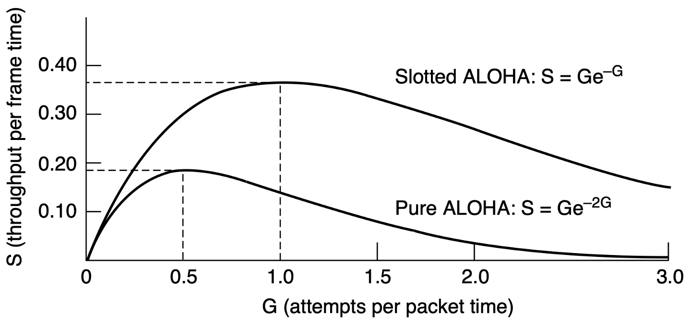
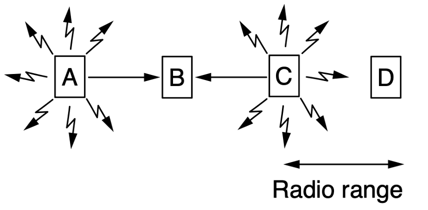
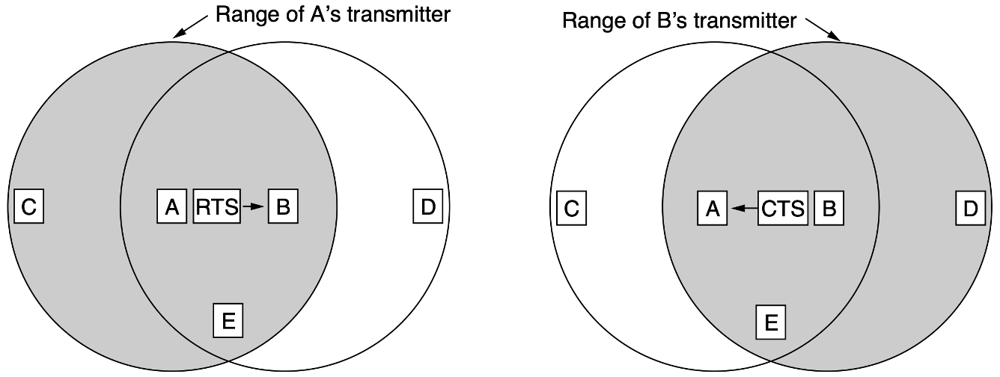
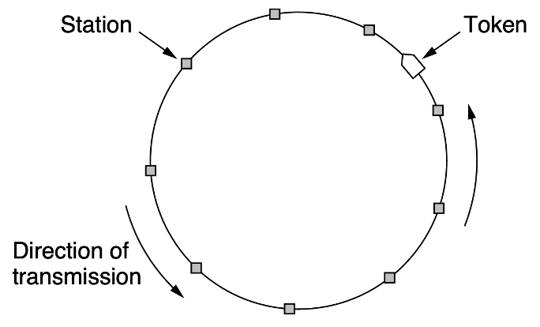

# 链路层2

## 多路访问协议

### 竞争协议

#### ALOHA

> PURE-ALOHA 的最好信道利用率为$\frac{1}{2e} $，而SLOTTED-ALOHA的最好信道利用率为$\frac{1}{e} $

PURE-ALOHA 的基本思想是总线型网络中的任何站点需要发送数据时，可以不进行任何检测，立刻发送。若一段时间内未收到确认，则该站点认为传输过程中发生了冲突，等待一段随机时间后重发数据（立刻重传一定会再次冲突），直至发送成功。

{width="400"}

SLOTTED-ALOHA 同步各站点的时间，将时间划分为一段段时隙，规定站点只有在时隙的开始才能发送帧，发送一帧的时间必须小于等于一个时隙。冲突后重传的策略和PURE-ALOHA相同。

{width="400"}

#### CSMA

载波侦听多路访问（Carrier Sense Multiple Access，CSMA）的思想是在发送前要侦听信道，检测到信道是空闲的才可以发送，分三种:

- 1-persistent CSMA：发送前持续侦听信道，一发现信道空闲则立刻发送，但这样势必会带来大量冲突
- non-persistend CSMA：发送前侦听信道，如果发现信道忙则放弃侦听，一段随机时间后重新侦听
- p-persistend CSMA：发送前持续侦听信道，如果发现信道空闲则有p的概率在当前时隙发出，有1-p的概率继续侦听。p-persistend CSMA 只适用于时分信道

#### CSMA/CD

冲突检测（Collison Detection）就是在发送过程中也持续侦听，适配器会检测信道电压变化，如果发现电压变化幅度超过某个阈值（不同帧发生了叠加），表明发生了冲突。

##### 争用期

电磁波在信道上传输的速率是有限的，当侦听到信道空闲时，信道未必真的空闲（可能只是其它帧还没到达）。极端情况是，当发送方发出的帧即将抵达接收方时，接收方发出了帧，这个时间加起来是$2\tau - \delta $，其中：

- $\tau $是单向传输时延
- $\delta $是极短时间，可忽略

因此只有在数据帧发出的$2\tau $时间内有可能发生冲突，这个时间被称作**争用期**。

##### 最短帧

考虑一种情况，发送方发出了一个极短的帧，在即将抵达接收方时发生了冲突，接收方检测到冲突会将其丢弃，但发送方对此毫不知情，因此为了避免这种情况，以太网规定了最短帧长=2\*最大单向传播时延\*数据传输率。短于最短帧长的mac帧需要加零补齐，故但凡收到短于最短帧长的帧都是错误的。

##### 截断二进制指数退避

之前一直在说发生冲突退避一个随机时间，那么这个时间如何随机出来？CSMA/CD采用截断二进制指数退避算法，计算流程如下：

1. 确定基本退避时间，一般取争用期
2. 从离散数集合$[0, 1, ..., (2^k-1)] $中随机取出一个数，记作$r$，其中$k=\min(重传次数, 10) $，等待时间为$2r\tau $
3. 重传16次还不能成功，说明网络拥塞，认为该帧永远无法发出，抛弃该帧并向高层报错

以太网还规定帧间最小间隔是9.6$\mu $s，相当于发96b的时间，这是为了使刚刚收到数据帧的缓冲来得及处理。

#### CSMA/CA

!!!question "为什么不能侦听无线信道？"
    1. 适配器接收到的信号强度远小于发送强度
    2. 存在隐蔽站和暴露站问题

冲突避免（Collision Avoidance）是指协议要尽力避免冲突，因为在802.11无线局域网中哪怕发生了冲突，仍会发送整个帧，这会严重降低网络效率。因为无线信道的质量远不如有线信道，所以802.11标准使用ARQ方案，标准无线局域网使用停等协议。

##### 帧间间隔

!!!note "AIFS 是什么？"
    下方没有提到AIFS，因为它是在802.11e（QoS 服务质量）标准中引入的，用来替代DIFS，用于划分不同服务的优先级。AIFSi表示i个时隙，等于SIFS+i * slot

为了尽量避免冲突，802.11标准规定，所有站在检测到信道空闲后，还要等待一段时间（继续监听信道）才能发送帧，这段时间被称为帧间间隔（InterFrame Space, IFS），帧间间隔取决于要发送的帧的类型，802.11的规定中有三种：

1. SIFS(短IFS)：最短的IFS，用来分隔属于一次对话的各帧
2. PIFS(点协调IFS)：不用管，一般不会用点协调
3. DIFS(分布式协调IFS)：最长IFS，在DCF方式下用来发送数据帧和管理数据帧

##### 虚拟载波侦听

上面说了不会真的去侦听无线信道，故是**虚拟**载波侦听，实际操作是源站要将它要占用信道的持续时间及时通知给所有其它站，以便使所有其它站在这段时间内都停止发送，这样大大减小了冲突概率。

##### 退避

当信道从忙转为空闲时，任何一个站要发送数据帧，不仅要等待一个DIFS的间隔，还要进入争用窗口，计算随机退避时间以便再次试图访问信道，因此降低了冲突发生概率。当且仅当检测到信道空闲，且这个数据帧是要发送的第一个数据帧时，才不使用退避算法，其它所有情况都必须使用退避算法。具体为：

1. 在发送第一个帧之前检测到信道忙
2. 每次重传
3. 每次成功后要发送下一个帧

CSMA/CA的退避和CSMA/CD稍有不同，第$i$次退避在$[0,...,(2^{2+k}-1)] $个时隙中随机选择一个，扩大了随机选择退避时间的范围，且6次退避后就不再增加。

##### RTS 和 CTS

隐藏终端问题如下图，A和C不在彼此的通信范围内，它们同时向B发送信息，是检测不到冲突的。

{width="400"}

暴露终端问题如下图，B向A发送数据和C向D发送数据是不冲突的，但是B和C会由于检测到对方正在发送，而误以为发生了冲突

{width="400"}

为了避免隐藏终端问题，802.11标准允许发送站对信道进行预约：

1. 源站在发送数据之前，先监听信道，若信道空闲，则等待时间DIFS后，广播一个请求发送控制（Request To Send,RTS）帧，它包括源地址、目的地址和本次通信所需的时间
2. 若AP成功收到RTS帧，且信道空闲，则等待时间SIFS后，广播一个允许发送（Clear To Send）控制帧，它也包括了这次通信所需的持续时间
3. 源站收到CTS帧后，再等待时间SIFS，就可发送数据
4. 若AP正确收到了源站发来的数据，则等待时间SIFS后就向源站发送确认帧ACK

{width="400"}

源站覆盖范围内的其他站在听到RTS帧后，将在RTS帧指示的时间内抑制发送；AP覆盖范围内的其他站在听到CTS帧后，将在CTS帧指示的时间内抑制发送。但是按照此处的RTS和CTS中时间，是无法解决暴露终端问题的，因为收到RTS还是得静默。不过其实没关系，因为已经证明隐藏终端问题和暴露终端问题在实际中发生的非常少。

!!!question "RTS/CTS 必须使用吗？"
    信道预约是可选机制，在数据帧较长时使用比较合算

## 无冲突协议

### 基本位图协议

每个竞争期正好有N个槽，如果第$i $个站有帧要发，则它在第$i $号槽中传输1位，当N个槽都经过后，每个站都完整知道了哪些站希望传输数据，这时，它们便按照顺序开始传输数据了。像这样在传输之前先广播自己有传输意愿的协议称为预留协议(Reservation Protocol)。

平均等待N个槽，在低负载的情况下信道利用率很容易计算，为d/(N+d)；在高负载情况下，考虑极限情况，每个站都有数据要发，则N位竞争期被均摊到N个帧上，为d/(d+1)

### 令牌环协议

!!!question "使用令牌环协议的网络一定是环形拓扑吗？"
    不一定，逻辑拓扑是环形即可，即每个站点要知道它的下一个站点是在哪里，比如在以太网中使用令牌环协议物理拓扑是星型的。

在令牌环协议中，一个环（Token）沿着**环形总线**在各站之间依次传递，令牌是一个特殊的控制帧，本身并不包含信息，仅控制信道使用，当环上的一个站点希望发送帧时，必须等待令牌。

1. 当网络空闲时，只有令牌帧在网络中循环
2. 当有站点要发送数据时，该站点将修改令牌中的标志位，并在令牌中附加要传的数据，将令牌变成一个数据帧发出去
3. 数据帧沿着环路传播，接收站点一边转发数据帧，一边检查目标地址是否是自己，如果是则复制一份数据以待后续处理
4. 数据帧转完一圈会回到源站点，发送站点通过检查返回的帧来判断传输过程是否出错，若是则重传
5. 源站点发完数据后，重新产生一个令牌，并传递给下一个站点

{width="300"}

### 二进制倒数协议

当站点数量特别庞大时，基本位图协议和令牌环协议的等待时间是很长的，所以需要设法改进。在二进制倒数协议中，如果一个站想要使用信道，则需要先以二进制形式广播自己的地址（假设传播时延可忽略），仲裁规则如下：要发送数据的站点从左到右对比收到的地址和自己的地址，如果发现某一位在收到的地址中为1，而在自己的地址中为0，它就必须放弃竞争。这个协议中存在优先级：高序号比低序号优先。

{width="200"}

信道利用率为$d/(d+\log_2N) $，但是如果帧格式中发送方地址正好是第一个字段，那么信道利用率是100%

## 有限竞争协议

!!!tip "衡量协议好坏的标准"
    1. 低负载下的延迟
    2. 高负载下的信道利用率

这里想要一种折中的办法，在低负载时竞争，在高负载时无冲突。假设同一时间有$k $个站点要发送数据，每个站点发送的概率是$p $，则恰有一个站点成功发送的概率是$kp(1-p)^{k-1} $，求导后可知极值点为$\frac{1}{k} $，代入原式可知最大概率为$(\frac{k-1}{k})^{k-1} $(函数图像如下图所示)，这个函数求导可知在$k<5 $时的变化很快，所以降低参与竞争的站点数目能够有效提高发送成功的概率，目标是在低负载时在单个组中包含很多个站，高负载时，每个时间槽中的站很少，甚至只有一个站。

{width="400"}

自适应树形遍历协议将站点看做一颗二叉树的叶子节点，在一次成功的传输之后的第一个竞争槽，即0号槽中，允许所有站点尝试获得信道，如果它们中的一个获得了信道，那很好；但如果发生了冲突，则只有2号槽中的站点可以参与竞争，如果其中的一个站点获得了信道，那么下一个槽就保留给了3号节点，否则继续DFS找到就绪站。

{width="300"}

如果在0号槽就发生了冲突，就需要遍历整棵树，而实际不需要从根开始。假设估计出的就绪站点有$q $个，按照上面的结论应该尽量让遍历起始节点下要发送的站点数为1，第$i $层有$2^i $个节点，平均每个节点下的就绪站点有$q/2^i $个，令其等于1，求解出$i=\log_2q $

## 局域网

### 以太网

以太网是目前最流行的有线局域网技术，它采用两项措施来简化通信：

1. 采用无连接的工作方式，提供不可靠的服务，尽最大努力交付数据，对差错的控制由高层完成
2. 发送的数据都使用曼彻斯特编码的信号

#### 传输介质

以太网常用的传输介质有4种：粗缆、细缆、双绞线和光纤。这里需要了解以太网的标准名称，10BASE5中，10是指标准的速率为10Mb/s，Base指基带传输，早起Base之后的5或2指单段最大传输距离不超过500m或185m,Base之后的T指双绞线，F指光纤。

计算机与外界局域网的连接是通过主板上嵌入的一块网络适配器(Adapter)，也称网络接口卡（Network Interface Card，NIC），适配器上有处理器和存储器，工作在数据链路层。适配器和局域网的通信是通过电缆或双绞线以串行方式进行的，而适配器和计算机的通信则是通过计算机的I/O总线以并行方式进行的。因此，适配器的重要功能就是进行数据的串并转换。当适配器收到正确的帧时，就使用中断来通知计算机，并交付协议栈中的网络层；当计算机要发送IP数据报时，就由协议栈把IP数据报向下交给适配器，组帧后发到局域网。

#### MAC 地址

!!!tip "MAC地址是IEEE802标准的规定，是所有局域网的通用的"

IEEE802 标准为局域网规定了一种48位的全球地址，指局域网上的每台计算机中固化在网络适配器ROM中的地址，称为物理地址或MAC地址。其长6B，一般表示为十六进制，形如`02-60-8c-e4-b1-21`，高24位为厂商代码，低24位为厂商自行分配的适配器序列号。

适配器从网络每收到一个MAC帧，首先都要用硬件检查是否发往本站，若是则收下，不是则丢弃，发往本站的帧包括：

1. 单播帧：目的地址与本站的MAC地址相同
2. 广播帧：全1地址，发给局域网中的所有站点
3. 多播帧：发给局域网中的部分站点

#### MAC 帧

以太网MAC格式有两种标准，DIX Ethernet V2标准和IEEE802.3标准，它们之间的差距很小，以下是DIX Ethernet V2的标准：

1. 前导码
   1. 7B前同步码：实现MAC帧比特同步
   2. 1B帧定界符：表示后面的信息是MAC帧
2. 目的地址：6B
3. 源地址：6B
4. 类型：2B，指出数据字段的数据应该交给哪个上层协议处理，比如网络层的IP
5. 数据：46~1500B，承载上层协议的数据单元（如IP数据报）
6. 校验码（FCS）：4B,校验范围是从目的地址到数据字段，采用32b CRC码

802.3帧格式与Ethernet V2帧格式的不同之处是用长度域替代了V2帧中的类型域，指出数据域长度，但实际上这两个可以同时存在，毕竟数据字段还有那么长。

#### 高速以太网

速率到达或超过100Mb/s的以太网称为高速以太网，包括100Base-T以太网、吉比特以太网和10吉比特以太网。

### WLAN

无线局域网可分为两大类：有固定基础设施（基站）的和无固定基础设施的。

#### 有固定基础设施的

对于有固定基础设施的无线局域网，IEEE制定了802.11系列协议标准。802.11使用星形拓扑，其中心称为接入点（Access Point，AP），在MAC层使用CSMA/CA协议，使用802.11系列协议的局域网也被称为Wi-Fi

802.11规定的无线局域网的最小构建是基本服务集（Basic Service Set，BSS），一个基本服务集包含一个接入点和若干个移动站。各站在本BSS内的通信，或与本BSS外部站的通信，都必须经过本BSS的AP。安装AP时，必须为其分配一个不超过32字节的服务集标识符（Service Set IDentifier，SSID）和一个信道。基本服务集覆盖的地理范围称为基本服务区(Basic Service Area，BSA)，无线局域网的基本服务区的直径一般不超过100m

基本服务集可以是孤立的，也可以通过AP连到一个分配系统（Distribution System，DB），然后连接到另一个基本服务集，构成一个扩展的服务集（Extended Service Set，ESS）。分配系统的作用是使扩展服务集表现的像基础服务集。ESS还可以通过一种称为门户（Portal）的设备为无线用户提供到有线连接的以太网接入。门户的作用相当于网桥。

#### 无固定基础设施移动自组织网络

无固定基础设施的无线局域网，也称自组网络（ad hoc network），自组织网络没有AP，而有一些平等状态的移动站相互通信组成了临时网络。一些可移动设备发现在它们附近还有其他的可移动设备，且要求和其他设备进行通信。自组织网络中的每个移动站都要参与网络中其它站的路由发现和维护，同时由于移动站构成的网络拓扑变化很快，因此在固定网络中有效的路由选择协议对移动自组织网络不适用。

#### MAC 帧

802.11的MAC帧有三种，即数据帧、控制帧和管理帧，数据帧的组成如下：

1. MAC首部，共30B
2. 帧主体，即帧的数据部分，最长2312B
3. 帧检验序列（FCS），共4B

MAC首部中最重要的是4个地址字段（都是MAC地址），这里仅讨论前三个地址（第四个地址用于自组织网络），这三个地址地段的内容取决于去往AP和来自AP的值，常用的两种情况如下：

| 去往AP | 来自AP |  地址1   | 地址2  |  地址3   | 地址4 |
| :----: | :----: | :------: | :----: | :------: | :---: |
|   0    |   1    | 目的地址 | AP地址 |  源地址  |  ---  |
|   1    |   0    |  AP地址  | 源地址 | 目的地址 |  ---  |

地址1是直接接收数据帧的节点地址，地址2是实际发送数据帧的节点地址，地址3是需要的源地址或目的地址。

此外，802.11还有：

1. 持续期字段：之前介绍过预约信道
2. 帧控制字段：类型字段和子类型字段用于区分帧的功能

### VLAN

通过虚拟局域网（Virtual LAN，VLAN）可将一个较大的局域网分割为一些较小的与地理位置无关的逻辑上的局域网，而每个VLAN是一个较小广播域，属于同一个VLAN的计算机可以直接通信，而不同VLAN之间的计算机不能通信。

有以下三种划分VLAN的方式：

1. 基于接口，将交换机的若干接口划分为一个逻辑组
2. 基于MAC地址，按MAC地址将一些主机划分为一个逻辑子网
3. 基于IP地址，根据网络层地址或协议划分VLAN

802.ac标准定义了支持VLAN的以太网帧格式的扩展，它在以太网帧中插入4B标识符，称为VLAN标签。VLAN标签的前两个字节总是置为0x8100，表示这是一个802.1Q帧，后两个字节事实只使用低12位，可以标识4096个不同的VLAN。插入VLAN标签后，FCS必须重新计算。

## PPP协议

点对点协议(Point-To-Point Protocol，PPP)是现在最流行的点对点链路控制协议，主要有两种应用：

1. 用户通常都要连到某个ISP才能接入互联网，PPP就是用户计算机与ISP通信时所用的数据链路层协议
2. 两台计算机之间的直连专用线路

PPP协议有三个组成部分：

1. 链路控制协议（LCP）：用来建立、配置、测试数据链路连接，以及协商一些选项
2. 网络控制协议（NCP）：PPP允许采用多种网络层协议，每个不同的网络层协议要用一个相应的NCP来配置，为网络层建立和配置逻辑连接
3. 将IP数据报封装到串行链路的方法，IP数据报在PPP帧中就是其数据部分，这个信息部分的长度受最大传输单元（MTU）限制

PPP帧结构如上图所示：

1. 首尾各有一个标志字段（F），规定为0x7E
2. 地址字段（A）：规定为0xFF（暂无意义）
3. 控制字段（C）：规定为0x03（暂无意义）
4. 协议段：表示信息段运载的是什么协议的分组
5. 信息段总长度可变，为0~1500B
6. 帧检验序列（FCS），CRC码

## 链路层设备

### 网桥

网桥是用来划分网段（冲突域）的设备，因为同一个集线器连接的是一个冲突域，如果只用集线器扩大网络，冲突域将越来越大，而网桥工作在数据链路层，可以根据mac地址去转发消息，从而隔离出不同冲突域。不过网桥实际已经被交换机淘汰。

### 交换机

链路层最重要的设备是以太网交换机（两层交换机），实际上是一个多接口的网桥，它能够将网络分成小的冲突域，为每个用户提供更大的带宽，

以太网交换机的特点：

1. 当交换机直接与主机或其他交换机连接时，通常都工作在全双工方式
2. 交换机具有并行性，能同时连接多对接口，使每对相互通信的主机都能像独占通信介质那样，无冲突传输数据，这样就不需要使用CSMA/CD协议
3. 当交换机的接口连接集线器时，只能使用CSMA/CD协议且只能工作在半双工方式。当前的交换机和计算机中的网卡，能自动识别上述两种情况。
4. 交换机是一种即插即用设备，其内部的帧转发表是通过自学习算法，基于网络中各主机间的通信，自动地逐渐建立的
5. 交换机因为使用专用交换结构芯片，交换速率较高

交换机的过滤和转发借助交换表完成，交换表中的一个表项至少包含：

1. 一个mac地址
2. 连接该mac地址的接口

交换表的建立是通过自学习过程：

1. 收到一个帧时，将帧的源地址和源接口号写入交换表（如果交换表中还没有的话）
2. 如果不清楚目标地址应该从哪个接口转发，则直接广播；反之，则从对应的接口转发
3. 交换表中的表项都设有过期时间，到期自动删除