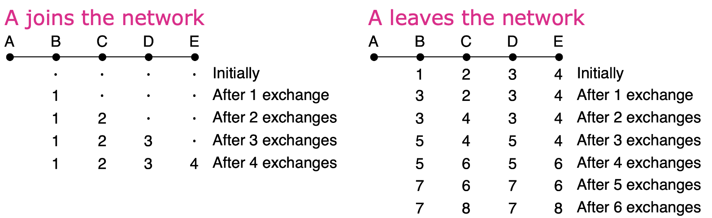
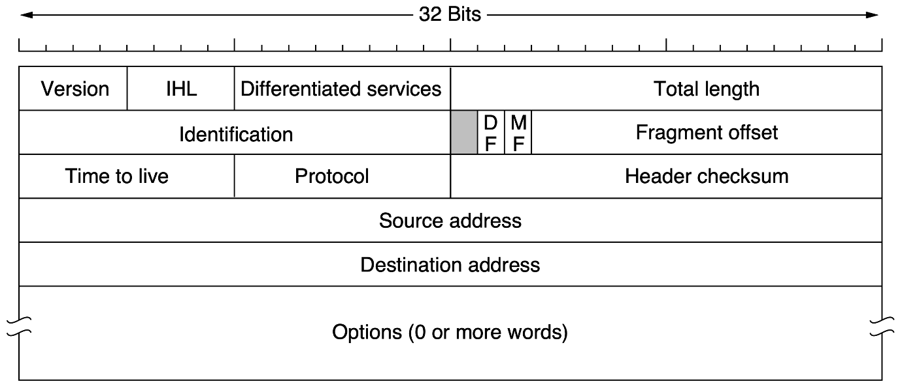
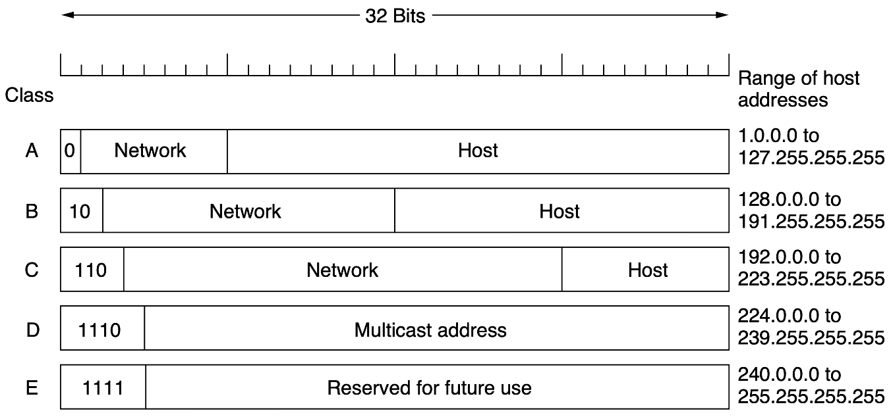
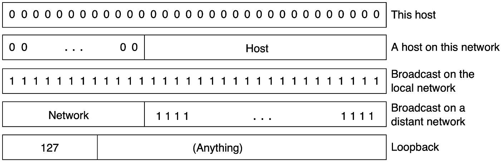
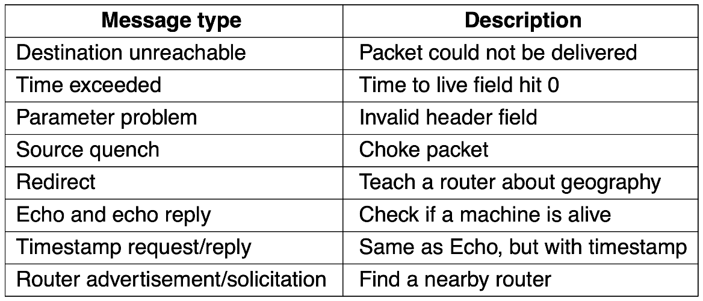

# 网络层

## 功能

### 简介

网络层提供主机到主机的通信服务，主要任务是将分组从源主机经过多个网络和多段链路传输到目的主机。该任务可划分为**分组转发**和**路由选择**两种重要功能。在互联网所采用的TCP/IP体系结构中，**网络层向上只提供简单的、无连接的、尽最大努力交付的数据报服务**。也就是说，所传送的分组可能出错、丢失、重复、失序或超时，这就使得网络中的路由器可以做得比较简单，而且价格低廉。

### 异构网络连接

> 由于历史原因，我们往往也把网络层的路由器称为网关。

互联网是全球范围内数以百万计的异构网络互连起来的。这些网络的拓扑结构、寻址方案、差错处理方法、路由选择机制等都不尽相同。网络层要完成的任务之一就是实现这些异构网络的互连。网络互连是指将两个以上的计算机网络，通过一定方法，用一些中继系统相互连接起来，以构成更大的网络系统。根据所在的层次，中继系统分以下4种：

1. 物理层：转发器、集线器
2. 数据链路层：网桥或交换机
3. 网络层：路由器
4. 网络层以上：网关

当使用物理层和数据链路层的中继系统时，只是把一个网络扩大了，而从网络层的角度看，它仍是同一个网络，一般并不称为网络互连。因此，网络互联通常是指路由器进行网络连接和路由选择。**路由器是专门用于路由选择的网络设备**（可以是专用硬件或专用计算机），用于在互联网中进行路由选择。IP 抹除了不同网络的差异，当IP网上的主机进行通信时，就好像在单个网络上通信一样，而看不见互连的各个网络的具体异构细节。

### 路由与转发

路由器主要完成两个功能：一个是路由选择（确定哪一条路径），二是分组转发（当一个分组到达时所采取的动作）。前者根据路由协议计算并构造路由表，后者处理通过路由器的数据流，关键操作是转发表查询、转发及相关的队列管理和任务调度等。

### 两种服务

1. 虚电路服务(virtual-circuit network)：两台计算机通信时，应当先建立网络层连接，也就是建立一条逻辑上的虚链路(virtual-circuit, VC)，但它并不会真的独占链路，只是同一个连接间的报文都通过固定节点转发。如今也有类似的协议在使用，比如MPLS
2. 数据报网络(datagram network)：网络在发送分组前不需要建立连接，中间节点选择最佳路由进行存储转发。网络层不提供服务质量的承诺，这使得网络中的路由比较简单，且造价低廉。如今的Internet基本使用数据报网络

对比：

|                    |                          数据报服务                          |                        虚电路服务                        |
| :----------------: | :----------------------------------------------------------: | :------------------------------------------------------: |
|     连接的建立     |                            不需要                            |                          必须有                          |
|      目的地址      |                每个分组都需要有完整的目的地址                | 仅在连接建立阶段使用，之后每个分组使用长度较短的虚电路号 |
|      路由选择      |               每个分组独立地进行路由选择和转发               |          属于同一条虚电路的分组按照同一路由转发          |
|      分组顺序      |                      不保证分组有序到达                      |                     保证分组有序到达                     |
|       可靠性       |             不保证可靠通信，可靠性由用户主机保证             |                     可靠性由网络保证                     |
| 对网络故障的适应性 | 出故障的节点丢失分组，其它分组路径选择发生变化时可以正常传输 |          所有经过故障节点的虚链路均不能正常工作          |
| 差错处理和流量控制 |          由用户主机进行流量控制，不保证数据报可靠性          |         可由分组交换网络负责，也可由用户主机负责         |

## 路由算法

### 路由原理

#### 最优化原则

- 在不考虑网络拓扑或流量的情况下，得出关于最优路由的通用表述
- 如果路由器节点$J $在从$I $到$K $的最佳路径上，那么从$J $到$K $的最佳路径也必须在这条路径上
- 汇集树 (Sink Tree) 是指从给定节点到所有其它节点的最短路径构成的有向无环图，可能不唯一

#### 最短路径算法

Dijkstra算法是经典的最短路径算法，伪代码如下：

- $c(i, j) $：从$i $到$j $的链路开销（没有则为$\infin $）
- $D(v) $：从源节点到目标$v $的当前开销
- $p(v) $：从源节点到目标$v $的前继节点
- $N' $：已经找到最短路径的节点

```py
N' = A
for all nodes v
    if v adjacent to A
        then D(v) = c(a, v)
        else D(v) = infinity
Loop
    find w not in N' such that D(w) is minimum
    add w to N'
    update D(v) for all v adjacnet to w and not in N':D(v) = min(D(v), D(w) + c(w, v))
until all nodes in N'
```

Dijkstra 算法在找到最短路径后，只知道最短路径上的前继节点位置，但路由时每个路由器都需要知道具体的输出路径，所以还需要遍历前继节点得到具体的路径。

### 路由算法

- 静态路由：由网络管理员手工配置每一条路由
- 动态路由：根据网络负载和拓扑结构的变化来动态调整自身的路由表

#### 泛洪

泛洪(flooding)是一种简单但开销较大的路由方案：

- 每个到达的数据包都被转发到所有可能的线路上（除了来的线路），数据包头中有跳数字段，每转发一次跳数减1，当跳数为0时丢弃数据包
- 为了减轻网络压力，源路由器可以在数据包头中添加一个序列号，每个路由器会为其他路由器维护一张序列号表，记录已经收到过的数据包，对于已经收到过的数据包不再转发
- 为了减少存储序列号的开销，可以使用计数器代替序号表，类似累积确认，数字k表示已经收到序号为1~k的数据包

虽然泛洪是一种开销很大的方案，但实际中确实有使用泛洪的网络，比如BLE Mesh。此外泛洪还有以下优点：

- 几乎不需要知道任何网络信息，即使路由器大量宕机，也能找到可行的路径
- 理论上泛洪总能找到最短路径，可以用于与其它路由算法对比
- 单播时泛洪效率较低，但广播时泛洪相对高效

#### 距离向量路由

在距离向量路由(distance vector routing)中：每个路由器都知道直连的邻居和开销，会和邻居交换自己的路由信息，然后使用Bellman-Ford算法迭代独立地计算路由:

- $D_x(y) $：从$x $到$y $最短路径的开销
- $D_x(y) = \min(c(x, v) + D_v(y)) $ for all neighbors $v $ of $x $

距离向量路由在正常情况下会收敛到全网的最佳路由，但是存在Count-to-infinity问题，它对好的变化反应快，但是对坏的变化（如链路故障）反应慢。

如下图所示，A加入网络后开始路由，B、C、D、E都依次计算出了到A的路由，这没有任何问题。但是，当A突然断线时，会发生如下问题：

- B知道到A的线路不存在了，将到A的距离标记为infinity，而C会告诉B它知道一条到A距离为2的线路，B更新到A的下一跳为C，距离为3
- C收到两个邻居B和D的包都显示它们到A的距离为3，C会随机选择一个作为到A的下一跳，并更新距离为4
- 这种错误的更新会不断继续下去，直到距离变为infinity（不是真的infinity，实际可以设置为网络的最大长度）



#### 链路状态路由

在链路状态路由（link state routing）中，路由器会：

1. 发现邻居并知晓它们的地址：发送一个特殊的HELLO包到所有点对点的线路，另一端的路由器将返回应答（其中包含它的名称，应全局唯一）
2. 设置到邻居的距离：可以用线路带宽的反比，或者使用链路延迟（使用探测包测算）
3. 构建包用于通告学习到的距离：其中包含发送者、序列号、年龄(age)、邻居和距离等，可以选择周期性构建或者在特定事件时构建
4. 发送和接收包：泛洪传播包（其中包含序列号和年龄），路由器要在较短时间内收到包，否则可能有其他路由器加入或退出网络
5. 计算到各路由器的最短路径：收到一定数量的包后，在本地使用最短路径算法计算出到各个目标的路由

年龄(age)类似于TTL，不过它有两个作用：
- 在泛洪的过程中不断减小，到0时包被丢弃，用于限制泛洪
- 作为过期时间，在收到后也不断减少，为0时包被丢弃

#### 层级路由

> N个路由器网络的最佳层数为$\ln N $，需要每个路由器中有$e\ln N $项

随着网络规模的不断扩大，如果每个路由器都需要维护全部路由信息，会消耗极大的存储空间，并且路由算法实际也难以工作，因而需要层级路由。


## 路由模式

### 广播

将包发送到所有地址：

#### Straightforward Solution

向每个地址都单独发送数据包，这种方法不仅浪费带宽，而且效率低，还需要知晓完整的地址列表。

#### Multidestination Routing

每个数据包中包含地址列表或位图（指示这个包要发到哪些地址），当路由器收到数据包时会检查目标地址，将数据包复制转发到所有目标线路，最终每个数据包中只包含一个地址并到达对应目标。发送节点仍然需要知道所有地址，并且路由器需要做大量的复制和转发工作。

#### Reverse Path Forwarding (RPF)

如果能够按照sink tree转发，那么不会有任何重复，但是路由器中只有路由表，所以采用近似策略。当一个广播数据包到达路由器的某个接口时，路由器查看这个数据包的源地址，并检查自己的单播路由表：
- 如果数据包进来的接口，正好是路由器发往该源地址的接口，则认为该数据包是合法的，并将其转发到其他所有接口
- 如果数据包从其他接口进来，路由器会认为这是一个重复的数据包或者是从环路绕回来的，直接将其丢弃

### 多播

#### 生成树

多播是指将消息发送到规模较大但相对整个网络较小的组，分为稠密组和稀疏组：

- 稠密组：主机散布在整个网络中的大部分地方
- 稀疏组：主机零星出现在网络的几个地方

对于稠密组，可以使用生成树，不过要进行剪枝，如下图所示


- MOSPF协议：对于链路状态路由，每个路由器是知道完整拓扑的，每个路由器可以自己构建剪枝后的生成树
- DVMRP协议：对于距离向量路由，剪枝需要递归进行

#### 核心基树

核心基树(Core-based tree)以每个组中所有路由器都认可的路由器为根，为每个组计算单一的生成树，进行多播时，会先将包发到根，在发送过程中经过生成树的节点即可同时向下转发。

### 任播

任播将同一个组的成员看作同一个地址，数据包会被路由到该组中最近的成员。任播常用于DNS根服务器等场景，可以提高服务的可用性和响应速度。

## 网络的连接

### 异构网络

异构网络连接的任务由网络层完成。网络层接收来自传输层的分组，加上IP头组成IP数据报，然后交给链路层。链路层根据实际的链路协议添加链路层头部，然后进行传输。


IPv4和IPv6并不兼容，一种解决方案是将IPv4数据报封装在IPv6数据报中，从而建立隧道(tunnel)进行传输


### 分组

每个网络或链路对数据包的最大大小有限制，MTU(Maximum Transmission Unit)是数据包能够通过链路的最大大小。如果数据包超过了这个大小，需要进行分片，分片有两种方式：

- **透明分片**：在进入网络时分片，在离开网络时重组
- **不透明分片**：在进入网络时分片，不在中间节点重组，只在目的主机重组


**Path MTU Discovery**：通过尝试发送较大的数据包来发现路径上的最小MTU，如果收到ICMP错误消息则说明链路的MTU不足，需要减小数据包大小重试。

## 网络协议

### IPv4

!!!tip 为什么只有v4和v6，其它版本呢？
    其实是有的，只是这些版本都没有被推广过，比如v0~v3都是试验版本，甚至当时TCP和IP都还没有分开。

#### header

IPv4 header 有20B的必须部分和可变长的可选部分



1. **Version**：IP协议的版本号（IPv4为4）
2. **IHL** (Internet Header Length)：IP头部的长度，以32位（4字节）为单位
3. **Differentiated service**：区分服务字段，高6位是服务类型，低2位是显式拥塞通告(ECN)
4. **Total length**：IP头部和数据的总长度，以字节为单位，最多65535字节
5. **Identification**：标识同一个数据包的所有分片，用于分片重组
6. **Reserved bit**：保留位，必须为0
7. **DF** (Don't fragment)：不分片标志，设置后不允许对该数据包进行分片
8. **MF** (More fragment)：更多分片标志，设置表示还有更多分片（不是最后一个分片）
9. **Fragment offset**：分片在原数据包中的偏移量，以8字节为单位，最多支持8192个分片
10. **TTL** (Time To Live)：生存时间，限制数据包的生命周期，每经过一个路由器减1，为0时丢弃
11. **Protocol**：指示上层协议类型（如TCP=6, UDP=17, ICMP=1）
12. **Header checksum**：头部校验和，用于检测头部错误，每一跳都要重新计算
13. **Source address和Destination address**：32位的源IP地址和目标IP地址
14. **Options**：可选字段，用于扩展功能，需要对齐到4字节边界

#### address

- IPv4地址是32位的，一般写成形如`10.0.0.1`的格式
- IP地址可以分为两部分，高一部分表示网络，低一部分表示主机，为了区分引入了子网掩码(subnet mask)。子网掩码写成`255.255.255.0`或`/24`的格式

IP地址最开始是按照一定规则进行了分类，但这样做有两大问题：

1. 地址分配不灵活：一个C类地址最多可以容纳$2^8 -2=254 $个主机（去除了特殊IP），如果不够用去申请一个B类地址，又发现用不完，造成地址浪费
2. 路由表膨胀：路由表是按照类别来记录的，随着连接到互联网的网络数量增加，路由器需要存储数以百万计的路由条目，导致路由表过大



#### CIDR

无类别域间路由(Classless InterDomain Routing, CIDR)不再遵循上面的类别划分，允许任意长度的网络前缀，转发时遵循最长前缀匹配原则（Longest Prefix Match）。


特殊的IP地址如下：



#### NAT

由于IPv4不够用，想到了一种解决方案，考虑到：

- 一台机器的端口号一共有65536个，几乎没有机器能够真正用完这些端口
- 在内部网络使用虚拟的IP地址，在与外部网络交流时使用真正的IP地址（由一台机器代理）
- 使用代理机器的IP地址+端口号来标识内部网络的IP地址
- 端口号在传输层中的TCP/UDP协议中有

映射关系存储在NAT(Network Address Translation)转换表中，具体的通信流程如下：

1. 内部网络的机器发出一个到外部网络的请求，这个请求由代理机转发，同时为它分配一个映射
2. 外部网络的请求在发往本网络时，根据NAT定位到具体机器


显然，NAT存在一些问题：外部网络无法直接找到内部网络的主机（需要内部主机主动发起连接），并且NAT违反了分层原则，需要查看传输层的端口号信息。

规定以下地址为内网地址，这也是日常使用`ifconfig`显示出的ip地址


### IPv6

IPv6 设计出来用于解决IPv4地址空间不足的问题，有128位地址空间，地址数量多到可以给世界上的每一粒沙子编号。它与IPv4不兼容，但可以与其它互联网协议配合使用，比如ICMPv6、TCP和UDP。目前IPv6已经在全球范围内逐步部署和使用。

IPv6 header 是定长的，为40B


1. **Version**：IP协议的版本号（IPv6为6）
2. **Differentiated services**：区分服务字段，类似IPv4
3. **Flow label**：流标签，用于标识需要相同处理的数据包流
4. **Payload length**：载荷长度，即数据部分的长度，以字节为单位
5. **Next header**：下一个头部，说明紧跟在IPv6头部之后的是扩展头还是上层协议（如TCP、UDP）
6. **Hop limit**：跳数限制，类似IPv4的TTL，每经过一个路由器减1
7. **Source address和Destination address**：128位的源IP地址和目标IP地址

IPv6地址写出来非常长，比如`8000:0000:0000:0000:0123:4567:89AB:CDEF`，按照规定可以省略全0的组，写成`8000::0123:4567:89AB:CDEF`（注意连续的全0组可以用`::`表示，但只能使用一次）

### ICMP

ICMP(Internet Control Message Protocol)用于向发送者报告网络层的错误和异常情况，比如目的不可达、超时等。



**Traceroute**：使用ICMP的TIME EXCEEDED消息来发现路径上的路由器，通过依次发送TTL为1, 2, 3...的数据包，每经过一个路由器TTL减1，当TTL为0时路由器返回TIME EXCEEDED消息，从而可以确定路径上的每个路由器。

### ARP

ARP(Address Resolution Protocol)用于将IP地址映射到MAC地址。当主机需要发送数据包到同一局域网内的另一台主机时，需要知道目标主机的MAC地址。ARP通过广播ARP请求来查询IP地址对应的MAC地址，目标主机会返回自己的MAC地址。

### DHCP

!!!warning DHCP 工作在应用层
    虽然是在网络层讲的DHCP，但它其实工作在应用层，毕竟它都用到了UDP

DHCP(Dynamic Host Configuration Protocol)使用DHCP服务器为网络中的主机动态分配IP地址（以下均认为是广播）：

- 主机启动时使用DHCP DISCOVER广播请求IP地址
- DHCP服务器使用DHCP OFFER响应
- 分配一个空闲的IP地址给主机
- 之后主机发送DHCP REQUEST确认，服务器发送DHCP ACK完成分配。

Leasing(租约)：为了避免过高的开销，IP地址并不会频繁变更，至少会持续一段时间。在租约到期前，主机会重新请求DHCP服务器来续约(renewal)

### MPLS

MPLS(MultiProtocol Label Switching)在每个包之前添加了一个标签，然后根据标签而不是地址进行转发，在LSR(Label Switching Router)中使用内部表记录每个标签和对应输出路线的映射，以及接下来将使用的新标签。


## 路由协议

### RIP

RIP(routing information protocol)使用距离向量算法，距离度量是跳数（最多15），相邻路由器每30s交换一次路由信息，如果有180s没收到邻居的信息，则标记其为无效，并通知其它邻居。

### OSPF

OSPF(Open Shortest Path First)是一种链路状态路由协议，使用Dijkstra算法计算最短路径。OSPF支持分层路由（分为骨干区域和普通区域），支持负载均衡，收敛速度快，适合大型网络。

### BGP

BGP(Border Gateway Protocol)是一种**路径向量**（类似于距离向量，不过要知道前置路径）路由协议，用于在不同自治系统(AS)之间交换路由信息。BGP是互联网的核心路由协议，负责在ISP之间传播路由信息，支持策略路由和路由过滤。