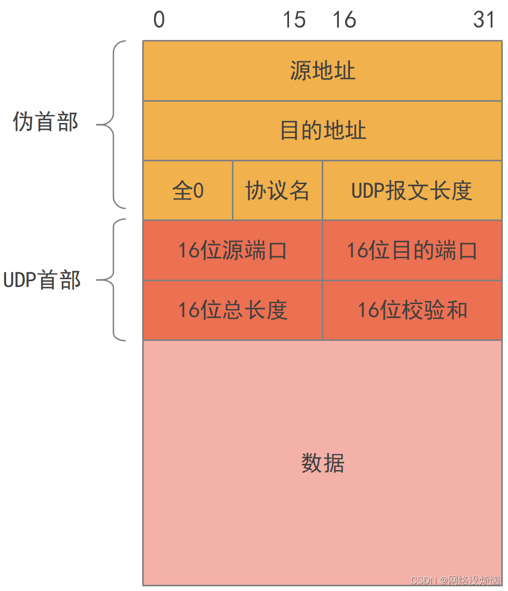
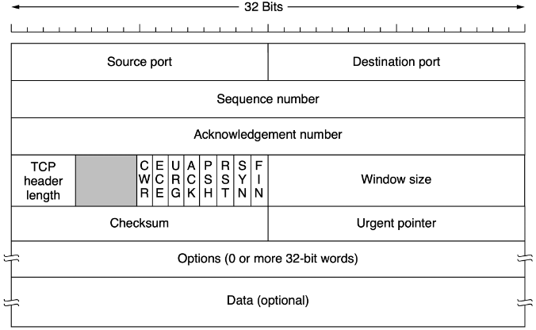
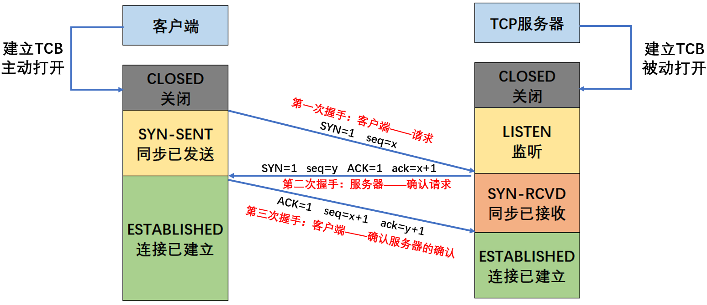
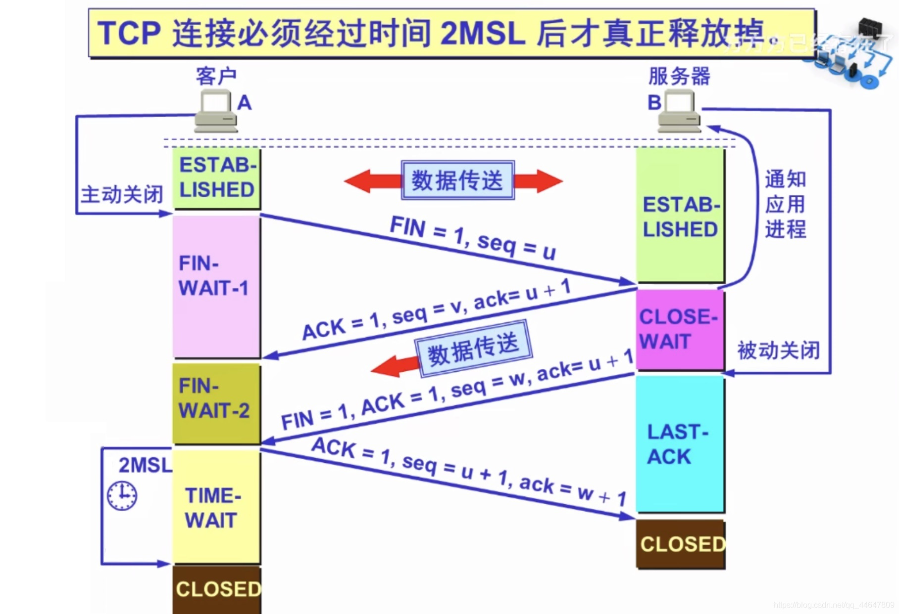
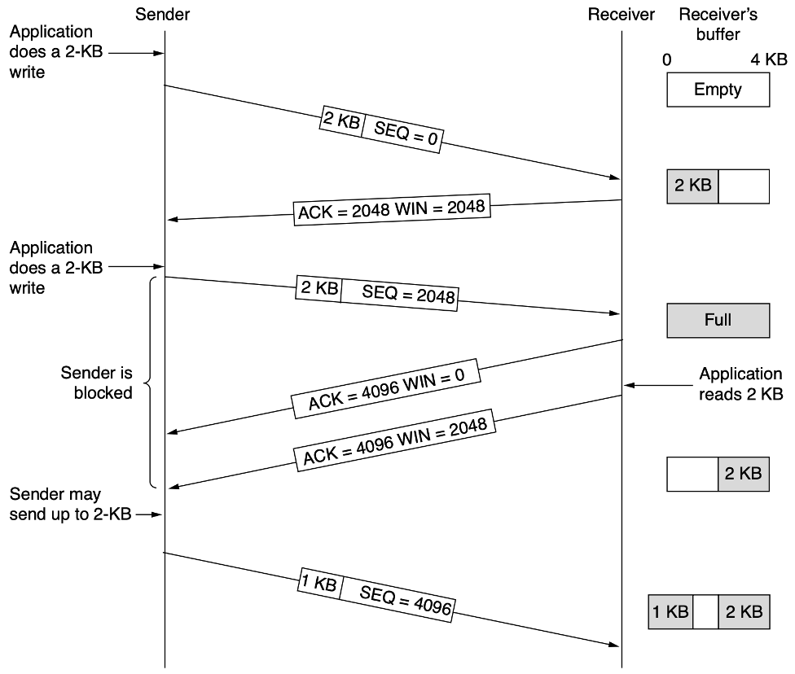
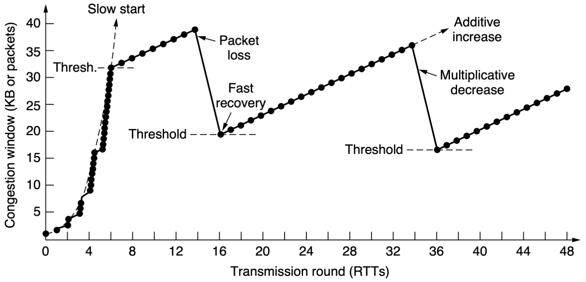

# 传输层

!!!note 为什么感觉计网越往上越简单？
    并非因为上层协议简单，而是考试内容相对简单。

## 传输层提供的服务

### 定位

网络层实现了点到点的通信（即不同主机之间的通信）。学过操作系统后我们知道，一台计算机上会运行多个进程，通过网络传输的数据最终需要传递给特定的进程。因此，传输层实现了端到端的通信（即不同主机上的不同进程之间的通信）。传输层属于面向通信部分的最高层，同时也是用户功能中的最低层。传输层的主要功能如下：

1. **进程间的逻辑通信**：实现端到端通信
2. **复用和分用**：
   - 复用：发送方的不同进程可以使用同一个传输层协议传送数据
   - 分用：接收方的传输层在剥去报文首部后，能够将数据正确交付到目的应用进程
3. **差错检测**：传输层需要对收到的报文进行差错检测
4. **提供两种传输服务**：面向连接和无连接的传输协议，最常见的是TCP和UDP

!!!question 为什么传输层要提供两种传输服务？
    因为网络层的实现取决于ISP，事实上平时我们用的网络层服务都是无连接的。传输层跑在用户机上，可以由用户选择是否有连接。

### 寻址

端口的作用是标识主机上的进程，它使得应用层的各种进程能够将其数据向下交付给传输层，同时也让传输层知道应当将其报文段中的数据向上交付给应用层的相应进程。这里的端口是软件概念（抽象出来的，不存在物理实体），并且是一个本地概念（只在同一台机器上有效）。

端口号长度为16bit，能够表示65536个不同的端口号。显然，没有一台机器能够真正用完这些端口，这也是网络层能够使用NAT的原因之一。端口号可以分为以下几类：

- **服务器端使用的端口号**：
  - **熟知端口号**：数值为0~1023，这些端口号被分配给了TCP/IP中最重要的一些应用程序，例如HTTP使用80端口，HTTPS使用443端口
  - **登记端口号**：数值为1024~49151，供没有熟知端口号的应用使用
- **客户端使用的端口号**：数值为49152~65535，这类端口号仅在客户进程运行时才动态选择，因此也称为短暂端口号

### 套接字

将端口号与IP地址组合就构成套接字（Socket）。套接字实际上是一个通信端点，能够唯一地标识网络上的一个应用进程。此外，Socket还有一个更常见的含义，它是应用程序层与TCP/IP协议族进行交互的编程接口（API），进程可以通过Socket在同一台机器上或不同机器上进行通信。

## UDP

### 概述

UDP 仅在IP层的数据报之上增加了复用、分用和差错检测功能。若应用开发者选择UDP，则应用程序几乎是直接和IP打交道。TCP并不是完全优于UDP，UDP还是有自己的优点：

1. 无连接：不会引入建立连接的时延
2. 无连接状态：UDP不维护连接状态，也不跟踪连接参数
3. 首部开销小：TCP至少有20B的首部开销，UDP仅有8B开销
4. UDP没有拥塞控制：网络中拥塞不会影响源主机的发送速率
5. UDP支持一对一、一对多、多对一和多对多的交互通信

!!!tip 实际真的会使用UDP吗？
    大部分情况下不会直接使用裸的UDP，哪怕可以容忍丢包，乱序一般都是不可接受的。实际会在应用层添加可靠机制，或会改进UDP

UDP常用于一次性传输较少数据的网络应用，如DNS、SNMP等。UDP是面向报文的，发送方的UDP对应用层交下来的报文，在添加首部后就向下交付给IP层了，一次发一个报文，既不合并，又不拆分。因此，应用程序必须选择合适的报文大小，若报文太长，则UDP将它交付给IP层后，可能导致分片；若报文太短，则UDP把它交给IP层后，会使IP数据报的首部相对长度太大，两者都会降低IP层的效率。

### 首部格式

UDP的首部只有8B，由4个字段组成，每个字段的长度都是2B，各字段的含义如下：

1. 源端口(source port)
2. 目的端口(destination port)
3. 长度(length)：UDP数据报的长度（包括首部和数据），最小是8B（只有首部），最大65536B
4. 校验和：可选，没有则置为0

接收方的传输层在收到UDP报文后，会查看目的端口将其上交给应用层对应程序，如果发现不存在对应进程，则由ICMP发送”端口不可达“差错报文给发送方。

### 校验

计算方式和IP Header很像，在UDP报文之前增加12B伪首部，包含：

1. 源IP地址
2. 目的IP地址
3. 0填充
4. 协议名（协议号），UDP是17
5. UDP报文长度

这**违反了分层原则**，看了网络层才有的IP，之所以要这么做是因为IP很重要，IP错了根本就传不到目标主机。伪首部不会真的发送，它单纯用来计算校验和。

---

UDP校验和计算方法如下：

1. 把全0填入校验和字段
2. 按16bit划分伪首部和UDP数据报
3. 如果数据部分不是2B的倍数需要补齐（这部分字节不发送）
4. 按照二进制反码计算出这些16位字的和
5. 将计算结果的二进制反码填入校验和字段

!!!tip 二进制加法和常规加法稍有不同
    - 0+0=0
    - 0+1=1
    - 1+1=0，并产生进位1
    - 若最高位有进位则在最低位加1

接收方在发现UDP报文错误时可以丢弃，也可以交付给应用层，但要附上错误报告。此外UDP校验和为全0应该填为全1，否则无法和不使用校验和区分。

## TCP

### 概述

TCP 能够在不可靠的IP层之上实现可靠传输，它主要解决传输的可靠、有序、无丢失和不重复问题，TCP相比UDP来说复杂了很多，主要特点如下：

1. 面向连接
2. 只能一对一
3. 可靠交付，保证无差错、不丢失、不重复且有序
4. 全双工通信
5. 面向字节流，TCP与应用程序的交互一次是一个数据块（大小不等），仅视为字节流

!!!question UDP 一定比 TCP快吗
    大部分情况下是的，极端情况下可能不是，比如丢包率过高导致UDP不断重传

### 首部格式

TCP首部比UDP长，前20B是固定的，后面有4N B是可扩展的

TCP的首部的字段非常多，包括：

1. 源端口(source port)和目的端口(destination port)，各占2B，和UDP一样
2. 序号(Sequence Number)，占4B,范围为0~2^32-1，TCP传输的字节流中的每个字节都要按顺序编号，序号字段值是指本报文段所发送数据的第一个字节序号
3. 确认号(Acknowledge Number)：占4B，**是期望收到对方下一个报文的序号**，和链路层的确认号不一样
4. 数据偏移（首部长度）：占4b，因为TCP首部有可选字段，所以首部长度不定。4B能表示的最大数是15，所以TCP首部最长是60B（偏移的单位是4B）
5. 保留，占6位，目前置为0
6. 紧急位URG，当URG=1时，表示紧急指针字段有效。紧急数据被插入至报文段数据最前面，而紧急数据后面的数据仍是普通数据
7. 确认位(ACK)：仅当ACK=1时，确认号字段才有效，TCP规定在连接建立后所有传送的报文段都必须把ACK置1
8. 推送位（PSH）：PSH=1表示接收者应尽快把报文段交付给应用程序，不要等待
9. 复位位（RST）：当RST=1表示TCP连接中出现严重差错，必须释放连接，然后重新建立传输连接。此外，它还被用于拒绝一个非法的报文段
10. 同步位（SYN）：当SYN=1时表示这是一个连接请求或连接接收报文
11. 终止位（FIN）：用来释放一个连接，当FIN=1表示发送方数据已经发送完毕，并要求释放传输连接
12. 窗口：占2B，接收方目前允许接收的最大数据量，用于流量控制
13. 校验和：占2B，计算方式同UDP，不过协议字段需要从17改为6
14. 紧急指针：占2B，指出紧急数据的字节数，即使窗口为0，也可以发送紧急数据
15. 选项：长度可变，TCP期初只规定了一种选项，即最大报文段长度（Maximum Segment Size，MSS），它是TCP报文段中数据字段的最大长度
16. 填充，使得整个首部的长度是4B的整数倍

### 连接管理

> 著名的三次握手，四次挥手，相信大部分人可能从一开始学计算机就知道这个东西了，不过它到底是怎么一回事，且看下文分解

#### 三次握手

在TCP连接的建立过程中，要解决以下三个问题：

1. 要使每一方能够确知对方存在
2. 要允许双方能够协商一些参数
3. 能够对运输实体资源进行分配

TCP的连接端口是套接字(Socket)，每一条TCP唯一地被通信的两个端点确定，还需要注意，同一个IP地址可能有多个不同的TCP连接，而同一个端口号也可以出现在多个TCP连接中。TCP连接采用Client/Server模式。

!!!question 为什么图中ack是对seq+1
    因为现在是连接建立阶段，按规定前两次握手都是不能带数据的，但序号消耗1，第三次握手可以携带数据，但如果没有数据则不消耗序号

三次握手的过程如上图所示：

1. 第一次：客户端请求，SYN=1，seq=x
2. 第二次：服务器确认请求，SYN=1，seq=y，ACK=1，ack=x+1
3. 第三次：客户端确认服务器的确认，ACK=1,seq=x+1，ack=y+1

!!!tip SYN Flooding

    如果有恶意客户端，只进行前两次握手，那么会空耗服务器的资源（每个连接都需要分配资源），当这样的恶意客户端足够多，服务器就无法正常工作，这便是SYN Flooding(SYN 泛洪攻击)，解决方案是SYN Cookie

#### 四次挥手

> 虽然中文叫挥手，但英文其实还是handshake

TCP 是全双工的通信，所以任何一方都能主动结束连接，但是一方结束了，另一方呢？这就是四次挥手要解决的问题。

四次挥手的过程如上图所示：

1. 第一次：客户端发送FIN=1的报文，然后停止发送数据，FIN报文即使不携带数据，也要消耗一个序号
2. 第二次：收到FIN=1报文后，服务器需要发送一个确认报文，然后可以继续发送数据，不过从此时起从客户端到服务器的逻辑连接就释放了
3. 第三次：服务器发完数据后，还需要发一个FIN=1的报文
4. 第四次：客户端在收到FIN=1的报文后发送一个确认报文，然后进入等待，经过2MSL（Maximum Segment Lifetime）后断开连接

#### 可能的问题

!!!question 客户端在TIME-WAIT状态时为什么需要等待2MSL？

确保四次挥手的最后一次确认能被服务器接收：处于LAST-ACK状态的服务器如果发现MSL内都没收到ACK，那么可以判定为丢包，会重发FIN=1的报文，还未关闭连接的客户端收到后会重发ACK，一来一回时间就是2MSL

但是你可能会说要是重发的FIN=1报文也丢了怎么办，没关系，TCP有心跳检测机制，服务器会维护一个保活计时器，每次收到客户端的报文，会重置保活计时器，若计时器到后还没有收到客户端数据，服务器每隔75s会发送一个探测报文段，若连续发送10个探测报文段后仍未收到客户端响应，则认为客户端发生异常，关闭这个连接。

!!!question 同时发起连接会怎么样？

建立连接有一个问题是双方几乎同时发起连接会怎么样？答案是最终只会有一个连接。过程大致是双方发起的三次握手会交错进行，但是最终肯定有一方会先完成三次握手建立连接，由于TCP连接是全双工的，并且端到端之间的连接唯一，所以后结束的三次握手将失败。

### 可靠传输

#### 序号

TCP 连接为传送的**每个字节**都编上序号

#### 确认

- 确认号是期望收到对方的下一个报文段的数据的第一个字节的序号
- 发送方会缓存已经发送但未收到确认的报文段，以便在需要时重发
- TCP 默认使用累积确认，并且支持捎带确认

#### 重传

有两种事件会导致TCP对报文段进行重传：

1. 超时：每发送完报文段就设置一个计时器，用于超时重传。由于IP数据报所选择的路由差距变化很大，所以传输层往返时延的方差也很大。为此，TCP采用了一种自适应算法，记录一个报文段的发出时间，以及收到相应的确认时间，这两个时间之差称为报文段的往返时间（Round-Trip-Time，RTT），TCP维护了一个加权平均往返时间（RTTS）,TCP设置的超时重传时间（Retransmission Time-Out， RTO）应略大于RTTS，但也不能大太多，否则当报文段丢失时，TCP不能很快重传，导致数据传输时延大。
2. 冗余确认：在发生缺失后，每收到一个报文段就返回对已收到的报文段的ACK，TCP规定，当收到对同一个报文段的三个冗余ACK时，就可以认为跟在这个被确认报文段后的报文段已经丢失，可以立刻执行重传，这种技术通常被称作**快速重传**。

### 流量控制

> 接收方比发送方更有资格控制流量，发送方只管发就可以了，接收方要考虑的可就多了。。。

TCP 利用滑动窗口机制来实现流量控制，滑动窗口在链路层已经讲过了，但TCP的滑动窗口有点不同，它的窗口大小可以动态调整（链路层不行）。这用到了报文头部的”窗口“字段，发送方的发送窗口不能超过接收方给出的接收窗口值。原因是接收方的接收缓存大小有限，并且接收方传输层可以选择传递数据给相应进程的时机。

TCP 流量控制的过程如上图所示，接收方一共有400B缓存：

1. 发送方发了 200B，接收方返回的窗口大小(rwnd)为200，表示最大再传200B
2. 发送方又发送了200B，接收方处理了100B，返回的窗口大小为100
3. 发送方再发送100B，接收方缓存满了，返回的窗口大小为0
4. 发送方停止发送，启动持续计时器，若计时器超时，则发送一个零窗口探测报文段，接收方收到后给出现在窗口大小。
   1. 若窗口值大于0，则可以继续发送
   2. 若窗口值仍等于0，则重置持续计时器

### 拥塞控制

拥塞控制和流量控制的区别是流量控制主要是针对单一TCP连接中的接收方，而拥塞控制是针对整个网络中的路由器和链路，但它们都是通过限制发送方发送速率来达成控制效果。对于通信端点来说，拥塞表现为传输时延增加。除了流量控制中的接收窗口（rwnd），接收方还要维持拥塞窗口（cwnd），显然发送窗口应该取二者较小值。

拥塞控制的核心思想是在网络空闲时增大传输窗口，在网络拥塞时减小传输窗口，具体表现为慢开始、拥塞避免、快重传和快恢复

慢开始是指开始的拥塞窗口小（传输速率慢），因为如果一开始传输就使用较大窗口非常容易造成网络拥塞（需要试探一下实际情况）。如上图所示，cwnd从1开始增长，每收到一个确认报文段就增加1（指数增大），此外，为了防止增长过快，需要设置阈值（ssthresh），当cwnd增长到阈值时，改用拥塞避免算法。

拥塞避免算法的思路是让cwnd缓慢增大，每经过一个轮次将cwnd加1（加法增大），如上图所示当cwnd达到ssthresh(16)时改为使用拥塞避免算法。

当检测到网络发生拥塞时（比如丢包），立刻将cwnd调整为慢开始的起始大小（乘法减小），重新执行慢开始，同时ssthresh修改为检测到拥塞时cwnd的一半。那为什么叫快重传？这主要是指当接收方收到同一个报文段的三个ACK后，可以立刻重传紧随其后的报文段，而不需要真的等到超时。

快恢复是指在发生拥塞时没必要执行慢开始，因为疑似将窗口减小的太多了，可以将cwnd减小为发生拥塞时的一半，然后直接执行拥塞控制算法。