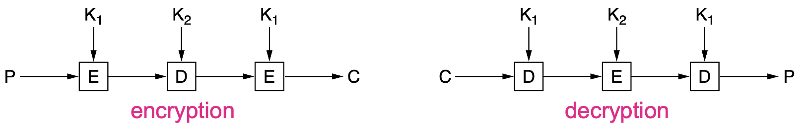
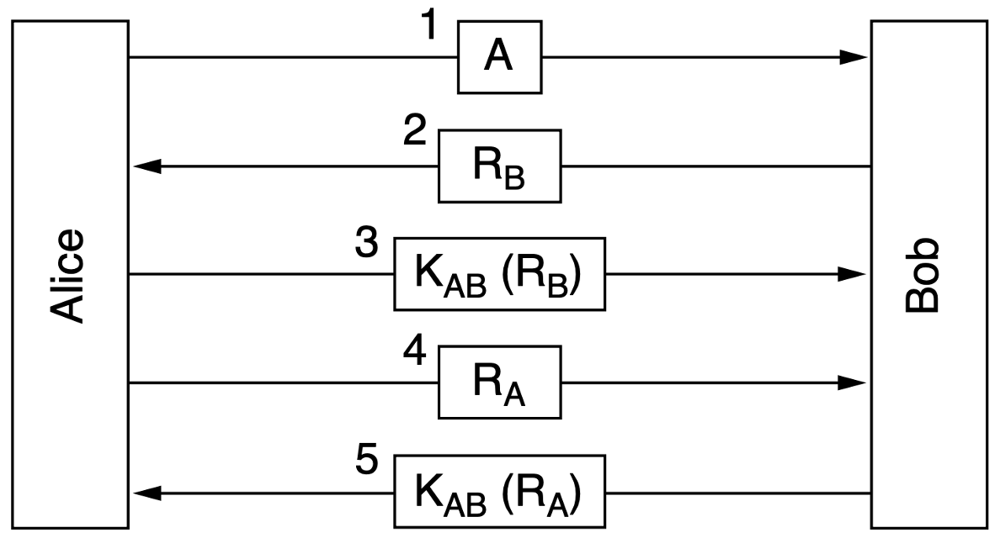
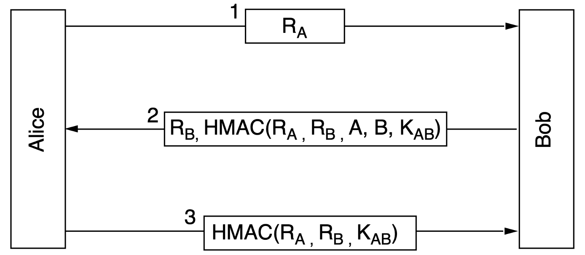
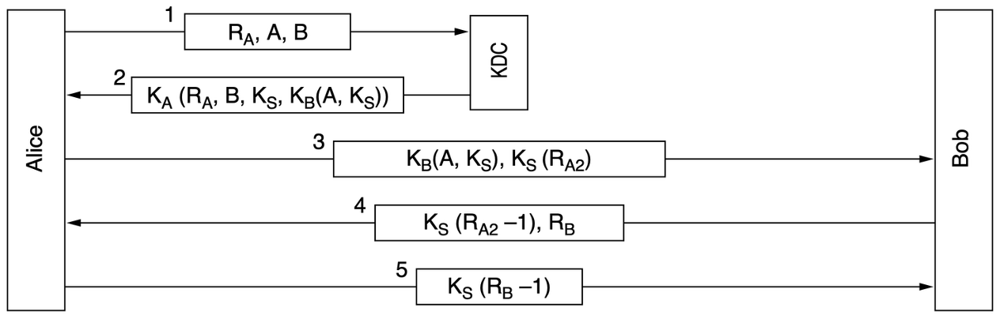

# 网络安全

> 计网直接在最后一章包含了一个《信安原》，不过鉴于是考选择题，这部分应该不需要掌握的太深。

## 网络安全基础

### 概念

网络安全需要保证：

1. Confidentiality 机密
2. Integrity 一致性
3. Availablity 可用性

网络安全的基本原则有：*Principle of*
1. *economy of mechanism(simplicity)* 复杂的系统更容易出bug
1. *fail-safe of defaults* 用白名单而不是黑名单
2. *complete mediation* 访问资源的操作都应该被鉴权
3. *least authority* 只赋予最小权限
4. *privilege separation* 将系统分为多个最小权限单元
5. *least common mechanism* 减少公共权限的数目
6. *open design* 设计是公开的
7. *psychological acceptability* 原理容易理解

### 攻击

1. 识别（Reconnaissance）
   1. port sacnning 端口扫描
   2. traceroute 路径探测
2. 嗅探与监听(Sniffing and Snooping)
   1. 在开放介质（比如wifi）中嗅探，使用wireshark，工作在混杂模式(promiscuous mode)
   2. 在交换网络中不能直接收到发给其它主机的包，故需要欺骗(spoofing)
      1. mac cloning：攻击者声称自己有目标mac地址，从而使switch转发给自己
      2. mac flooding：攻击者用伪造大量以太网帧填充switch转发表，导致目标主机的帧只能被广播
      3. ARP poisoning：攻击者抢先回应ARP请求，从而污染源主机ARP缓存
      4. MITM：Man in the Middle
3. 欺骗(spoofing)
   1. DNS spoofing：如果攻击者和受害者共享DNS服务器，攻击者可以主动污染DNS缓存，否则只能诱导受害者发起DNS解析请求
   2. TCP spoofing：
      1. 攻击者新建一个连接，假装是另一台电脑上的用户
      2. 攻击者在连接中在已有连接中注入数据，假装自己是会话双方的一方
4. 中断(Disruption)
   1. Crashes：瘫痪目标机器
   2. Algorithmic complexity：用精心设计的数据让目标机器计算过载
   3. Flooding：用大量的请求使目标机器无法继续提供服务，比如SYN flooding

## 密码学

### 基本原则

- Kerckhoffs’ principle：all algorithms must be public;only the keys are secret
- 密码分析的基本变种：
  - Ciphertext-only problem
  - Known plaintext problem
  - Chosen plaintext problem
- 加密原则：
  - Redundancy：否则无法区分攻击者添加的信息
  - Freshness：需要一些方法来防范重放攻击

### 基本手段

- 替换(substitution)加密，对字母做某些替换，比如凯撒密码，或者随机映射，破解需要进行词频分析
- 移位(trnaspostion)加密，只对字母进行重排，比如列转置(Columnar transposition)
- 一次性密码本(one-time-pad)：密钥必须与要加密的明文一样长，并且必须由真正的随机过程生成，且秘钥只只用一次

### 对称加密

- 使用同一个秘钥进行加密和解密
- 块加密：一次对n-bit的明文进行加密，产生n-bit密文
- 硬件实现：P-box for permutation，S-box for substitution
- Product cipher：通常使用至少20轮的排列和替换

#### DES

块加密，64bit的明文和密文，但是秘钥是56bit，16轮加密，实际每一轮使用的秘钥是48bit的，并且每一轮的秘钥都不相同

{width=300}

DES如今已经不再安全，引入了三重DES(Triple DES)，秘钥相当于有112位

#### AES

块大小为128bit（16 bytes = 4x4 array/state），秘钥长度有三种选择：

- 128 bits for 10 rounds
- 192 bits for 12 rounds
- 256 bits for 14 rounds

流程如下：

- Initial round key addition: AddRoundKey
- 9 rounds (assume 10 rounds needed): 
  - SubBytes：对每个state做映射
  - ShiftRows：每个state循环左移，从上到下每一行左移位数依次为0，1，2，3
  - MixColumns：每一列state与固定的多项式相乘
  - AddRoundKey：每个state与round subkey进行异或运算
- Final round without MixColumns

#### 加密模式

- EBC：将秘钥按照64bit分组（最后一个分组可能需要填充），每一组都使用相同的秘钥进行加密，容易收到密文替换攻击(ciphertext replacement attack)
- CBC：每个明文块在加密前先与上一个密文块进行异或，第一个明文块与初始化向量(IV,Initializetion Vector)异或，形成了一个链式结构，替换中间的块会导致其后块作废
- CF：仍然需要初始化向量，将初始化向量的左边前8位与明文前8位进行异或，得到第一个密文，将初始化向量左移8位，并将刚得到的密文填入后8位，重复这个流程，从而得到一个密码流。如果有一次加密出错，只会影响8B的内容
- SC：初始化向量只在第一步使用，反复加密IV得到不重复的 keystream，传输的明文中1bit的错误只会在解密的明文中产生1bit错误，重复使用相同的初始化向量和秘钥容易受到密钥流重用攻击(keystream reuse attack)

#### 公钥加密算法

公钥加密算法需要满足三点：

- D(E(P)) = P
- 不能从D推断E
- E不能够通过明文攻破

计网里面只讲了RSA，RSA基于大素数分解：

1. 选择两个足够大的素数p和q，则n=p\*q，z=(p-1)\*(q-1)
2. 选择e和z互质，寻找d*e=1 mod z
3. (e, n)是公钥，(d, n)是私钥，且C=P^e mod n，P=C^d mod n

### 数字签名

- 接收者可以确定发送者
- 发送者不能否认内容
- 接收者不能捏造收到的内容

1. Symmetric-Key Signatures：引入中央权威机构，它和每一对象之间都有共享的秘钥
2. Public-Key Signatures：用自己的私钥加密，对方用公钥解密
3. 消息摘要(Message Digests)：单向哈希函数能够把任意长的输入映射到固定长度
   1. SHA1 已经被攻破 160位输出
   2. SHA-2: 224, 256, 384, 512-bit
   3. SHA-3

### 交换公钥

公钥如果要在网络上传递的话，又要怎么保护公钥的安全呢？似乎陷入了死循环

- Certificates：CA(Certifacate Authority)为个人、公司和其他组织证明公钥
- X.509 Standard：将证书使用OSI ASN.1 编码，仅仅是个标准
- PKI(Public Key Infrastructure)：提供一种结构化组成的方式，为不同的文档和协议定义标准
  - hierarchies of CAs：最顶层是root CA，CA下有若干RA(Regional Authorities)
  - chain of trust/certification path：服务端同时提供自己的、RA的、逐层向上的CA的证书，客户端从下向上检查
  - 世界范围内运行多个 root CA，现代浏览器预装了100多个 root CA的公钥（trust anchors）

### 认证

#### 挑战响应协议

- 证明你是你，通常使用公钥加密来达成认证和建立session key
- 挑战响应协议(Challenge-response protocol)：一方发送随机数给另一方，另一方以某种方式返回随机数用于认证

使用挑战响应协议进行两次认证，**这个版本也会受到反射攻击**

{width=400}

shortened two-way authentication protocol，但它易受到反射攻击(reflection attack)

{width=400}

设计认证协议的通用规则：

1. 发起方在接收方给出私密信息前需要先证明其身份
2. 发起方和接收方使用不同的密钥进行验证
3. 发送方和接收方需要从不同的题库中抽取挑战题
4. 协议能够抵御涉及第二个并行会话的攻击，避免在其中一个会话中获取的信息被用于另一个会话。

#### HMAC

HMAC不会受到反射攻击

{width=400}

#### Diffie-Hellman key exchange

秘钥交换算法，不要和公钥密码算法混了

1. A选择两个大数n和g，满足n和$\frac{n-1}{2} $都是质数，再选择一个大数x，将n, g, g^x mod n发给B
2. B 收到后选择另一个大数y 将g^y mod n发给A
3. A 计算出秘钥 $(g^y)^x$ mod n = $g^{xy}$ mod n，B计算出秘钥 $(g^x)^y$ mod n = $g^{xy}$ mod n

可能会收到中间人攻击

#### KDC

秘钥分发中心(Key Distribution Center)：一个可信方，与每个用户共享一个私有密钥

{width=400}

会受到重放攻击，解决方案是使用时间戳和计数

Needham-Schroeder authentication protocol:

{width=400}

Otway-Rees authentication protocol:

{width=400}

### IP Secure

IP Secure 为了性能，使用symmetric-key cryptography；虽然位于IP层，但是是**有连接的**，被IPsec保护的连接被称作SA(Security Association)，它是单向的，所以实现双向通信需要两个SA

IPsec支持两种模式：
  - 传输模式(Transport Mode)：IPsec Header 被添加在IP Header之后，IP Header 中的Protocol字段会被修改，用于指示IPsec Header的存在，IPsec中有NextHeader字段指示后面是什么协议（通常是TCP）
  - 隧道模式(Tunnel Mode)：用一个新的带IPsec的IP Header包含普通的IP包，额外的开销比较大

IPsec主要包含两部分：

- ISAKMP(Internet Security Association and Key Manage Protocol)用于建立共享秘钥的框架
- 两种新的Header
  - AH(Authentication Header)：提供一致性检查，反重放攻击，但不保密
  - ESP(Encapsulating Security Payload)：只提供保密性

!!!error '写不动了，后面感觉也没那么重要了（'